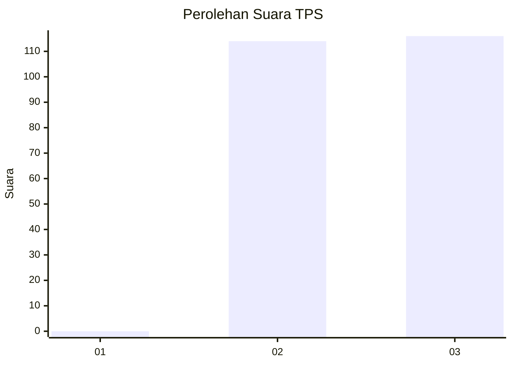
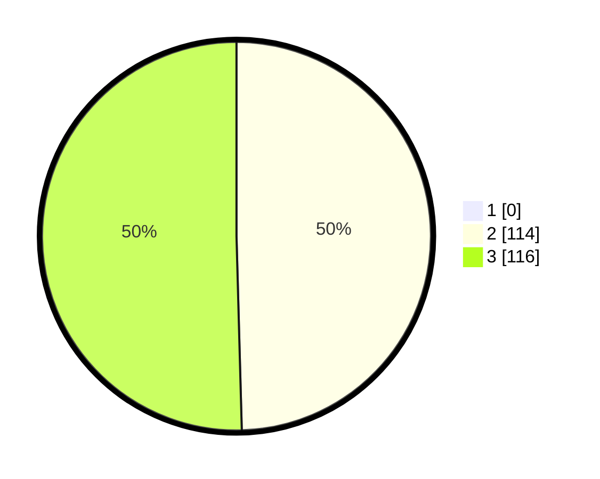

# Hasil

## Grafik

## Tabel

| No. | Nama Paslon    | Suara | Suara (raw) | Persentase |
|:--- |:-------------- | -----:| -----------:| ----------:|
| 1   | ANIES MUHAIMIN | 0     | [0][p-1]    | 0,00       |
| 2   | PRABOWO GIBRAN | 114   | [114][p-2]  | 49,57      |
| 3   | GANJAR MAHFUD  | 116   | [116][p-3]  | 50,43      |

[p-1]: https://github.com/gigit-pemilu/pemilu-2024-51-bali/blob/main/pilpres/hitung-suara/sub/51-bali/sub/02-tabanan/sub/03-selemadeg-barat/sub/2008-mundeh-kauh/sub/002-tps/sub/paslon-1.txt
[p-2]: https://github.com/gigit-pemilu/pemilu-2024-51-bali/blob/main/pilpres/hitung-suara/sub/51-bali/sub/02-tabanan/sub/03-selemadeg-barat/sub/2008-mundeh-kauh/sub/002-tps/sub/paslon-2.txt
[p-3]: https://github.com/gigit-pemilu/pemilu-2024-51-bali/blob/main/pilpres/hitung-suara/sub/51-bali/sub/02-tabanan/sub/03-selemadeg-barat/sub/2008-mundeh-kauh/sub/002-tps/sub/paslon-3.txt

## Foto C Plano

https://sirekap-obj-formc.kpu.go.id/4dcf/pemilu/ppwp/51/02/03/20/08/5102032008002-20240216-142819--650ed2d9-56a5-4e90-99d4-72a5d0dc4e3a.jpg

https://sirekap-obj-formc.kpu.go.id/4dcf/pemilu/ppwp/51/02/03/20/08/5102032008002-20240216-142821--743ee102-c0e6-4cea-be58-a42fe091b7b1.jpg

https://sirekap-obj-formc.kpu.go.id/4dcf/pemilu/ppwp/51/02/03/20/08/5102032008002-20240216-142820--17fdcbbf-b2ba-424d-8e83-aab333898f7b.jpg

## Metadata

| Key        | Value               |
| ---------- | ------------------- |
| Time Stamp | 2024-02-21 13:00:00 |

## DATA PEMILIH TETAP

Jumlah pemilih dalam DPT: **257**.
 * L: **135**.
 * P: **122**.

## DATA PENGGUNA HAK PILIH

Jumlah pengguna hak pilih dalam DPT: **231**.
 * L: **122**.
 * P: **109**.

Jumlah pengguna hak pilih dalam DPTb: **0**.
 * L: **0**.
 * P: **0**.

Jumlah pengguna hak pilih dalam DPK: **0**.
 * L: **0**.
 * P: **0**.

Jumlah pengguna hak pilih: **231**.
 * L: **122**.
 * P: **109**.

## JUMLAH SUARA SAH DAN TIDAK SAH

JUMLAH SELURUH SUARA SAH: **230**.

JUMLAH SUARA TIDAK SAH: **1**.

JUMLAH SELURUH SUARA SAH DAN SUARA TIDAK SAH: **231**.

