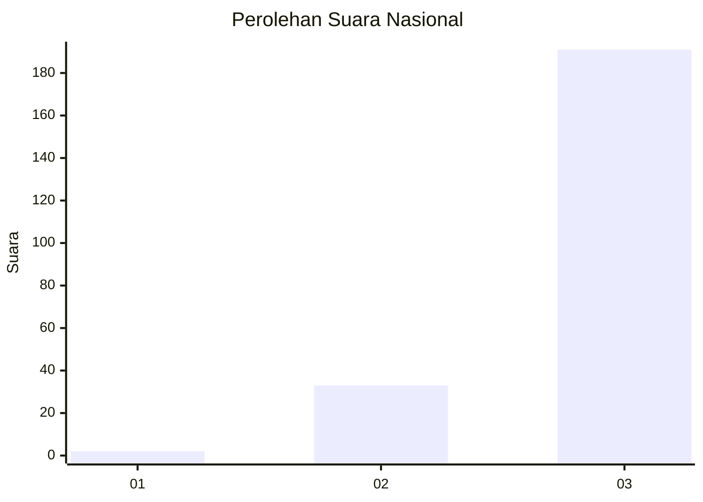
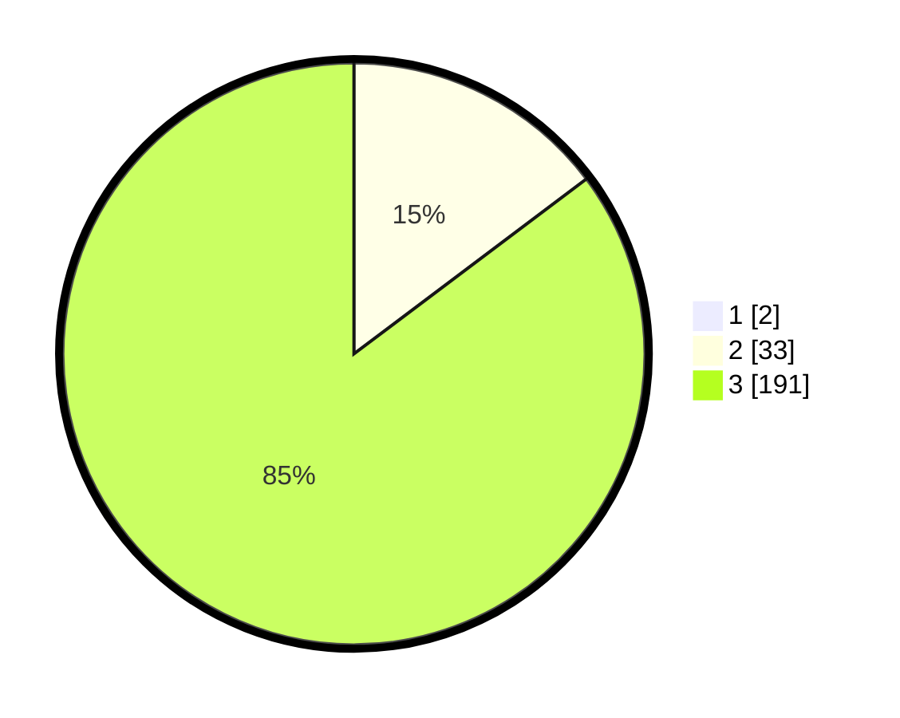

# Hasil

## Grafik

## Tabel

| No. | Nama Paslon    | Suara | Suara (raw) | Persentase |
|:--- |:-------------- | -----:| -----------:| ----------:|
| 1   | ANIES MUHAIMIN | 2     | [2][p-1]    | 0,88       |
| 2   | PRABOWO GIBRAN | 33    | [33][p-2]   | 14,60      |
| 3   | GANJAR MAHFUD  | 191   | [191][p-3]  | 84,51      |

[p-1]: https://github.com/gigit-pemilu/pemilu-2024/blob/main/pilpres/hitung-suara/sub/51-bali/sub/02-tabanan/sub/03-selemadeg-barat/sub/2008-mundeh-kauh/sub/003-tps/sub/paslon-1.txt
[p-2]: https://github.com/gigit-pemilu/pemilu-2024/blob/main/pilpres/hitung-suara/sub/51-bali/sub/02-tabanan/sub/03-selemadeg-barat/sub/2008-mundeh-kauh/sub/003-tps/sub/paslon-2.txt
[p-3]: https://github.com/gigit-pemilu/pemilu-2024/blob/main/pilpres/hitung-suara/sub/51-bali/sub/02-tabanan/sub/03-selemadeg-barat/sub/2008-mundeh-kauh/sub/003-tps/sub/paslon-3.txt

## Foto C Plano

https://sirekap-obj-formc.kpu.go.id/17fa/pemilu/ppwp/51/02/03/20/08/5102032008003-20240216-100845--359f8b31-e1d4-4fc3-a75b-4fbcf214ca87.jpg

https://sirekap-obj-formc.kpu.go.id/17fa/pemilu/ppwp/51/02/03/20/08/5102032008003-20240216-100857--5ef626ee-72cf-4d0a-bf2e-57ad30d823f2.jpg

https://sirekap-obj-formc.kpu.go.id/17fa/pemilu/ppwp/51/02/03/20/08/5102032008003-20240216-091933--7c67fcfd-244a-4e25-8889-d88f9c9a9bd7.jpg

## Metadata

| Key        | Value               |
| ---------- | ------------------- |
| Time Stamp | 2024-02-16 10:30:29 |

## DATA PEMILIH TETAP

Jumlah pemilih dalam DPT: **280**.
 * L: **141**.
 * P: **139**.

## DATA PENGGUNA HAK PILIH

Jumlah pengguna hak pilih dalam DPT: **228**.
 * L: **113**.
 * P: **115**.

Jumlah pengguna hak pilih dalam DPTb: **1**.
 * L: **0**.
 * P: **1**.

Jumlah pengguna hak pilih dalam DPK: **0**.
 * L: **0**.
 * P: **0**.

Jumlah pengguna hak pilih: **229**.
 * L: **113**.
 * P: **116**.

## JUMLAH SUARA SAH DAN TIDAK SAH

JUMLAH SELURUH SUARA SAH: **226**.

JUMLAH SUARA TIDAK SAH: **3**.

JUMLAH SELURUH SUARA SAH DAN SUARA TIDAK SAH: **229**.

