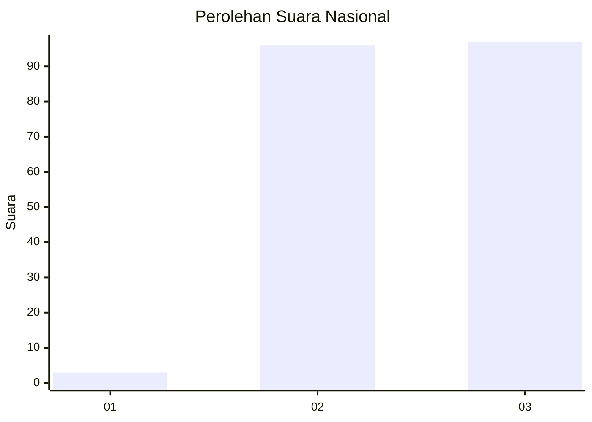
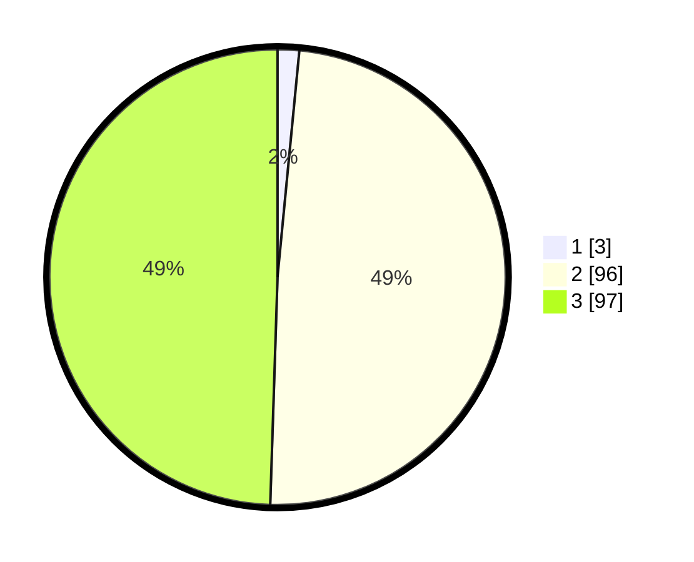

# Hasil

## Grafik

## Tabel

| No. | Nama Paslon    | Suara | Suara (raw) | Persentase |
|:--- |:-------------- | -----:| -----------:| ----------:|
| 1   | ANIES MUHAIMIN | 3     | [3][p-1]    | 1,53       |
| 2   | PRABOWO GIBRAN | 96    | [96][p-2]   | 48,98      |
| 3   | GANJAR MAHFUD  | 97    | [97][p-3]   | 49,49      |

[p-1]: https://github.com/gigit-pemilu/pemilu-2024/blob/main/pilpres/hitung-suara/sub/51-bali/sub/02-tabanan/sub/03-selemadeg-barat/sub/2008-mundeh-kauh/sub/005-tps/sub/paslon-1.txt
[p-2]: https://github.com/gigit-pemilu/pemilu-2024/blob/main/pilpres/hitung-suara/sub/51-bali/sub/02-tabanan/sub/03-selemadeg-barat/sub/2008-mundeh-kauh/sub/005-tps/sub/paslon-2.txt
[p-3]: https://github.com/gigit-pemilu/pemilu-2024/blob/main/pilpres/hitung-suara/sub/51-bali/sub/02-tabanan/sub/03-selemadeg-barat/sub/2008-mundeh-kauh/sub/005-tps/sub/paslon-3.txt

## Foto C Plano

https://sirekap-obj-formc.kpu.go.id/9138/pemilu/ppwp/51/02/03/20/08/5102032008005-20240216-093032--d30687b8-63fa-422e-9268-7204a466236a.jpg

https://sirekap-obj-formc.kpu.go.id/9138/pemilu/ppwp/51/02/03/20/08/5102032008005-20240216-093034--adc89ee1-009f-4883-ba78-a5163d83aa79.jpg

https://sirekap-obj-formc.kpu.go.id/9138/pemilu/ppwp/51/02/03/20/08/5102032008005-20240216-093033--ea25cbf1-1b6a-4206-a684-9cd57dbf9ce5.jpg

## Metadata

| Key        | Value               |
| ---------- | ------------------- |
| Time Stamp | 2024-02-16 10:00:28 |

## DATA PEMILIH TETAP

Jumlah pemilih dalam DPT: **203**.
 * L: **100**.
 * P: **103**.

## DATA PENGGUNA HAK PILIH

Jumlah pengguna hak pilih dalam DPT: **196**.
 * L: **96**.
 * P: **100**.

Jumlah pengguna hak pilih dalam DPTb: **0**.
 * L: **0**.
 * P: **0**.

Jumlah pengguna hak pilih dalam DPK: **2**.
 * L: **0**.
 * P: **2**.

Jumlah pengguna hak pilih: **198**.
 * L: **96**.
 * P: **102**.

## JUMLAH SUARA SAH DAN TIDAK SAH

JUMLAH SELURUH SUARA SAH: **196**.

JUMLAH SUARA TIDAK SAH: **2**.

JUMLAH SELURUH SUARA SAH DAN SUARA TIDAK SAH: **198**.

