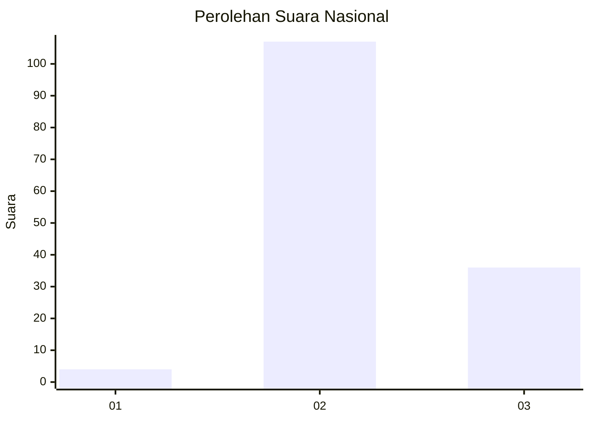
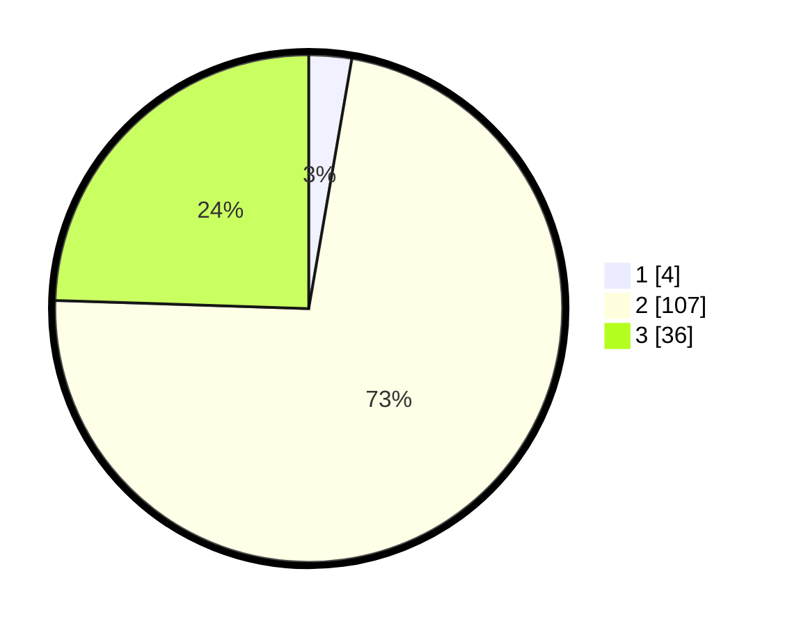

# Hasil

## Grafik

## Tabel

| No. | Nama Paslon    | Suara | Suara (raw) | Persentase |
|:--- |:-------------- | -----:| -----------:| ----------:|
| 1   | ANIES MUHAIMIN | 4     | [4][p-1]    | 2,72       |
| 2   | PRABOWO GIBRAN | 107   | [107][p-2]  | 72,79      |
| 3   | GANJAR MAHFUD  | 36    | [36][p-3]   | 24,49      |

[p-1]: https://github.com/gigit-pemilu/pemilu-2024/blob/main/pilpres/hitung-suara/sub/51-bali/sub/02-tabanan/sub/03-selemadeg-barat/sub/2009-angkah/sub/001-tps/sub/paslon-1.txt
[p-2]: https://github.com/gigit-pemilu/pemilu-2024/blob/main/pilpres/hitung-suara/sub/51-bali/sub/02-tabanan/sub/03-selemadeg-barat/sub/2009-angkah/sub/001-tps/sub/paslon-2.txt
[p-3]: https://github.com/gigit-pemilu/pemilu-2024/blob/main/pilpres/hitung-suara/sub/51-bali/sub/02-tabanan/sub/03-selemadeg-barat/sub/2009-angkah/sub/001-tps/sub/paslon-3.txt

## Foto C Plano

https://sirekap-obj-formc.kpu.go.id/47a6/pemilu/ppwp/51/02/03/20/09/5102032009001-20240215-222155--76de335f-4995-4bb9-9936-b4331bb038e2.jpg

https://sirekap-obj-formc.kpu.go.id/47a6/pemilu/ppwp/51/02/03/20/09/5102032009001-20240215-222159--71c849c7-d48c-4175-8e25-4623a27064ab.jpg

https://sirekap-obj-formc.kpu.go.id/47a6/pemilu/ppwp/51/02/03/20/09/5102032009001-20240215-222157--59887b92-dd32-4bb6-a7b0-be31db8fa605.jpg

## Metadata

| Key        | Value               |
| ---------- | ------------------- |
| Time Stamp | 2024-02-16 10:00:28 |

## DATA PEMILIH TETAP

Jumlah pemilih dalam DPT: **156**.
 * L: **79**.
 * P: **77**.

## DATA PENGGUNA HAK PILIH

Jumlah pengguna hak pilih dalam DPT: **146**.
 * L: **76**.
 * P: **70**.

Jumlah pengguna hak pilih dalam DPTb: **2**.
 * L: **1**.
 * P: **1**.

Jumlah pengguna hak pilih dalam DPK: **0**.
 * L: **0**.
 * P: **0**.

Jumlah pengguna hak pilih: **149**.
 * L: **77**.
 * P: **72**.

## JUMLAH SUARA SAH DAN TIDAK SAH

JUMLAH SELURUH SUARA SAH: **147**.

JUMLAH SUARA TIDAK SAH: **2**.

JUMLAH SELURUH SUARA SAH DAN SUARA TIDAK SAH: **149**.

