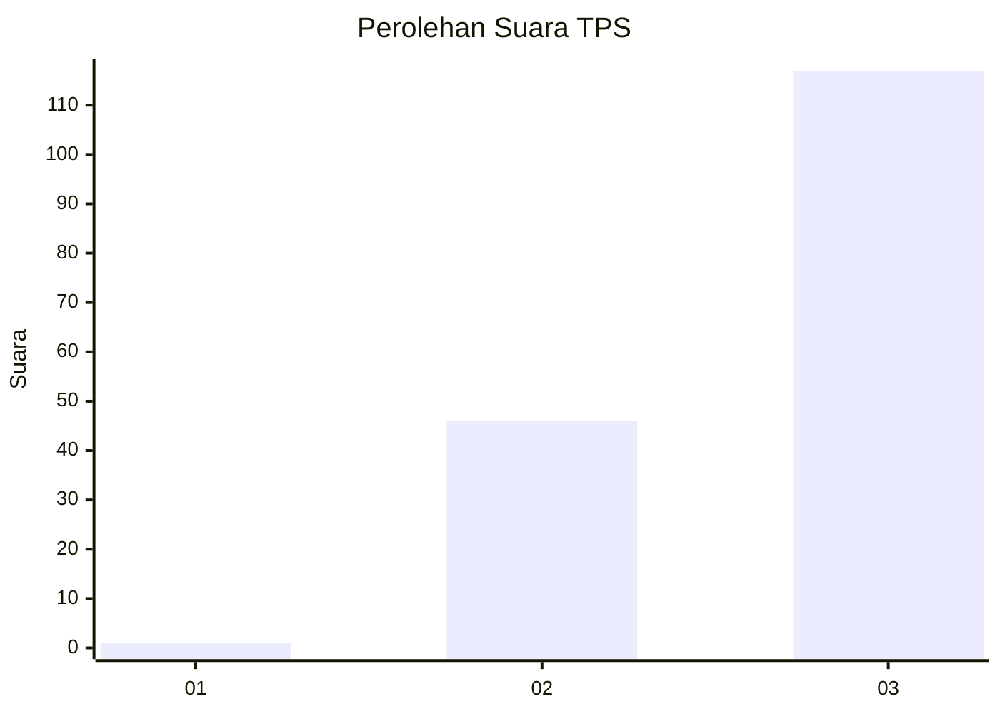
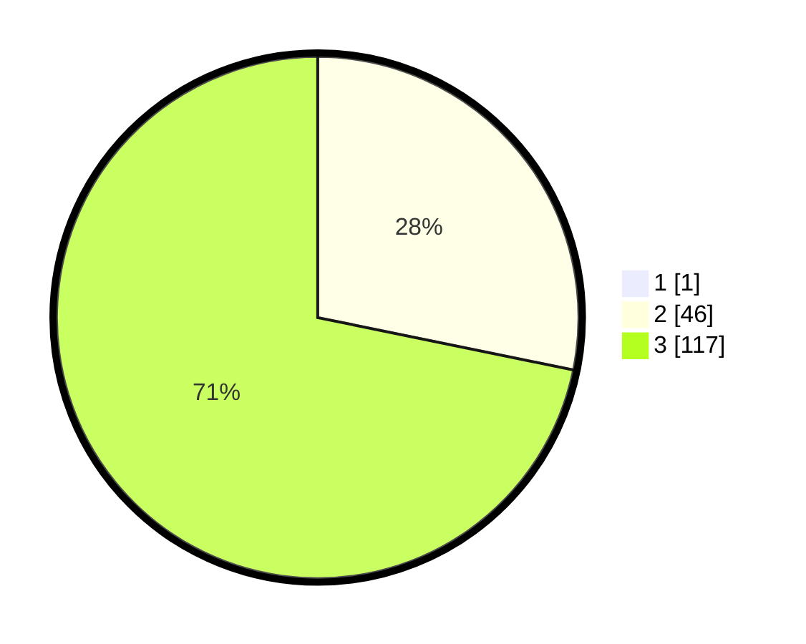

# Hasil

## Grafik

## Tabel

| No. | Nama Paslon    | Suara | Suara (raw) | Persentase |
|:--- |:-------------- | -----:| -----------:| ----------:|
| 1   | ANIES MUHAIMIN | 1     | [1][p-1]    | 0,61       |
| 2   | PRABOWO GIBRAN | 46    | [46][p-2]   | 28,05      |
| 3   | GANJAR MAHFUD  | 117   | [117][p-3]  | 71,34      |

[p-1]: https://github.com/gigit-pemilu/pemilu-2024-51-bali/blob/main/pilpres/hitung-suara/sub/51-bali/sub/02-tabanan/sub/03-selemadeg-barat/sub/2009-angkah/sub/004-tps/sub/paslon-1.txt
[p-2]: https://github.com/gigit-pemilu/pemilu-2024-51-bali/blob/main/pilpres/hitung-suara/sub/51-bali/sub/02-tabanan/sub/03-selemadeg-barat/sub/2009-angkah/sub/004-tps/sub/paslon-2.txt
[p-3]: https://github.com/gigit-pemilu/pemilu-2024-51-bali/blob/main/pilpres/hitung-suara/sub/51-bali/sub/02-tabanan/sub/03-selemadeg-barat/sub/2009-angkah/sub/004-tps/sub/paslon-3.txt

## Foto C Plano

https://sirekap-obj-formc.kpu.go.id/8451/pemilu/ppwp/51/02/03/20/09/5102032009004-20240216-055416--ec342c9d-990a-4bfd-99ee-f1d2cf73c744.jpg

https://sirekap-obj-formc.kpu.go.id/8451/pemilu/ppwp/51/02/03/20/09/5102032009004-20240216-055428--a7081bd4-66ae-4546-987d-7ce8abb89214.jpg

https://sirekap-obj-formc.kpu.go.id/8451/pemilu/ppwp/51/02/03/20/09/5102032009004-20240216-055425--73d20d4a-6239-46d2-b15b-bf1996925ee4.jpg

## Metadata

| Key        | Value               |
| ---------- | ------------------- |
| Time Stamp | 2024-02-16 10:00:28 |

## DATA PEMILIH TETAP

Jumlah pemilih dalam DPT: **188**.
 * L: **92**.
 * P: **96**.

## DATA PENGGUNA HAK PILIH

Jumlah pengguna hak pilih dalam DPT: **163**.
 * L: **81**.
 * P: **82**.

Jumlah pengguna hak pilih dalam DPTb: **1**.
 * L: **0**.
 * P: **1**.

Jumlah pengguna hak pilih dalam DPK: **0**.
 * L: **0**.
 * P: **0**.

Jumlah pengguna hak pilih: **164**.
 * L: **81**.
 * P: **83**.

## JUMLAH SUARA SAH DAN TIDAK SAH

JUMLAH SELURUH SUARA SAH: **164**.

JUMLAH SUARA TIDAK SAH: **0**.

JUMLAH SELURUH SUARA SAH DAN SUARA TIDAK SAH: **164**.

