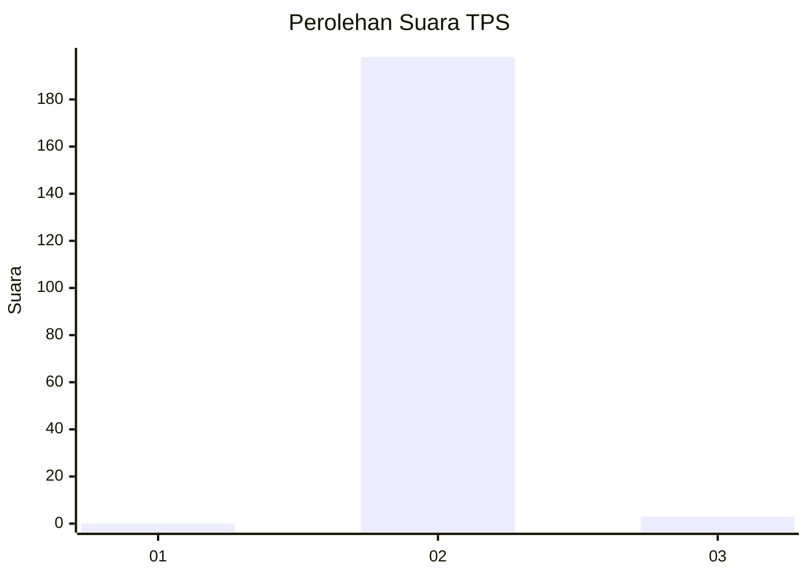
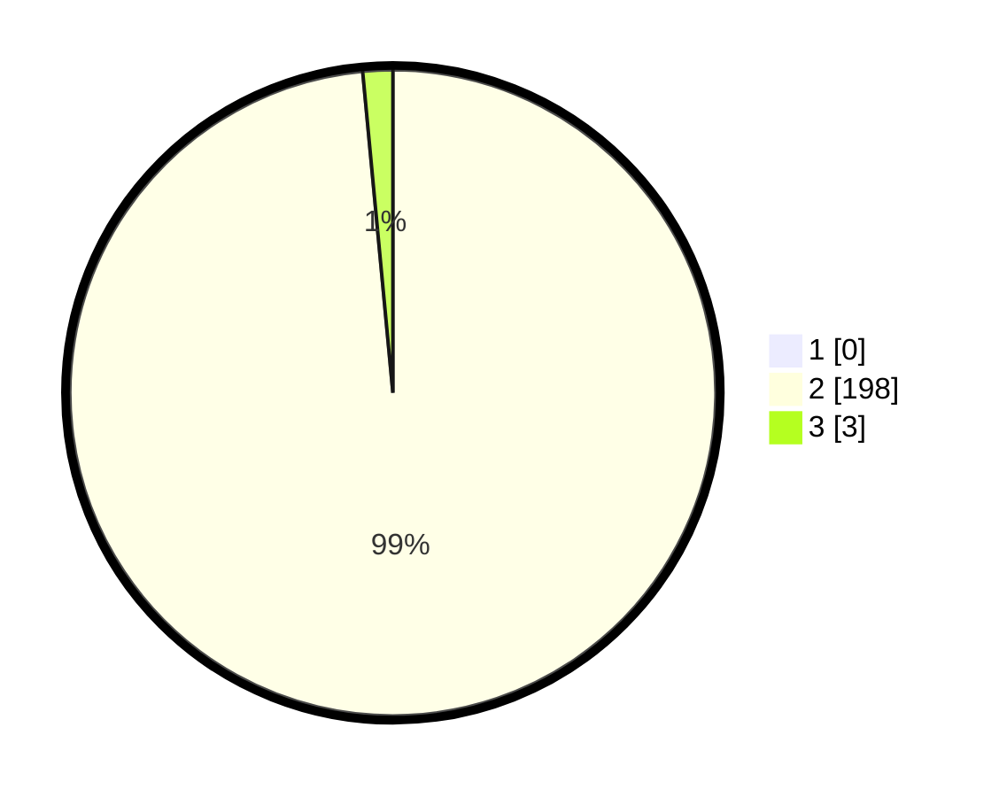

# Hasil

## Grafik

## Tabel

| No. | Nama Paslon    | Suara | Suara (raw) | Persentase |
|:--- |:-------------- | -----:| -----------:| ----------:|
| 1   | ANIES MUHAIMIN | 0     | [0][p-1]    | 0,00       |
| 2   | PRABOWO GIBRAN | 198   | [198][p-2]  | 98,51      |
| 3   | GANJAR MAHFUD  | 3     | [3][p-3]    | 1,49       |

[p-1]: https://github.com/gigit-pemilu/pemilu-2024-51-bali/blob/main/pilpres/hitung-suara/sub/51-bali/sub/02-tabanan/sub/03-selemadeg-barat/sub/2009-angkah/sub/005-tps/sub/paslon-1.txt
[p-2]: https://github.com/gigit-pemilu/pemilu-2024-51-bali/blob/main/pilpres/hitung-suara/sub/51-bali/sub/02-tabanan/sub/03-selemadeg-barat/sub/2009-angkah/sub/005-tps/sub/paslon-2.txt
[p-3]: https://github.com/gigit-pemilu/pemilu-2024-51-bali/blob/main/pilpres/hitung-suara/sub/51-bali/sub/02-tabanan/sub/03-selemadeg-barat/sub/2009-angkah/sub/005-tps/sub/paslon-3.txt

## Foto C Plano

https://sirekap-obj-formc.kpu.go.id/5aeb/pemilu/ppwp/51/02/03/20/09/5102032009005-20240216-004850--4aa52b4e-e36c-4847-8983-a45135dcb13a.jpg

https://sirekap-obj-formc.kpu.go.id/5aeb/pemilu/ppwp/51/02/03/20/09/5102032009005-20240216-004851--5d73d4e4-80df-4811-8303-73ab8541bb61.jpg

https://sirekap-obj-formc.kpu.go.id/5aeb/pemilu/ppwp/51/02/03/20/09/5102032009005-20240216-004851--840fdef2-9c2b-41af-a765-5439e663293f.jpg

## Metadata

| Key        | Value               |
| ---------- | ------------------- |
| Time Stamp | 2024-02-16 10:00:28 |

## DATA PEMILIH TETAP

Jumlah pemilih dalam DPT: **213**.
 * L: **105**.
 * P: **108**.

## DATA PENGGUNA HAK PILIH

Jumlah pengguna hak pilih dalam DPT: **203**.
 * L: **99**.
 * P: **104**.

Jumlah pengguna hak pilih dalam DPTb: **1**.
 * L: **0**.
 * P: **1**.

Jumlah pengguna hak pilih dalam DPK: **1**.
 * L: **0**.
 * P: **1**.

Jumlah pengguna hak pilih: **205**.
 * L: **99**.
 * P: **106**.

## JUMLAH SUARA SAH DAN TIDAK SAH

JUMLAH SELURUH SUARA SAH: **201**.

JUMLAH SUARA TIDAK SAH: **4**.

JUMLAH SELURUH SUARA SAH DAN SUARA TIDAK SAH: **205**.

