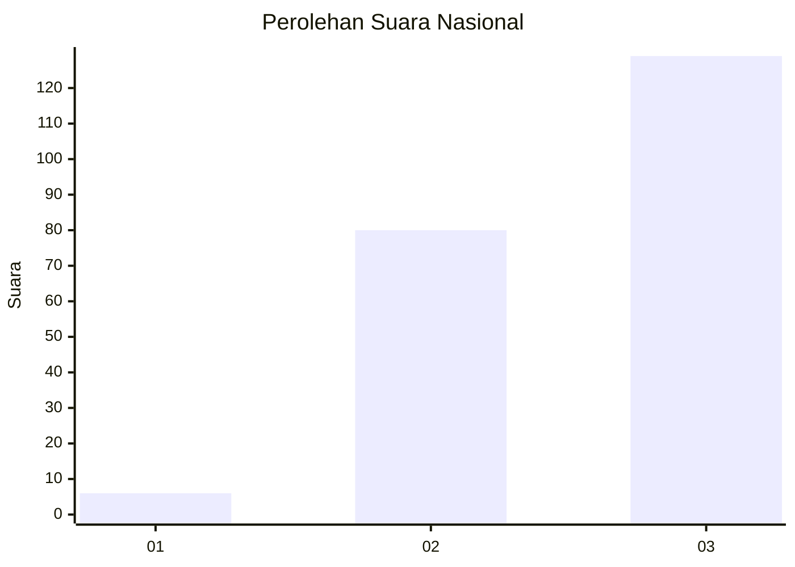
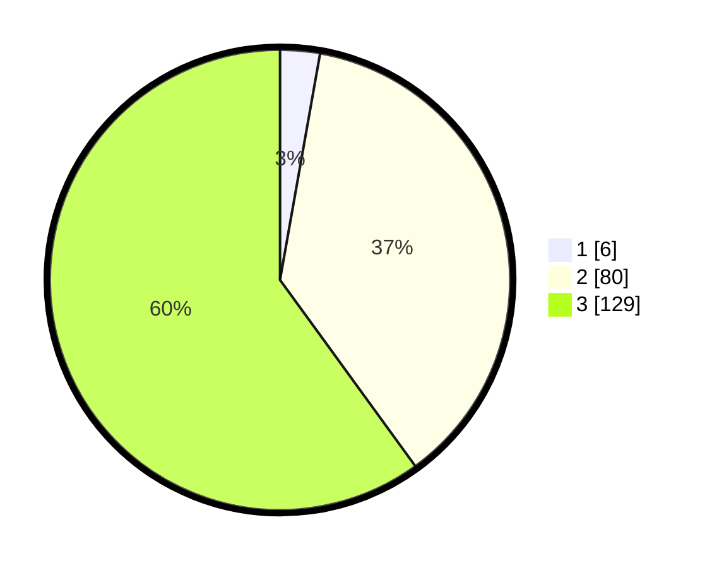

# Hasil

## Grafik

## Tabel

| No. | Nama Paslon    | Suara | Suara (raw) | Persentase |
|:--- |:-------------- | -----:| -----------:| ----------:|
| 1   | ANIES MUHAIMIN | 6     | [6][p-1]    | 2,79       |
| 2   | PRABOWO GIBRAN | 80    | [80][p-2]   | 37,21      |
| 3   | GANJAR MAHFUD  | 129   | [129][p-3]  | 60,00      |

[p-1]: https://github.com/gigit-pemilu/pemilu-2024/blob/main/pilpres/hitung-suara/sub/51-bali/sub/02-tabanan/sub/03-selemadeg-barat/sub/2009-angkah/sub/006-tps/sub/paslon-1.txt
[p-2]: https://github.com/gigit-pemilu/pemilu-2024/blob/main/pilpres/hitung-suara/sub/51-bali/sub/02-tabanan/sub/03-selemadeg-barat/sub/2009-angkah/sub/006-tps/sub/paslon-2.txt
[p-3]: https://github.com/gigit-pemilu/pemilu-2024/blob/main/pilpres/hitung-suara/sub/51-bali/sub/02-tabanan/sub/03-selemadeg-barat/sub/2009-angkah/sub/006-tps/sub/paslon-3.txt

## Foto C Plano

https://sirekap-obj-formc.kpu.go.id/540e/pemilu/ppwp/51/02/03/20/09/5102032009006-20240216-015640--8b662eb3-b414-468b-8be0-8c1f7bda87df.jpg

https://sirekap-obj-formc.kpu.go.id/540e/pemilu/ppwp/51/02/03/20/09/5102032009006-20240216-015641--e373a9e7-ea47-448a-94de-c1b864684dff.jpg

https://sirekap-obj-formc.kpu.go.id/540e/pemilu/ppwp/51/02/03/20/09/5102032009006-20240216-015640--0e56e55a-0bf4-4434-be78-98d44012457f.jpg

## Metadata

| Key        | Value               |
| ---------- | ------------------- |
| Time Stamp | 2024-02-16 10:30:29 |

## DATA PEMILIH TETAP

Jumlah pemilih dalam DPT: **250**.
 * L: **130**.
 * P: **120**.

## DATA PENGGUNA HAK PILIH

Jumlah pengguna hak pilih dalam DPT: **216**.
 * L: **116**.
 * P: **100**.

Jumlah pengguna hak pilih dalam DPTb: **0**.
 * L: **0**.
 * P: **0**.

Jumlah pengguna hak pilih dalam DPK: **0**.
 * L: **0**.
 * P: **0**.

Jumlah pengguna hak pilih: **216**.
 * L: **116**.
 * P: **100**.

## JUMLAH SUARA SAH DAN TIDAK SAH

JUMLAH SELURUH SUARA SAH: **215**.

JUMLAH SUARA TIDAK SAH: **1**.

JUMLAH SELURUH SUARA SAH DAN SUARA TIDAK SAH: **216**.

