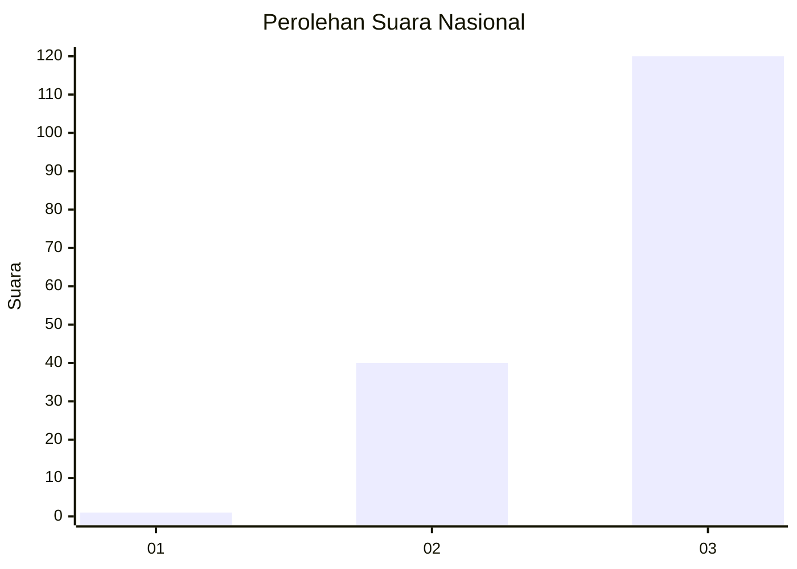
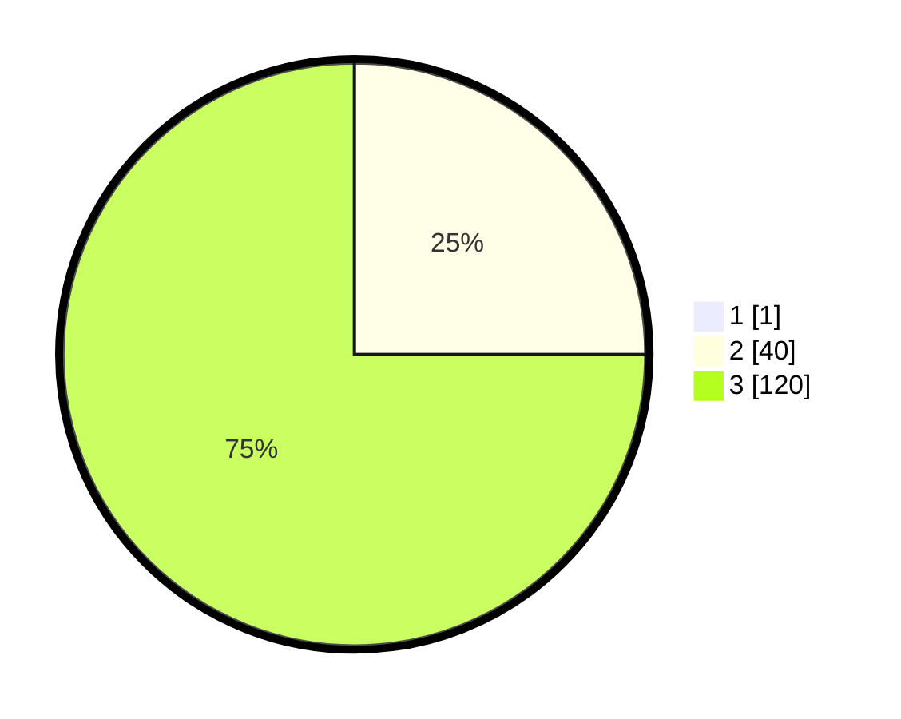

# Hasil

## Grafik

## Tabel

| No. | Nama Paslon    | Suara | Suara (raw) | Persentase |
|:--- |:-------------- | -----:| -----------:| ----------:|
| 1   | ANIES MUHAIMIN | 1     | [1][p-1]    | 0,62       |
| 2   | PRABOWO GIBRAN | 40    | [40][p-2]   | 24,84      |
| 3   | GANJAR MAHFUD  | 120   | [120][p-3]  | 74,53      |

[p-1]: https://github.com/gigit-pemilu/pemilu-2024/blob/main/pilpres/hitung-suara/sub/51-bali/sub/02-tabanan/sub/03-selemadeg-barat/sub/2009-angkah/sub/007-tps/sub/paslon-1.txt
[p-2]: https://github.com/gigit-pemilu/pemilu-2024/blob/main/pilpres/hitung-suara/sub/51-bali/sub/02-tabanan/sub/03-selemadeg-barat/sub/2009-angkah/sub/007-tps/sub/paslon-2.txt
[p-3]: https://github.com/gigit-pemilu/pemilu-2024/blob/main/pilpres/hitung-suara/sub/51-bali/sub/02-tabanan/sub/03-selemadeg-barat/sub/2009-angkah/sub/007-tps/sub/paslon-3.txt

## Foto C Plano

https://sirekap-obj-formc.kpu.go.id/1acc/pemilu/ppwp/51/02/03/20/09/5102032009007-20240216-105454--a2d088a1-582c-46f2-8a50-437726826010.jpg

https://sirekap-obj-formc.kpu.go.id/1acc/pemilu/ppwp/51/02/03/20/09/5102032009007-20240216-105456--b1b74a09-b1d9-4626-bd9b-337a8d7b26c6.jpg

https://sirekap-obj-formc.kpu.go.id/1acc/pemilu/ppwp/51/02/03/20/09/5102032009007-20240216-105455--7e86bd4c-eb8c-45f7-a3fd-16238441e4d9.jpg

## Metadata

| Key        | Value               |
| ---------- | ------------------- |
| Time Stamp | 2024-02-16 14:00:34 |

## DATA PEMILIH TETAP

Jumlah pemilih dalam DPT: **197**.
 * L: **97**.
 * P: **100**.

## DATA PENGGUNA HAK PILIH

Jumlah pengguna hak pilih dalam DPT: **158**.
 * L: **76**.
 * P: **82**.

Jumlah pengguna hak pilih dalam DPTb: **3**.
 * L: **2**.
 * P: **1**.

Jumlah pengguna hak pilih dalam DPK: **0**.
 * L: **0**.
 * P: **0**.

Jumlah pengguna hak pilih: **161**.
 * L: **78**.
 * P: **83**.

## JUMLAH SUARA SAH DAN TIDAK SAH

JUMLAH SELURUH SUARA SAH: **161**.

JUMLAH SUARA TIDAK SAH: **0**.

JUMLAH SELURUH SUARA SAH DAN SUARA TIDAK SAH: **161**.

