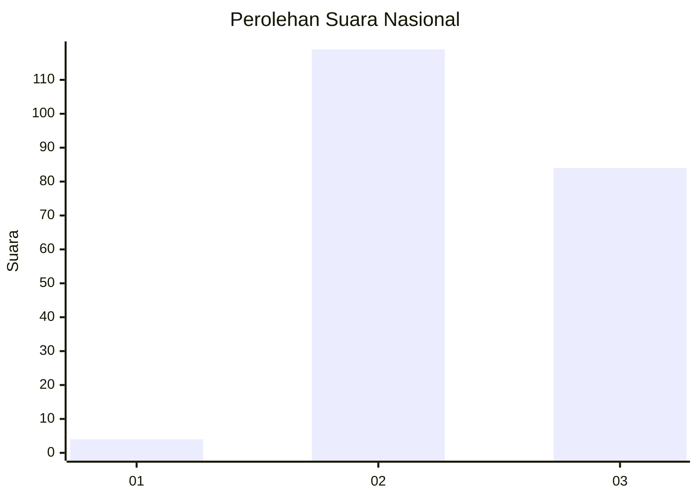
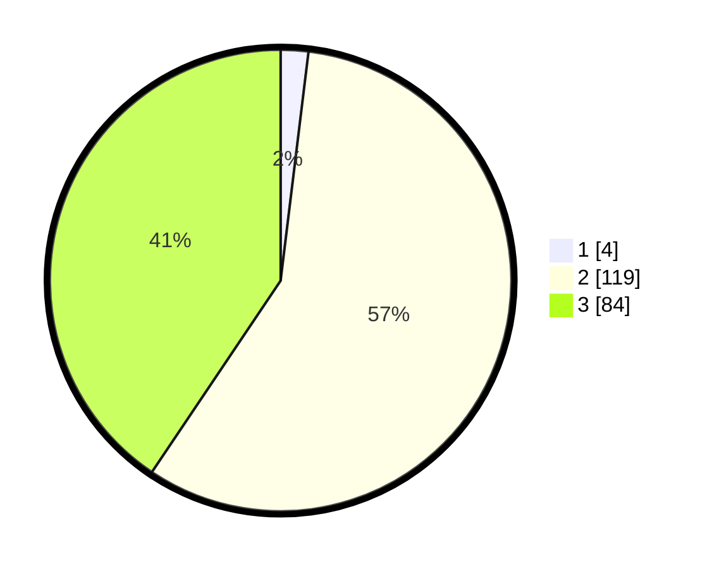

# Hasil

## Grafik

## Tabel

| No. | Nama Paslon    | Suara | Suara (raw) | Persentase |
|:--- |:-------------- | -----:| -----------:| ----------:|
| 1   | ANIES MUHAIMIN | 4     | [4][p-1]    | 1,93       |
| 2   | PRABOWO GIBRAN | 119   | [119][p-2]  | 57,49      |
| 3   | GANJAR MAHFUD  | 84    | [84][p-3]   | 40,58      |

[p-1]: https://github.com/gigit-pemilu/pemilu-2024/blob/main/pilpres/hitung-suara/sub/51-bali/sub/02-tabanan/sub/03-selemadeg-barat/sub/2010-selabih/sub/001-tps/sub/paslon-1.txt
[p-2]: https://github.com/gigit-pemilu/pemilu-2024/blob/main/pilpres/hitung-suara/sub/51-bali/sub/02-tabanan/sub/03-selemadeg-barat/sub/2010-selabih/sub/001-tps/sub/paslon-2.txt
[p-3]: https://github.com/gigit-pemilu/pemilu-2024/blob/main/pilpres/hitung-suara/sub/51-bali/sub/02-tabanan/sub/03-selemadeg-barat/sub/2010-selabih/sub/001-tps/sub/paslon-3.txt

## Foto C Plano

https://sirekap-obj-formc.kpu.go.id/ac81/pemilu/ppwp/51/02/03/20/10/5102032010001-20240215-215757--aa97722f-8c35-4bf1-a40a-dbd89f1c5426.jpg

https://sirekap-obj-formc.kpu.go.id/ac81/pemilu/ppwp/51/02/03/20/10/5102032010001-20240214-132242--e298a99b-2d47-4d71-a4f4-9fe2b7417905.jpg

https://sirekap-obj-formc.kpu.go.id/ac81/pemilu/ppwp/51/02/03/20/10/5102032010001-20240214-132345--69a4bd2e-d3f4-4561-bd28-5294aefce5a1.jpg

## Metadata

| Key        | Value               |
| ---------- | ------------------- |
| Time Stamp | 2024-02-15 22:00:27 |

## DATA PEMILIH TETAP

Jumlah pemilih dalam DPT: **207**.
 * L: **100**.
 * P: **107**.

## DATA PENGGUNA HAK PILIH

Jumlah pengguna hak pilih dalam DPT: **207**.
 * L: **100**.
 * P: **107**.

Jumlah pengguna hak pilih dalam DPTb: **1**.
 * L: **0**.
 * P: **1**.

Jumlah pengguna hak pilih dalam DPK: **0**.
 * L: **0**.
 * P: **0**.

Jumlah pengguna hak pilih: **208**.
 * L: **100**.
 * P: **108**.

## JUMLAH SUARA SAH DAN TIDAK SAH

JUMLAH SELURUH SUARA SAH: **207**.

JUMLAH SUARA TIDAK SAH: **1**.

JUMLAH SELURUH SUARA SAH DAN SUARA TIDAK SAH: **208**.

