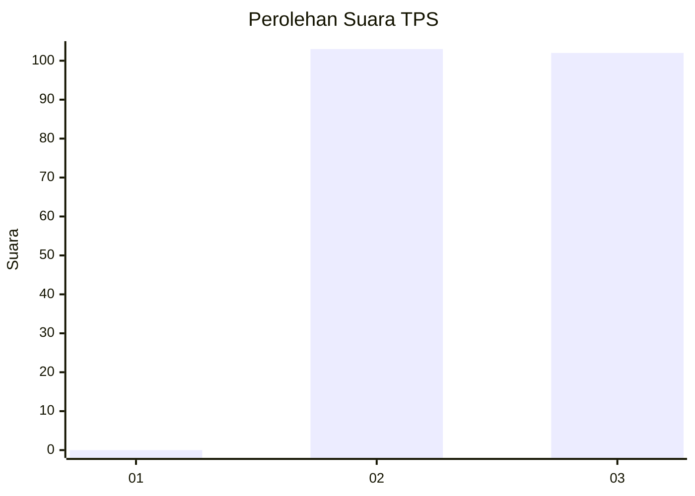
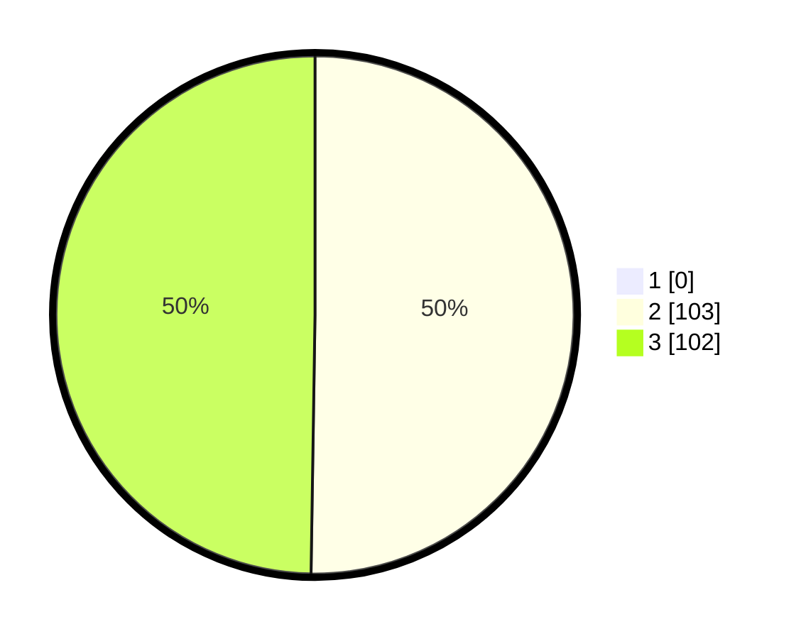

# Hasil

## Grafik

## Tabel

| No. | Nama Paslon    | Suara | Suara (raw) | Persentase |
|:--- |:-------------- | -----:| -----------:| ----------:|
| 1   | ANIES MUHAIMIN | 0     | [0][p-1]    | 0,00       |
| 2   | PRABOWO GIBRAN | 103   | [103][p-2]  | 50,24      |
| 3   | GANJAR MAHFUD  | 102   | [102][p-3]  | 49,76      |

[p-1]: https://github.com/gigit-pemilu/pemilu-2024-51-bali/blob/main/pilpres/hitung-suara/sub/51-bali/sub/02-tabanan/sub/03-selemadeg-barat/sub/2010-selabih/sub/002-tps/sub/paslon-1.txt
[p-2]: https://github.com/gigit-pemilu/pemilu-2024-51-bali/blob/main/pilpres/hitung-suara/sub/51-bali/sub/02-tabanan/sub/03-selemadeg-barat/sub/2010-selabih/sub/002-tps/sub/paslon-2.txt
[p-3]: https://github.com/gigit-pemilu/pemilu-2024-51-bali/blob/main/pilpres/hitung-suara/sub/51-bali/sub/02-tabanan/sub/03-selemadeg-barat/sub/2010-selabih/sub/002-tps/sub/paslon-3.txt

## Foto C Plano

https://sirekap-obj-formc.kpu.go.id/58d6/pemilu/ppwp/51/02/03/20/10/5102032010002-20240215-220954--67ca781a-3dd1-4560-9719-48c792d1893e.jpg

https://sirekap-obj-formc.kpu.go.id/58d6/pemilu/ppwp/51/02/03/20/10/5102032010002-20240214-133106--884fefcf-bbd8-4734-996f-8ffb31a3adc0.jpg

https://sirekap-obj-formc.kpu.go.id/58d6/pemilu/ppwp/51/02/03/20/10/5102032010002-20240214-132937--597afb27-952a-482d-aaae-dc117b28dfc1.jpg

## Metadata

| Key        | Value               |
| ---------- | ------------------- |
| Time Stamp | 2024-02-15 22:30:27 |

## DATA PEMILIH TETAP

Jumlah pemilih dalam DPT: **205**.
 * L: **103**.
 * P: **102**.

## DATA PENGGUNA HAK PILIH

Jumlah pengguna hak pilih dalam DPT: **205**.
 * L: **103**.
 * P: **102**.

Jumlah pengguna hak pilih dalam DPTb: **0**.
 * L: **0**.
 * P: **0**.

Jumlah pengguna hak pilih dalam DPK: **0**.
 * L: **0**.
 * P: **0**.

Jumlah pengguna hak pilih: **205**.
 * L: **103**.
 * P: **102**.

## JUMLAH SUARA SAH DAN TIDAK SAH

JUMLAH SELURUH SUARA SAH: **205**.

JUMLAH SUARA TIDAK SAH: **0**.

JUMLAH SELURUH SUARA SAH DAN SUARA TIDAK SAH: **205**.

