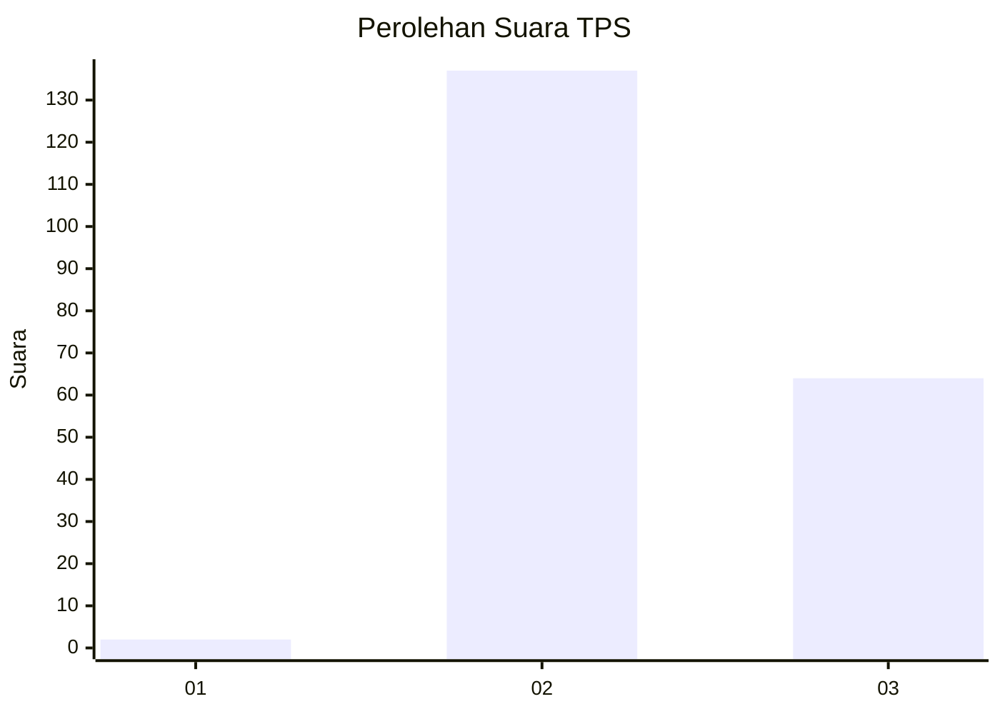
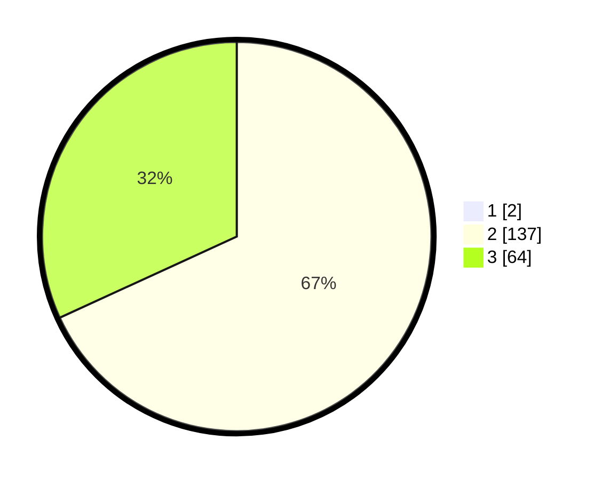

# Hasil

## Grafik

## Tabel

| No. | Nama Paslon    | Suara | Suara (raw) | Persentase |
|:--- |:-------------- | -----:| -----------:| ----------:|
| 1   | ANIES MUHAIMIN | 2     | [2][p-1]    | 0,99       |
| 2   | PRABOWO GIBRAN | 137   | [137][p-2]  | 67,49      |
| 3   | GANJAR MAHFUD  | 64    | [64][p-3]   | 31,53      |

[p-1]: https://github.com/gigit-pemilu/pemilu-2024-51-bali/blob/main/pilpres/hitung-suara/sub/51-bali/sub/02-tabanan/sub/03-selemadeg-barat/sub/2010-selabih/sub/003-tps/sub/paslon-1.txt
[p-2]: https://github.com/gigit-pemilu/pemilu-2024-51-bali/blob/main/pilpres/hitung-suara/sub/51-bali/sub/02-tabanan/sub/03-selemadeg-barat/sub/2010-selabih/sub/003-tps/sub/paslon-2.txt
[p-3]: https://github.com/gigit-pemilu/pemilu-2024-51-bali/blob/main/pilpres/hitung-suara/sub/51-bali/sub/02-tabanan/sub/03-selemadeg-barat/sub/2010-selabih/sub/003-tps/sub/paslon-3.txt

## Foto C Plano

https://sirekap-obj-formc.kpu.go.id/dbd4/pemilu/ppwp/51/02/03/20/10/5102032010003-20240216-015226--10c1e863-9d4b-46a5-83d1-8e26c826a43d.jpg

https://sirekap-obj-formc.kpu.go.id/dbd4/pemilu/ppwp/51/02/03/20/10/5102032010003-20240216-015229--75c85d4a-8fd2-421c-bb10-54ae6164d96d.jpg

https://sirekap-obj-formc.kpu.go.id/dbd4/pemilu/ppwp/51/02/03/20/10/5102032010003-20240216-015227--9c56434d-91a3-48ee-8fb5-6eda7cb4e29b.jpg

## Metadata

| Key        | Value               |
| ---------- | ------------------- |
| Time Stamp | 2024-02-16 10:30:29 |

## DATA PEMILIH TETAP

Jumlah pemilih dalam DPT: **204**.
 * L: **107**.
 * P: **97**.

## DATA PENGGUNA HAK PILIH

Jumlah pengguna hak pilih dalam DPT: **203**.
 * L: **106**.
 * P: **97**.

Jumlah pengguna hak pilih dalam DPTb: **1**.
 * L: **0**.
 * P: **1**.

Jumlah pengguna hak pilih dalam DPK: **0**.
 * L: **0**.
 * P: **0**.

Jumlah pengguna hak pilih: **204**.
 * L: **106**.
 * P: **98**.

## JUMLAH SUARA SAH DAN TIDAK SAH

JUMLAH SELURUH SUARA SAH: **203**.

JUMLAH SUARA TIDAK SAH: **1**.

JUMLAH SELURUH SUARA SAH DAN SUARA TIDAK SAH: **204**.

