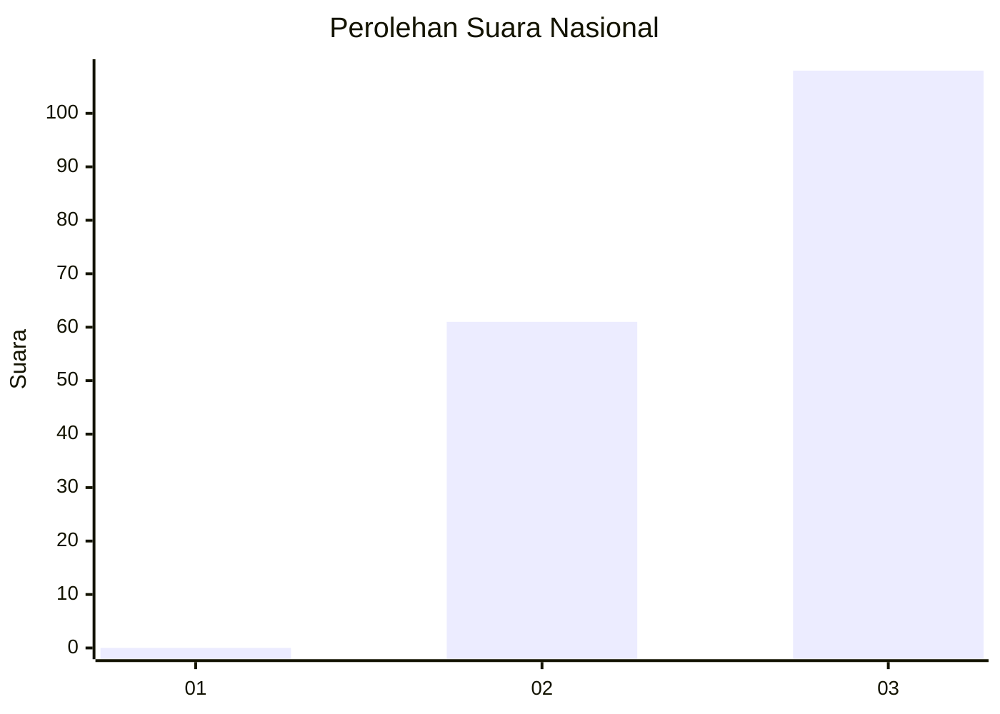
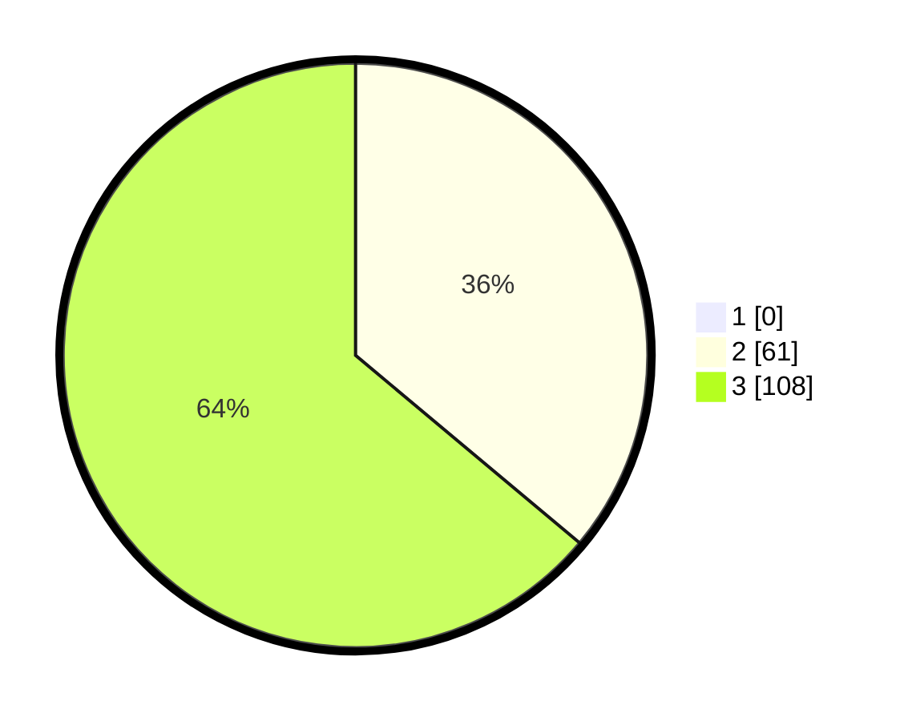

# Hasil

## Grafik

## Tabel

| No. | Nama Paslon    | Suara | Suara (raw) | Persentase |
|:--- |:-------------- | -----:| -----------:| ----------:|
| 1   | ANIES MUHAIMIN | 0     | [0][p-1]    | 0,00       |
| 2   | PRABOWO GIBRAN | 61    | [61][p-2]   | 36,09      |
| 3   | GANJAR MAHFUD  | 108   | [108][p-3]  | 63,91      |

[p-1]: https://github.com/gigit-pemilu/pemilu-2024/blob/main/pilpres/hitung-suara/sub/51-bali/sub/02-tabanan/sub/03-selemadeg-barat/sub/2010-selabih/sub/005-tps/sub/paslon-1.txt
[p-2]: https://github.com/gigit-pemilu/pemilu-2024/blob/main/pilpres/hitung-suara/sub/51-bali/sub/02-tabanan/sub/03-selemadeg-barat/sub/2010-selabih/sub/005-tps/sub/paslon-2.txt
[p-3]: https://github.com/gigit-pemilu/pemilu-2024/blob/main/pilpres/hitung-suara/sub/51-bali/sub/02-tabanan/sub/03-selemadeg-barat/sub/2010-selabih/sub/005-tps/sub/paslon-3.txt

## Foto C Plano

https://sirekap-obj-formc.kpu.go.id/4ad1/pemilu/ppwp/51/02/03/20/10/5102032010005-20240216-034034--df8ac617-f194-4db3-977e-41306e47c0b1.jpg

https://sirekap-obj-formc.kpu.go.id/4ad1/pemilu/ppwp/51/02/03/20/10/5102032010005-20240216-034035--294e7b36-6d34-465b-916b-020e2f6097ab.jpg

https://sirekap-obj-formc.kpu.go.id/4ad1/pemilu/ppwp/51/02/03/20/10/5102032010005-20240216-034034--c2d753a4-f16a-4065-b06f-800162015cc6.jpg

## Metadata

| Key        | Value               |
| ---------- | ------------------- |
| Time Stamp | 2024-02-16 10:30:29 |

## DATA PEMILIH TETAP

Jumlah pemilih dalam DPT: **175**.
 * L: **85**.
 * P: **90**.

## DATA PENGGUNA HAK PILIH

Jumlah pengguna hak pilih dalam DPT: **171**.
 * L: **83**.
 * P: **88**.

Jumlah pengguna hak pilih dalam DPTb: **0**.
 * L: **0**.
 * P: **0**.

Jumlah pengguna hak pilih dalam DPK: **0**.
 * L: **0**.
 * P: **0**.

Jumlah pengguna hak pilih: **171**.
 * L: **83**.
 * P: **88**.

## JUMLAH SUARA SAH DAN TIDAK SAH

JUMLAH SELURUH SUARA SAH: **169**.

JUMLAH SUARA TIDAK SAH: **2**.

JUMLAH SELURUH SUARA SAH DAN SUARA TIDAK SAH: **171**.

