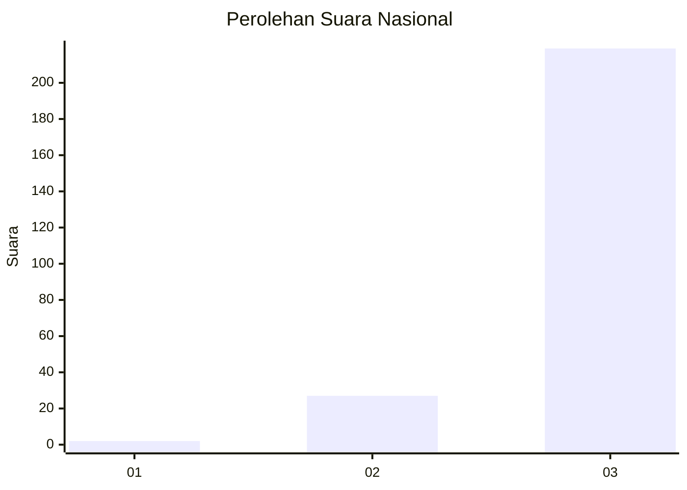
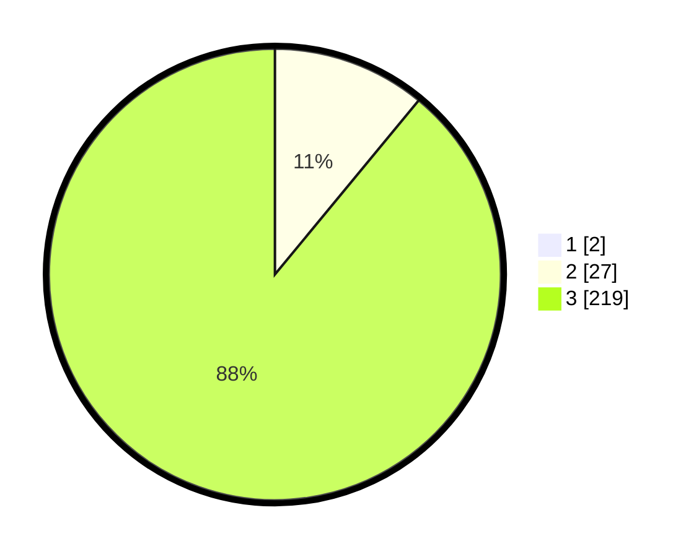

# Hasil

## Grafik

## Tabel

| No. | Nama Paslon    | Suara | Suara (raw) | Persentase |
|:--- |:-------------- | -----:| -----------:| ----------:|
| 1   | ANIES MUHAIMIN | 2     | [2][p-1]    | 0,81       |
| 2   | PRABOWO GIBRAN | 27    | [27][p-2]   | 10,89      |
| 3   | GANJAR MAHFUD  | 219   | [219][p-3]  | 88,31      |

[p-1]: https://github.com/gigit-pemilu/pemilu-2024/blob/main/pilpres/hitung-suara/sub/51-bali/sub/02-tabanan/sub/03-selemadeg-barat/sub/2011-bengkel-sari/sub/001-tps/sub/paslon-1.txt
[p-2]: https://github.com/gigit-pemilu/pemilu-2024/blob/main/pilpres/hitung-suara/sub/51-bali/sub/02-tabanan/sub/03-selemadeg-barat/sub/2011-bengkel-sari/sub/001-tps/sub/paslon-2.txt
[p-3]: https://github.com/gigit-pemilu/pemilu-2024/blob/main/pilpres/hitung-suara/sub/51-bali/sub/02-tabanan/sub/03-selemadeg-barat/sub/2011-bengkel-sari/sub/001-tps/sub/paslon-3.txt

## Foto C Plano

https://sirekap-obj-formc.kpu.go.id/f9e0/pemilu/ppwp/51/02/03/20/11/5102032011001-20240216-122824--c9fed348-b1d0-4333-a6fb-649d1f80b2be.jpg

https://sirekap-obj-formc.kpu.go.id/f9e0/pemilu/ppwp/51/02/03/20/11/5102032011001-20240214-204250--56d5d200-f795-4d8c-866b-39f522944c2d.jpg

https://sirekap-obj-formc.kpu.go.id/f9e0/pemilu/ppwp/51/02/03/20/11/5102032011001-20240214-204351--08af8642-51f7-4109-ab75-ab4a8f7e4e6a.jpg

## Metadata

| Key        | Value               |
| ---------- | ------------------- |
| Time Stamp | 2024-02-16 12:51:22 |

## DATA PEMILIH TETAP

Jumlah pemilih dalam DPT: **294**.
 * L: **144**.
 * P: **150**.

## DATA PENGGUNA HAK PILIH

Jumlah pengguna hak pilih dalam DPT: **243**.
 * L: **122**.
 * P: **121**.

Jumlah pengguna hak pilih dalam DPTb: **0**.
 * L: **0**.
 * P: **0**.

Jumlah pengguna hak pilih dalam DPK: **6**.
 * L: **0**.
 * P: **6**.

Jumlah pengguna hak pilih: **249**.
 * L: **122**.
 * P: **127**.

## JUMLAH SUARA SAH DAN TIDAK SAH

JUMLAH SELURUH SUARA SAH: **248**.

JUMLAH SUARA TIDAK SAH: **1**.

JUMLAH SELURUH SUARA SAH DAN SUARA TIDAK SAH: **249**.

