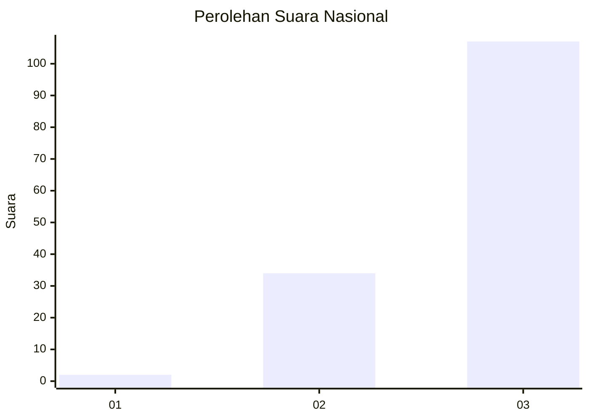
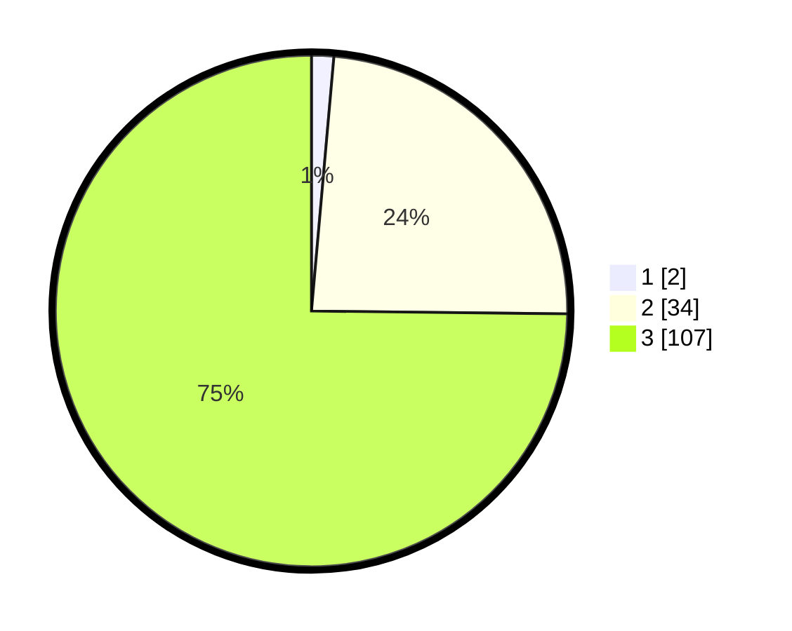

# Hasil

## Grafik

## Tabel

| No. | Nama Paslon    | Suara | Suara (raw) | Persentase |
|:--- |:-------------- | -----:| -----------:| ----------:|
| 1   | ANIES MUHAIMIN | 2     | [2][p-1]    | 1,40       |
| 2   | PRABOWO GIBRAN | 34    | [34][p-2]   | 23,78      |
| 3   | GANJAR MAHFUD  | 107   | [107][p-3]  | 74,83      |

[p-1]: https://github.com/gigit-pemilu/pemilu-2024/blob/main/pilpres/hitung-suara/sub/51-bali/sub/02-tabanan/sub/03-selemadeg-barat/sub/2011-bengkel-sari/sub/003-tps/sub/paslon-1.txt
[p-2]: https://github.com/gigit-pemilu/pemilu-2024/blob/main/pilpres/hitung-suara/sub/51-bali/sub/02-tabanan/sub/03-selemadeg-barat/sub/2011-bengkel-sari/sub/003-tps/sub/paslon-2.txt
[p-3]: https://github.com/gigit-pemilu/pemilu-2024/blob/main/pilpres/hitung-suara/sub/51-bali/sub/02-tabanan/sub/03-selemadeg-barat/sub/2011-bengkel-sari/sub/003-tps/sub/paslon-3.txt

## Foto C Plano

https://sirekap-obj-formc.kpu.go.id/767f/pemilu/ppwp/51/02/03/20/11/5102032011003-20240215-210426--75f079d6-eb73-40bb-8979-335480c3b1a2.jpg

https://sirekap-obj-formc.kpu.go.id/767f/pemilu/ppwp/51/02/03/20/11/5102032011003-20240215-210428--19c0bdbd-43fa-41cb-b9af-7cc4f4219d01.jpg

https://sirekap-obj-formc.kpu.go.id/767f/pemilu/ppwp/51/02/03/20/11/5102032011003-20240215-210427--be175e3e-b8b2-4e47-8ba6-750bc59016dc.jpg

## Metadata

| Key        | Value               |
| ---------- | ------------------- |
| Time Stamp | 2024-02-15 22:00:27 |

## DATA PEMILIH TETAP

Jumlah pemilih dalam DPT: **165**.
 * L: **79**.
 * P: **86**.

## DATA PENGGUNA HAK PILIH

Jumlah pengguna hak pilih dalam DPT: **144**.
 * L: **72**.
 * P: **72**.

Jumlah pengguna hak pilih dalam DPTb: **0**.
 * L: **0**.
 * P: **0**.

Jumlah pengguna hak pilih dalam DPK: **0**.
 * L: **0**.
 * P: **0**.

Jumlah pengguna hak pilih: **144**.
 * L: **72**.
 * P: **72**.

## JUMLAH SUARA SAH DAN TIDAK SAH

JUMLAH SELURUH SUARA SAH: **143**.

JUMLAH SUARA TIDAK SAH: **1**.

JUMLAH SELURUH SUARA SAH DAN SUARA TIDAK SAH: **144**.

