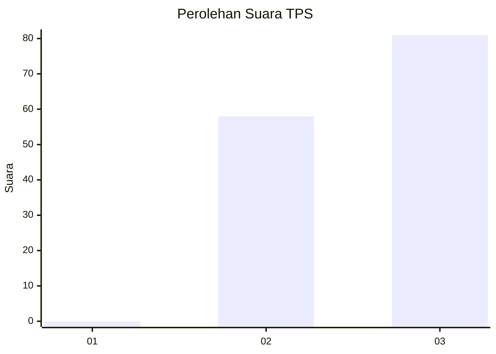
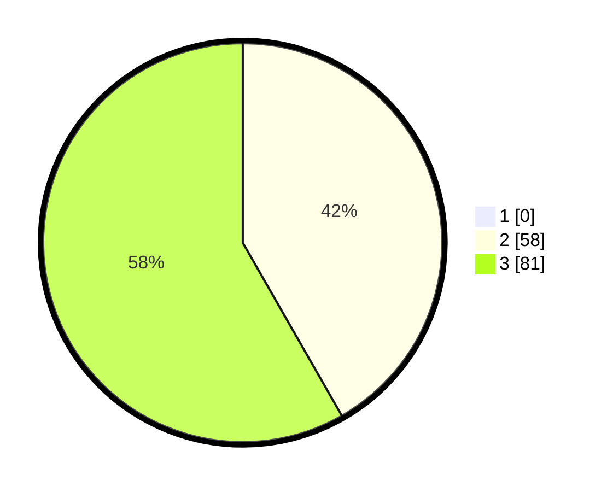

# Hasil

## Grafik

## Tabel

| No. | Nama Paslon    | Suara | Suara (raw) | Persentase |
|:--- |:-------------- | -----:| -----------:| ----------:|
| 1   | ANIES MUHAIMIN | 0     | [0][p-1]    | 0,00       |
| 2   | PRABOWO GIBRAN | 58    | [58][p-2]   | 41,73      |
| 3   | GANJAR MAHFUD  | 81    | [81][p-3]   | 58,27      |

[p-1]: https://github.com/gigit-pemilu/pemilu-2024-51-bali/blob/main/pilpres/hitung-suara/sub/51-bali/sub/02-tabanan/sub/03-selemadeg-barat/sub/2011-bengkel-sari/sub/004-tps/sub/paslon-1.txt
[p-2]: https://github.com/gigit-pemilu/pemilu-2024-51-bali/blob/main/pilpres/hitung-suara/sub/51-bali/sub/02-tabanan/sub/03-selemadeg-barat/sub/2011-bengkel-sari/sub/004-tps/sub/paslon-2.txt
[p-3]: https://github.com/gigit-pemilu/pemilu-2024-51-bali/blob/main/pilpres/hitung-suara/sub/51-bali/sub/02-tabanan/sub/03-selemadeg-barat/sub/2011-bengkel-sari/sub/004-tps/sub/paslon-3.txt

## Foto C Plano

https://sirekap-obj-formc.kpu.go.id/7291/pemilu/ppwp/51/02/03/20/11/5102032011004-20240216-002815--512d76da-f4a6-4790-adf7-6f639fafae33.jpg

https://sirekap-obj-formc.kpu.go.id/7291/pemilu/ppwp/51/02/03/20/11/5102032011004-20240216-002816--3ffbdce0-33a1-4c8c-bb84-3b37a46e4750.jpg

https://sirekap-obj-formc.kpu.go.id/7291/pemilu/ppwp/51/02/03/20/11/5102032011004-20240216-002816--3d574fce-01b9-4a15-b794-a45931396422.jpg

## Metadata

| Key        | Value               |
| ---------- | ------------------- |
| Time Stamp | 2024-02-16 10:30:29 |

## DATA PEMILIH TETAP

Jumlah pemilih dalam DPT: **149**.
 * L: **70**.
 * P: **79**.

## DATA PENGGUNA HAK PILIH

Jumlah pengguna hak pilih dalam DPT: **139**.
 * L: **64**.
 * P: **75**.

Jumlah pengguna hak pilih dalam DPTb: **0**.
 * L: **0**.
 * P: **0**.

Jumlah pengguna hak pilih dalam DPK: **0**.
 * L: **0**.
 * P: **0**.

Jumlah pengguna hak pilih: **139**.
 * L: **64**.
 * P: **75**.

## JUMLAH SUARA SAH DAN TIDAK SAH

JUMLAH SELURUH SUARA SAH: **139**.

JUMLAH SUARA TIDAK SAH: **0**.

JUMLAH SELURUH SUARA SAH DAN SUARA TIDAK SAH: **139**.

