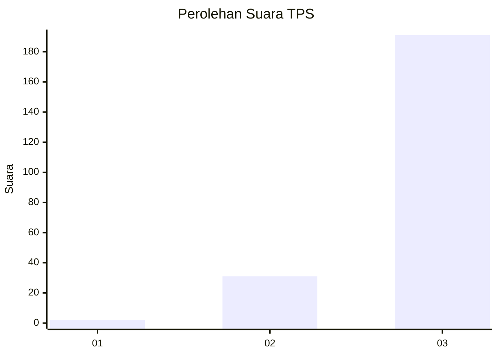
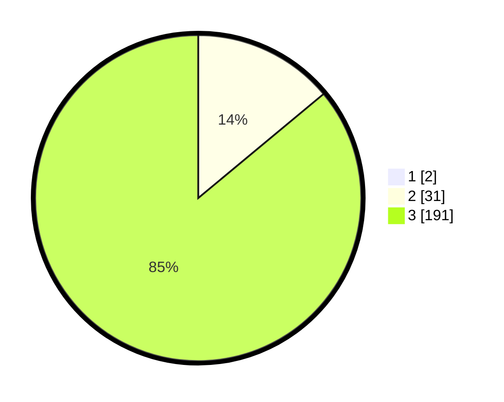

# Hasil

## Grafik

## Tabel

| No. | Nama Paslon    | Suara | Suara (raw) | Persentase |
|:--- |:-------------- | -----:| -----------:| ----------:|
| 1   | ANIES MUHAIMIN | 2     | [2][p-1]    | 0,89       |
| 2   | PRABOWO GIBRAN | 31    | [31][p-2]   | 13,84      |
| 3   | GANJAR MAHFUD  | 191   | [191][p-3]  | 85,27      |

[p-1]: https://github.com/gigit-pemilu/pemilu-2024-51-bali/blob/main/pilpres/hitung-suara/sub/51-bali/sub/02-tabanan/sub/03-selemadeg-barat/sub/2011-bengkel-sari/sub/005-tps/sub/paslon-1.txt
[p-2]: https://github.com/gigit-pemilu/pemilu-2024-51-bali/blob/main/pilpres/hitung-suara/sub/51-bali/sub/02-tabanan/sub/03-selemadeg-barat/sub/2011-bengkel-sari/sub/005-tps/sub/paslon-2.txt
[p-3]: https://github.com/gigit-pemilu/pemilu-2024-51-bali/blob/main/pilpres/hitung-suara/sub/51-bali/sub/02-tabanan/sub/03-selemadeg-barat/sub/2011-bengkel-sari/sub/005-tps/sub/paslon-3.txt

## Foto C Plano

https://sirekap-obj-formc.kpu.go.id/9cdd/pemilu/ppwp/51/02/03/20/11/5102032011005-20240216-124515--e6739088-2267-4d02-81a1-50e243f02fe1.jpg

https://sirekap-obj-formc.kpu.go.id/9cdd/pemilu/ppwp/51/02/03/20/11/5102032011005-20240216-124519--9a23a5d4-ec7c-415f-af08-410929bd1dbb.jpg

https://sirekap-obj-formc.kpu.go.id/9cdd/pemilu/ppwp/51/02/03/20/11/5102032011005-20240216-124517--14d218ff-1fa1-49f7-b0fa-88d940e1af0c.jpg

## Metadata

| Key        | Value               |
| ---------- | ------------------- |
| Time Stamp | 2024-02-16 14:00:34 |

## DATA PEMILIH TETAP

Jumlah pemilih dalam DPT: **268**.
 * L: **131**.
 * P: **137**.

## DATA PENGGUNA HAK PILIH

Jumlah pengguna hak pilih dalam DPT: **227**.
 * L: **112**.
 * P: **115**.

Jumlah pengguna hak pilih dalam DPTb: **0**.
 * L: **0**.
 * P: **0**.

Jumlah pengguna hak pilih dalam DPK: **0**.
 * L: **0**.
 * P: **0**.

Jumlah pengguna hak pilih: **227**.
 * L: **112**.
 * P: **115**.

## JUMLAH SUARA SAH DAN TIDAK SAH

JUMLAH SELURUH SUARA SAH: **225**.

JUMLAH SUARA TIDAK SAH: **2**.

JUMLAH SELURUH SUARA SAH DAN SUARA TIDAK SAH: **227**.

