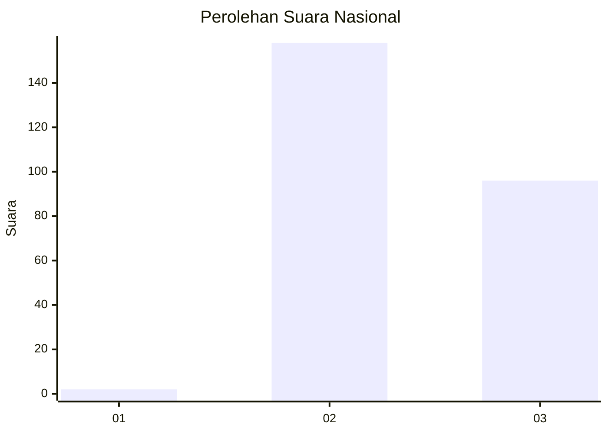
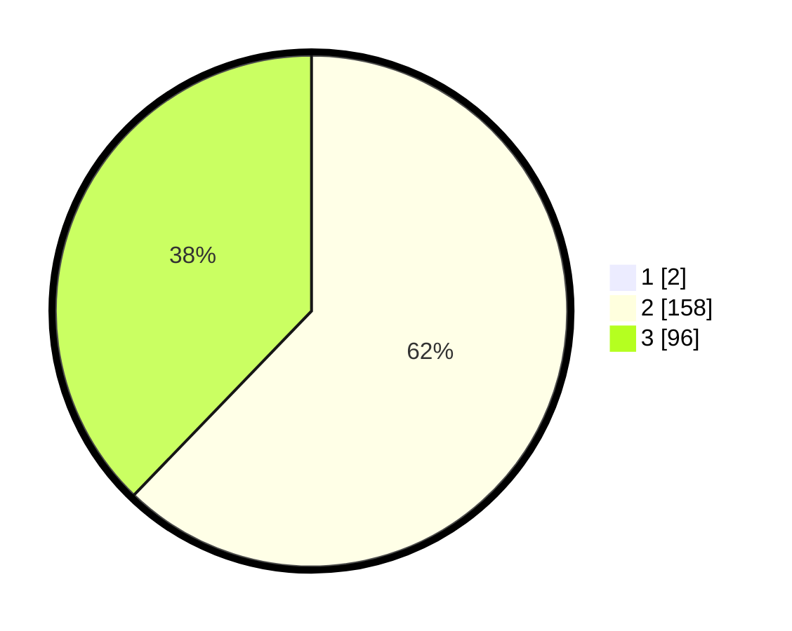

# Hasil

## Grafik

## Tabel

| No. | Nama Paslon    | Suara | Suara (raw) | Persentase |
|:--- |:-------------- | -----:| -----------:| ----------:|
| 1   | ANIES MUHAIMIN | 2     | [2][p-1]    | 0,78       |
| 2   | PRABOWO GIBRAN | 158   | [158][p-2]  | 61,72      |
| 3   | GANJAR MAHFUD  | 96    | [96][p-3]   | 37,50      |

[p-1]: https://github.com/gigit-pemilu/pemilu-2024/blob/main/pilpres/hitung-suara/sub/51-bali/sub/02-tabanan/sub/04-kerambitan/sub/2001-tibubiu/sub/002-tps/sub/paslon-1.txt
[p-2]: https://github.com/gigit-pemilu/pemilu-2024/blob/main/pilpres/hitung-suara/sub/51-bali/sub/02-tabanan/sub/04-kerambitan/sub/2001-tibubiu/sub/002-tps/sub/paslon-2.txt
[p-3]: https://github.com/gigit-pemilu/pemilu-2024/blob/main/pilpres/hitung-suara/sub/51-bali/sub/02-tabanan/sub/04-kerambitan/sub/2001-tibubiu/sub/002-tps/sub/paslon-3.txt

## Foto C Plano

https://sirekap-obj-formc.kpu.go.id/5386/pemilu/ppwp/51/02/04/20/01/5102042001002-20240214-155052--67be53fb-9b20-4cca-993c-c84f0806e6ac.jpg

https://sirekap-obj-formc.kpu.go.id/5386/pemilu/ppwp/51/02/04/20/01/5102042001002-20240214-141301--adbd8445-3799-42ae-a7ee-274035356865.jpg

https://sirekap-obj-formc.kpu.go.id/5386/pemilu/ppwp/51/02/04/20/01/5102042001002-20240214-140959--041f8f3b-ea28-47c0-a7dd-e3bbdd0465d6.jpg

## Metadata

| Key        | Value               |
| ---------- | ------------------- |
| Time Stamp | 2024-02-14 21:46:01 |

## DATA PEMILIH TETAP

Jumlah pemilih dalam DPT: **287**.
 * L: **139**.
 * P: **148**.

## DATA PENGGUNA HAK PILIH

Jumlah pengguna hak pilih dalam DPT: **258**.
 * L: **123**.
 * P: **135**.

Jumlah pengguna hak pilih dalam DPTb: **0**.
 * L: **0**.
 * P: **0**.

Jumlah pengguna hak pilih dalam DPK: **0**.
 * L: **0**.
 * P: **0**.

Jumlah pengguna hak pilih: **258**.
 * L: **123**.
 * P: **135**.

## JUMLAH SUARA SAH DAN TIDAK SAH

JUMLAH SELURUH SUARA SAH: **256**.

JUMLAH SUARA TIDAK SAH: **3**.

JUMLAH SELURUH SUARA SAH DAN SUARA TIDAK SAH: **259**.

