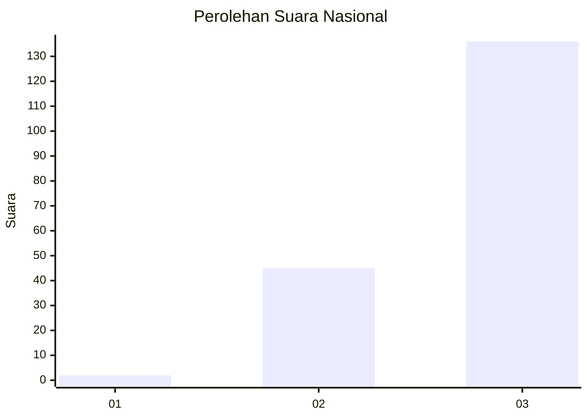
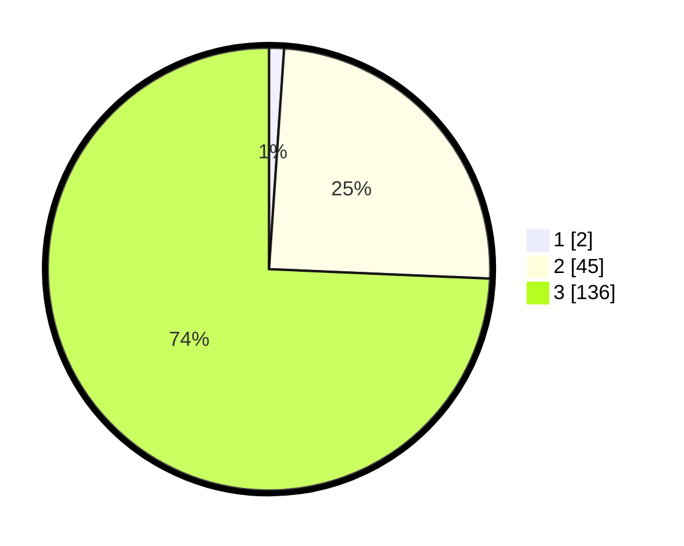

# Hasil

## Grafik

## Tabel

| No. | Nama Paslon    | Suara | Suara (raw) | Persentase |
|:--- |:-------------- | -----:| -----------:| ----------:|
| 1   | ANIES MUHAIMIN | 2     | [2][p-1]    | 1,09       |
| 2   | PRABOWO GIBRAN | 45    | [45][p-2]   | 24,59      |
| 3   | GANJAR MAHFUD  | 136   | [136][p-3]  | 74,32      |

[p-1]: https://github.com/gigit-pemilu/pemilu-2024/blob/main/pilpres/hitung-suara/sub/51-bali/sub/02-tabanan/sub/04-kerambitan/sub/2001-tibubiu/sub/003-tps/sub/paslon-1.txt
[p-2]: https://github.com/gigit-pemilu/pemilu-2024/blob/main/pilpres/hitung-suara/sub/51-bali/sub/02-tabanan/sub/04-kerambitan/sub/2001-tibubiu/sub/003-tps/sub/paslon-2.txt
[p-3]: https://github.com/gigit-pemilu/pemilu-2024/blob/main/pilpres/hitung-suara/sub/51-bali/sub/02-tabanan/sub/04-kerambitan/sub/2001-tibubiu/sub/003-tps/sub/paslon-3.txt

## Foto C Plano

https://sirekap-obj-formc.kpu.go.id/5f4f/pemilu/ppwp/51/02/04/20/01/5102042001003-20240216-110224--35af967d-b360-47fd-b194-0434b6f76fb4.jpg

https://sirekap-obj-formc.kpu.go.id/5f4f/pemilu/ppwp/51/02/04/20/01/5102042001003-20240216-110231--800fda17-c407-4a70-b030-4a49dcbc6a5c.jpg

https://sirekap-obj-formc.kpu.go.id/5f4f/pemilu/ppwp/51/02/04/20/01/5102042001003-20240216-110234--d9eaf8f5-1f4a-4079-9051-934d50a816c6.jpg

## Metadata

| Key        | Value               |
| ---------- | ------------------- |
| Time Stamp | 2024-02-16 12:51:22 |

## DATA PEMILIH TETAP

Jumlah pemilih dalam DPT: **191**.
 * L: **89**.
 * P: **102**.

## DATA PENGGUNA HAK PILIH

Jumlah pengguna hak pilih dalam DPT: **180**.
 * L: **83**.
 * P: **97**.

Jumlah pengguna hak pilih dalam DPTb: **4**.
 * L: **2**.
 * P: **2**.

Jumlah pengguna hak pilih dalam DPK: **0**.
 * L: **0**.
 * P: **0**.

Jumlah pengguna hak pilih: **184**.
 * L: **85**.
 * P: **99**.

## JUMLAH SUARA SAH DAN TIDAK SAH

JUMLAH SELURUH SUARA SAH: **183**.

JUMLAH SUARA TIDAK SAH: **1**.

JUMLAH SELURUH SUARA SAH DAN SUARA TIDAK SAH: **184**.

