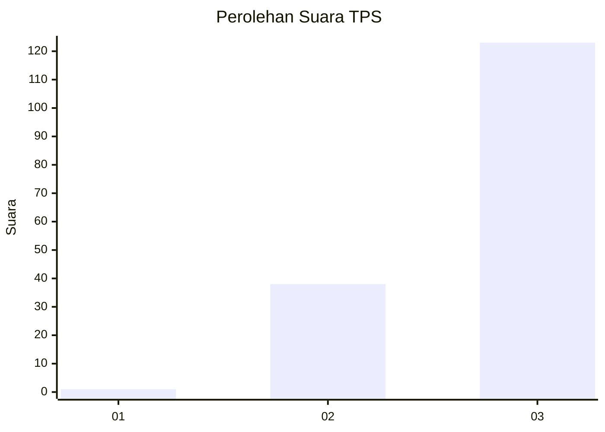
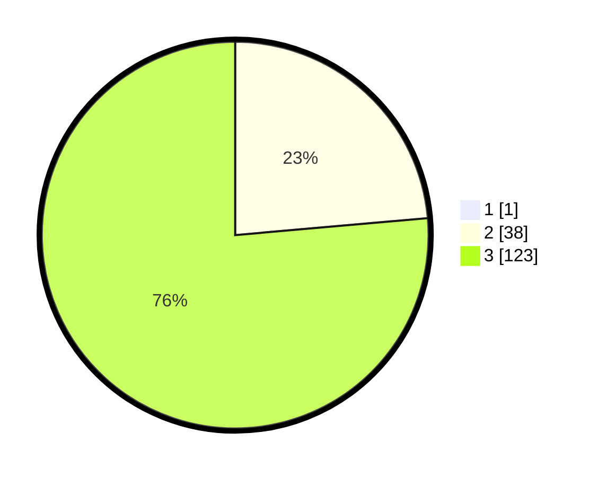

# Hasil

## Grafik

## Tabel

| No. | Nama Paslon    | Suara | Suara (raw) | Persentase |
|:--- |:-------------- | -----:| -----------:| ----------:|
| 1   | ANIES MUHAIMIN | 1     | [1][p-1]    | 0,62       |
| 2   | PRABOWO GIBRAN | 38    | [38][p-2]   | 23,46      |
| 3   | GANJAR MAHFUD  | 123   | [123][p-3]  | 75,93      |

[p-1]: https://github.com/gigit-pemilu/pemilu-2024-51-bali/blob/main/pilpres/hitung-suara/sub/51-bali/sub/02-tabanan/sub/04-kerambitan/sub/2001-tibubiu/sub/004-tps/sub/paslon-1.txt
[p-2]: https://github.com/gigit-pemilu/pemilu-2024-51-bali/blob/main/pilpres/hitung-suara/sub/51-bali/sub/02-tabanan/sub/04-kerambitan/sub/2001-tibubiu/sub/004-tps/sub/paslon-2.txt
[p-3]: https://github.com/gigit-pemilu/pemilu-2024-51-bali/blob/main/pilpres/hitung-suara/sub/51-bali/sub/02-tabanan/sub/04-kerambitan/sub/2001-tibubiu/sub/004-tps/sub/paslon-3.txt

## Foto C Plano

https://sirekap-obj-formc.kpu.go.id/3da1/pemilu/ppwp/51/02/04/20/01/5102042001004-20240214-205834--72dcde62-2fe9-42c9-a7c7-9b70ecc26138.jpg

https://sirekap-obj-formc.kpu.go.id/3da1/pemilu/ppwp/51/02/04/20/01/5102042001004-20240214-205845--b1342b29-8c91-4107-9903-d71626080386.jpg

https://sirekap-obj-formc.kpu.go.id/3da1/pemilu/ppwp/51/02/04/20/01/5102042001004-20240214-205858--56e419ba-50c7-4092-872d-91176b50b70e.jpg

## Metadata

| Key        | Value               |
| ---------- | ------------------- |
| Time Stamp | 2024-02-15 23:29:50 |

## DATA PEMILIH TETAP

Jumlah pemilih dalam DPT: **189**.
 * L: **96**.
 * P: **93**.

## DATA PENGGUNA HAK PILIH

Jumlah pengguna hak pilih dalam DPT: **164**.
 * L: **85**.
 * P: **79**.

Jumlah pengguna hak pilih dalam DPTb: **1**.
 * L: **0**.
 * P: **1**.

Jumlah pengguna hak pilih dalam DPK: **0**.
 * L: **0**.
 * P: **0**.

Jumlah pengguna hak pilih: **165**.
 * L: **85**.
 * P: **80**.

## JUMLAH SUARA SAH DAN TIDAK SAH

JUMLAH SELURUH SUARA SAH: **162**.

JUMLAH SUARA TIDAK SAH: **3**.

JUMLAH SELURUH SUARA SAH DAN SUARA TIDAK SAH: **165**.

