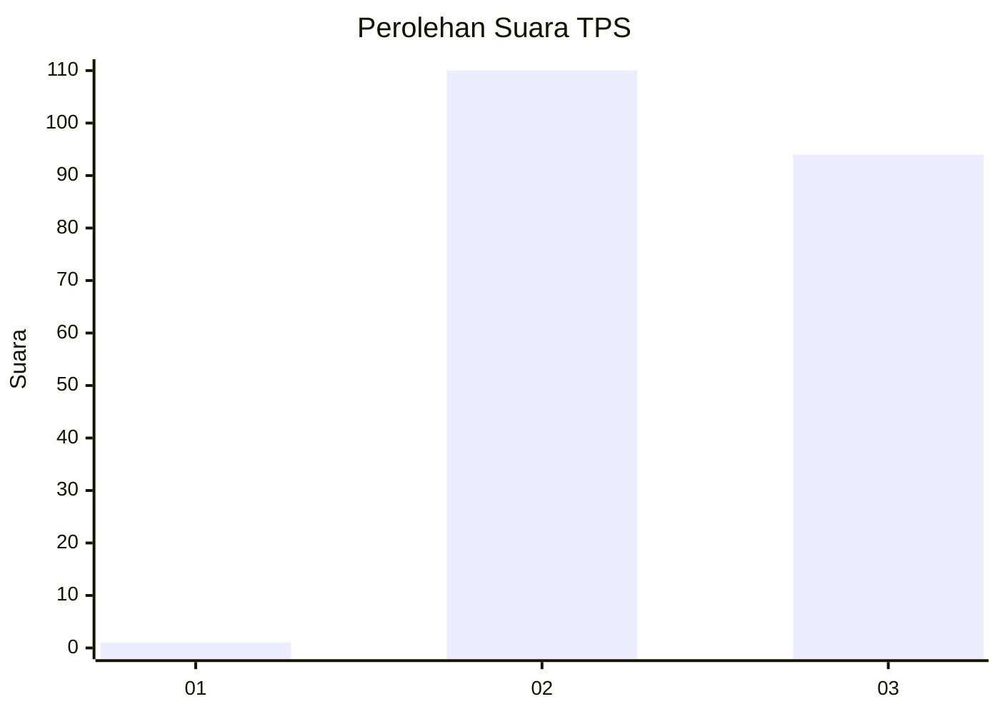
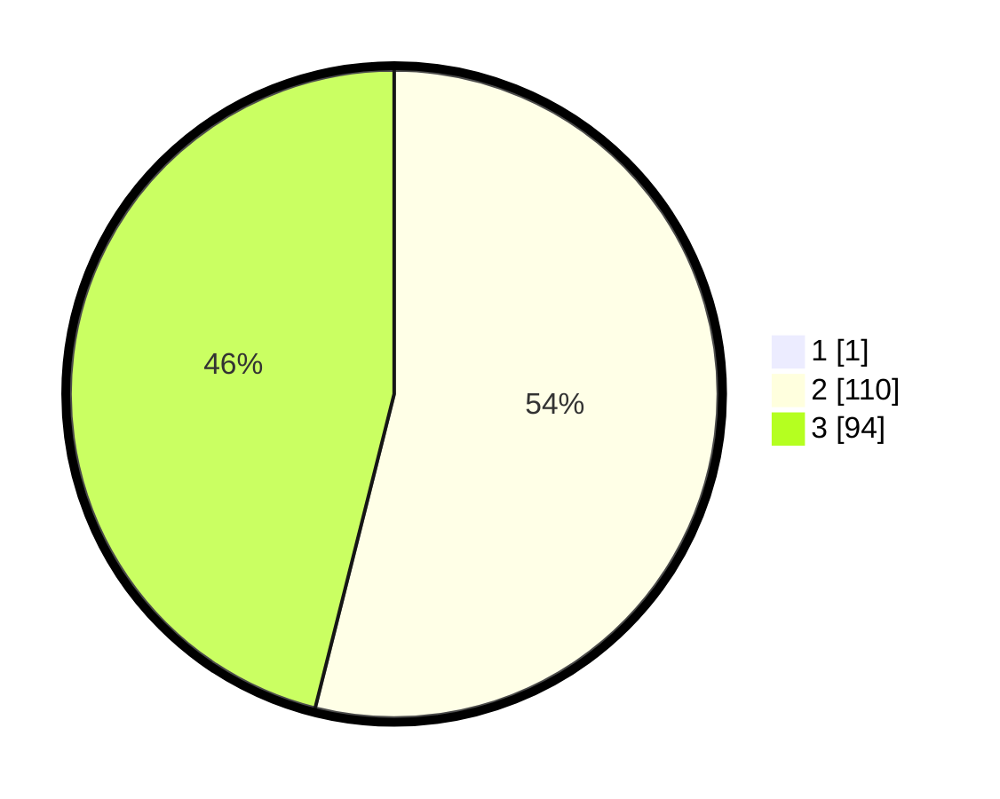

# Hasil

## Grafik

## Tabel

| No. | Nama Paslon    | Suara | Suara (raw) | Persentase |
|:--- |:-------------- | -----:| -----------:| ----------:|
| 1   | ANIES MUHAIMIN | 1     | [1][p-1]    | 0,49       |
| 2   | PRABOWO GIBRAN | 110   | [110][p-2]  | 53,66      |
| 3   | GANJAR MAHFUD  | 94    | [94][p-3]   | 45,85      |

[p-1]: https://github.com/gigit-pemilu/pemilu-2024-51-bali/blob/main/pilpres/hitung-suara/sub/51-bali/sub/02-tabanan/sub/04-kerambitan/sub/2001-tibubiu/sub/005-tps/sub/paslon-1.txt
[p-2]: https://github.com/gigit-pemilu/pemilu-2024-51-bali/blob/main/pilpres/hitung-suara/sub/51-bali/sub/02-tabanan/sub/04-kerambitan/sub/2001-tibubiu/sub/005-tps/sub/paslon-2.txt
[p-3]: https://github.com/gigit-pemilu/pemilu-2024-51-bali/blob/main/pilpres/hitung-suara/sub/51-bali/sub/02-tabanan/sub/04-kerambitan/sub/2001-tibubiu/sub/005-tps/sub/paslon-3.txt

## Foto C Plano

https://sirekap-obj-formc.kpu.go.id/d6a7/pemilu/ppwp/51/02/04/20/01/5102042001005-20240214-155122--9f505bad-f3f6-4ab5-a8a0-eb45797a7ad0.jpg

https://sirekap-obj-formc.kpu.go.id/d6a7/pemilu/ppwp/51/02/04/20/01/5102042001005-20240214-155131--aeb9a865-2425-4309-bd1e-e5c90adea94a.jpg

https://sirekap-obj-formc.kpu.go.id/d6a7/pemilu/ppwp/51/02/04/20/01/5102042001005-20240214-155137--002c1edb-9d89-498e-a80a-b1b788424372.jpg

## Metadata

| Key        | Value               |
| ---------- | ------------------- |
| Time Stamp | 2024-02-14 21:46:01 |

## DATA PEMILIH TETAP

Jumlah pemilih dalam DPT: **219**.
 * L: **111**.
 * P: **108**.

## DATA PENGGUNA HAK PILIH

Jumlah pengguna hak pilih dalam DPT: **205**.
 * L: **102**.
 * P: **103**.

Jumlah pengguna hak pilih dalam DPTb: **0**.
 * L: **0**.
 * P: **0**.

Jumlah pengguna hak pilih dalam DPK: **0**.
 * L: **0**.
 * P: **0**.

Jumlah pengguna hak pilih: **205**.
 * L: **102**.
 * P: **103**.

## JUMLAH SUARA SAH DAN TIDAK SAH

JUMLAH SELURUH SUARA SAH: **205**.

JUMLAH SUARA TIDAK SAH: **0**.

JUMLAH SELURUH SUARA SAH DAN SUARA TIDAK SAH: **205**.

