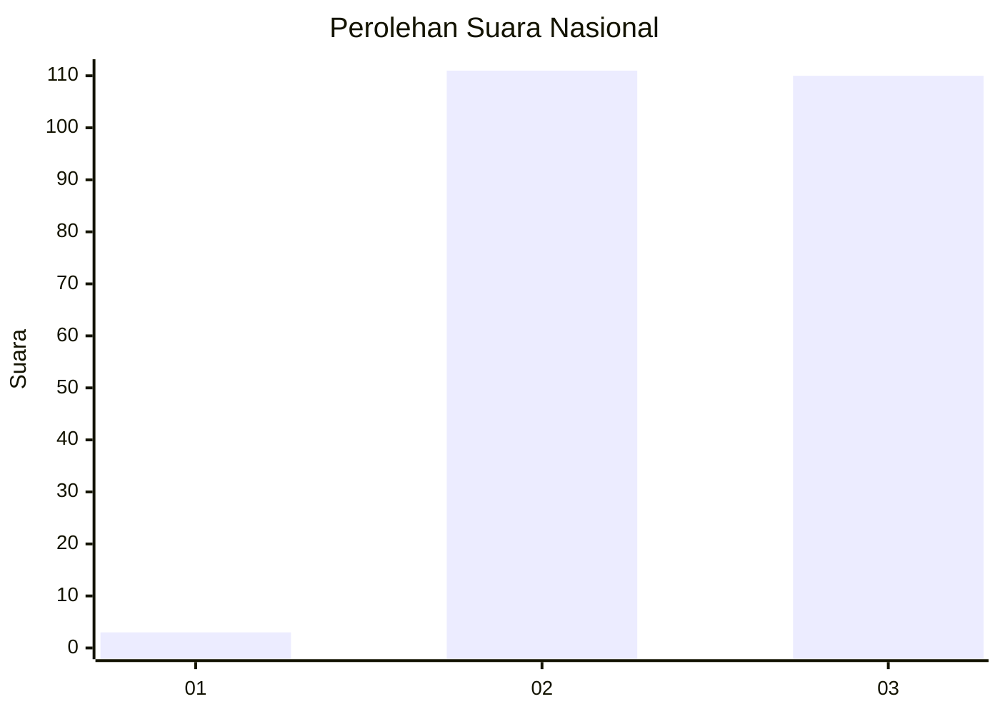
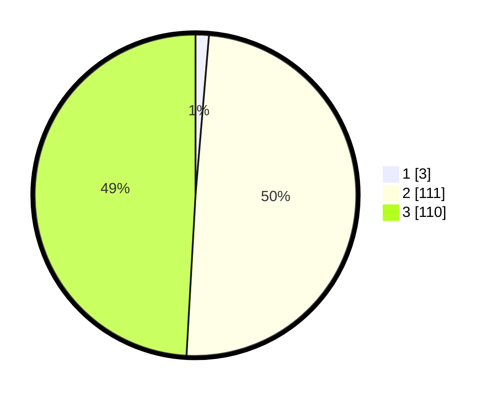

# Hasil

## Grafik

## Tabel

| No. | Nama Paslon    | Suara | Suara (raw) | Persentase |
|:--- |:-------------- | -----:| -----------:| ----------:|
| 1   | ANIES MUHAIMIN | 3     | [3][p-1]    | 1,34       |
| 2   | PRABOWO GIBRAN | 111   | [111][p-2]  | 49,55      |
| 3   | GANJAR MAHFUD  | 110   | [110][p-3]  | 49,11      |

[p-1]: https://github.com/gigit-pemilu/pemilu-2024/blob/main/pilpres/hitung-suara/sub/51-bali/sub/02-tabanan/sub/04-kerambitan/sub/2001-tibubiu/sub/006-tps/sub/paslon-1.txt
[p-2]: https://github.com/gigit-pemilu/pemilu-2024/blob/main/pilpres/hitung-suara/sub/51-bali/sub/02-tabanan/sub/04-kerambitan/sub/2001-tibubiu/sub/006-tps/sub/paslon-2.txt
[p-3]: https://github.com/gigit-pemilu/pemilu-2024/blob/main/pilpres/hitung-suara/sub/51-bali/sub/02-tabanan/sub/04-kerambitan/sub/2001-tibubiu/sub/006-tps/sub/paslon-3.txt

## Foto C Plano

https://sirekap-obj-formc.kpu.go.id/63f0/pemilu/ppwp/51/02/04/20/01/5102042001006-20240214-202035--2d083871-7b24-4793-b4a1-88b53eaa9d97.jpg

https://sirekap-obj-formc.kpu.go.id/63f0/pemilu/ppwp/51/02/04/20/01/5102042001006-20240214-202043--5bd2ad55-6f54-44a9-95fe-922856f6e008.jpg

https://sirekap-obj-formc.kpu.go.id/63f0/pemilu/ppwp/51/02/04/20/01/5102042001006-20240214-202046--1980dea3-e895-4987-8478-2fa599e9da43.jpg

## Metadata

| Key        | Value               |
| ---------- | ------------------- |
| Time Stamp | 2024-02-15 22:00:27 |

## DATA PEMILIH TETAP

Jumlah pemilih dalam DPT: **229**.
 * L: **111**.
 * P: **118**.

## DATA PENGGUNA HAK PILIH

Jumlah pengguna hak pilih dalam DPT: **222**.
 * L: **109**.
 * P: **113**.

Jumlah pengguna hak pilih dalam DPTb: **5**.
 * L: **3**.
 * P: **2**.

Jumlah pengguna hak pilih dalam DPK: **0**.
 * L: **0**.
 * P: **0**.

Jumlah pengguna hak pilih: **227**.
 * L: **112**.
 * P: **115**.

## JUMLAH SUARA SAH DAN TIDAK SAH

JUMLAH SELURUH SUARA SAH: **224**.

JUMLAH SUARA TIDAK SAH: **3**.

JUMLAH SELURUH SUARA SAH DAN SUARA TIDAK SAH: **227**.

