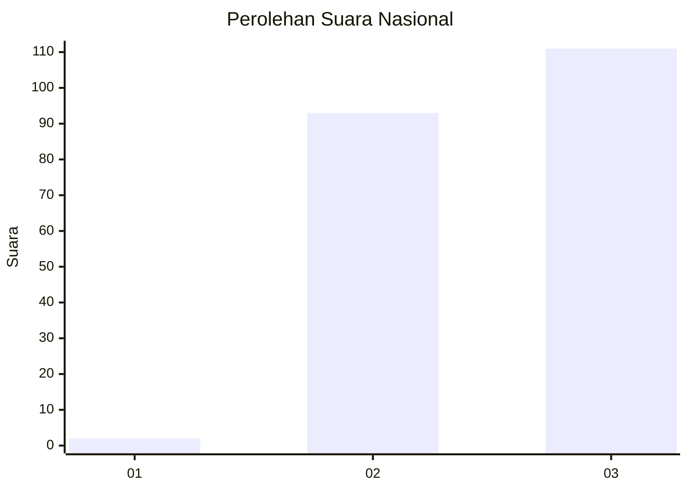
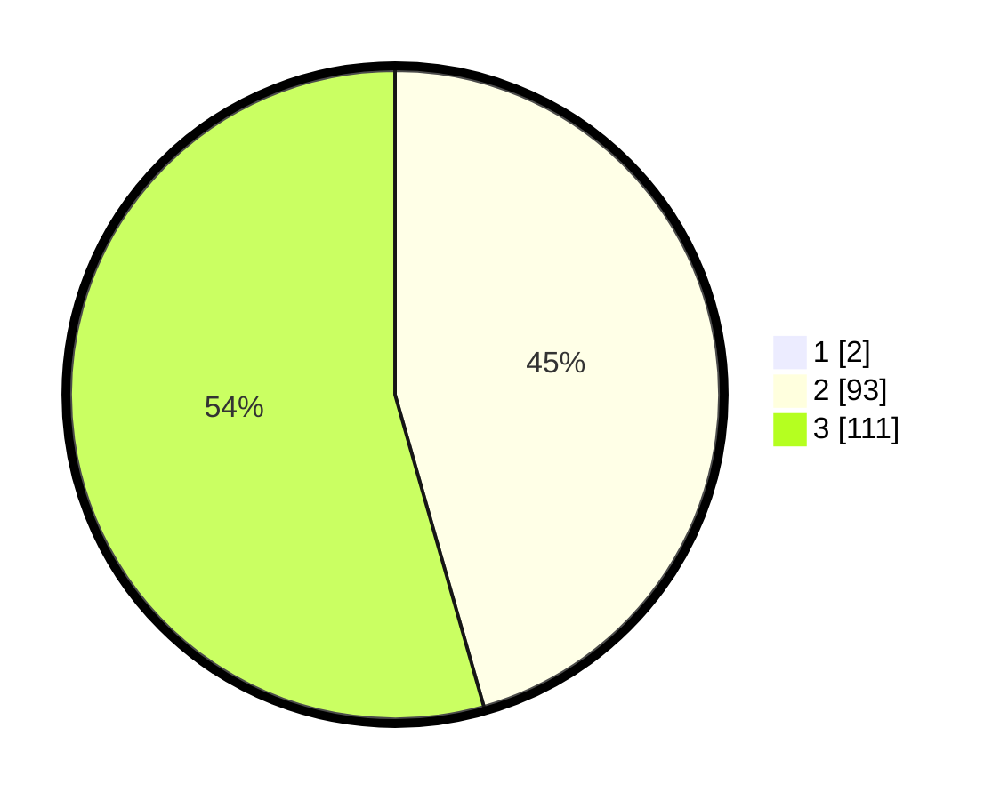

# Hasil

## Grafik

## Tabel

| No. | Nama Paslon    | Suara | Suara (raw) | Persentase |
|:--- |:-------------- | -----:| -----------:| ----------:|
| 1   | ANIES MUHAIMIN | 2     | [2][p-1]    | 0,97       |
| 2   | PRABOWO GIBRAN | 93    | [93][p-2]   | 45,15      |
| 3   | GANJAR MAHFUD  | 111   | [111][p-3]  | 53,88      |

[p-1]: https://github.com/gigit-pemilu/pemilu-2024/blob/main/pilpres/hitung-suara/sub/51-bali/sub/02-tabanan/sub/04-kerambitan/sub/2002-kelating/sub/003-tps/sub/paslon-1.txt
[p-2]: https://github.com/gigit-pemilu/pemilu-2024/blob/main/pilpres/hitung-suara/sub/51-bali/sub/02-tabanan/sub/04-kerambitan/sub/2002-kelating/sub/003-tps/sub/paslon-2.txt
[p-3]: https://github.com/gigit-pemilu/pemilu-2024/blob/main/pilpres/hitung-suara/sub/51-bali/sub/02-tabanan/sub/04-kerambitan/sub/2002-kelating/sub/003-tps/sub/paslon-3.txt

## Foto C Plano

https://sirekap-obj-formc.kpu.go.id/f6cf/pemilu/ppwp/51/02/04/20/02/5102042002003-20240215-014615--ba0eeb9b-38fc-424e-ba37-93764109feb0.jpg

https://sirekap-obj-formc.kpu.go.id/f6cf/pemilu/ppwp/51/02/04/20/02/5102042002003-20240215-014722--8fba34e2-c972-49a0-bbe7-6e4c27ed97d1.jpg

https://sirekap-obj-formc.kpu.go.id/f6cf/pemilu/ppwp/51/02/04/20/02/5102042002003-20240215-014825--e39fce9f-5f5d-43d9-ba4f-352b56fb8e52.jpg

## Metadata

| Key        | Value               |
| ---------- | ------------------- |
| Time Stamp | 2024-02-15 22:00:27 |

