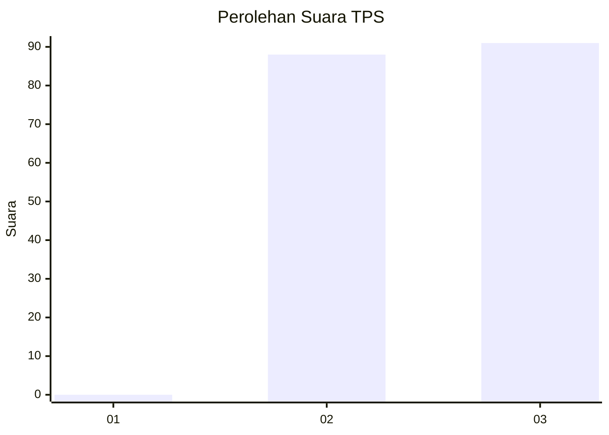
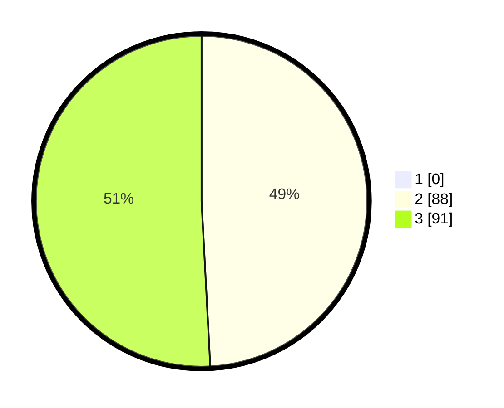

# Hasil

## Grafik

## Tabel

| No. | Nama Paslon    | Suara | Suara (raw) | Persentase |
|:--- |:-------------- | -----:| -----------:| ----------:|
| 1   | ANIES MUHAIMIN | 0     | [0][p-1]    | 0,00       |
| 2   | PRABOWO GIBRAN | 88    | [88][p-2]   | 49,16      |
| 3   | GANJAR MAHFUD  | 91    | [91][p-3]   | 50,84      |

[p-1]: https://github.com/gigit-pemilu/pemilu-2024-51-bali/blob/main/pilpres/hitung-suara/sub/51-bali/sub/02-tabanan/sub/04-kerambitan/sub/2002-kelating/sub/007-tps/sub/paslon-1.txt
[p-2]: https://github.com/gigit-pemilu/pemilu-2024-51-bali/blob/main/pilpres/hitung-suara/sub/51-bali/sub/02-tabanan/sub/04-kerambitan/sub/2002-kelating/sub/007-tps/sub/paslon-2.txt
[p-3]: https://github.com/gigit-pemilu/pemilu-2024-51-bali/blob/main/pilpres/hitung-suara/sub/51-bali/sub/02-tabanan/sub/04-kerambitan/sub/2002-kelating/sub/007-tps/sub/paslon-3.txt

## Foto C Plano

https://sirekap-obj-formc.kpu.go.id/8210/pemilu/ppwp/51/02/04/20/02/5102042002007-20240214-131116--71718fd5-1f1f-4154-b91d-60fc25910d89.jpg

https://sirekap-obj-formc.kpu.go.id/8210/pemilu/ppwp/51/02/04/20/02/5102042002007-20240214-130827--7e22f9e8-539b-4785-8879-4da7c886c1fe.jpg

https://sirekap-obj-formc.kpu.go.id/8210/pemilu/ppwp/51/02/04/20/02/5102042002007-20240214-130945--63c0579b-d3e8-44d0-89b7-98dbb91f2725.jpg

## Metadata

| Key        | Value               |
| ---------- | ------------------- |
| Time Stamp | 2024-02-15 21:30:27 |

