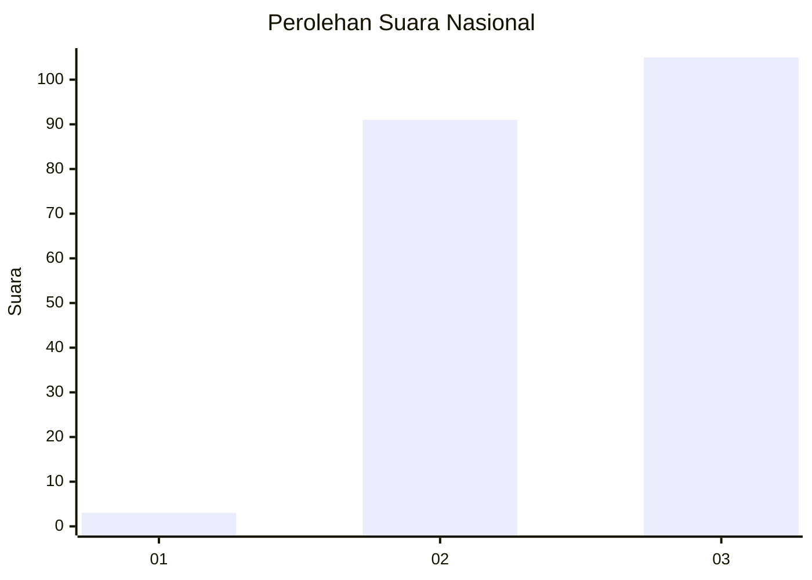
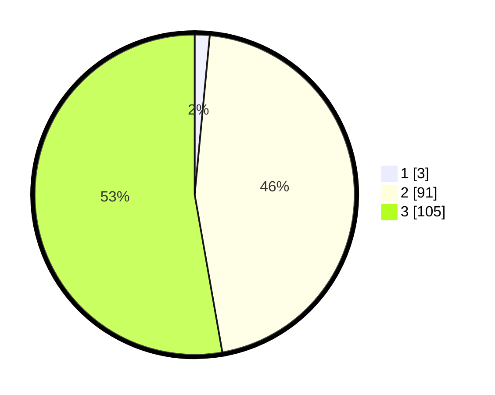

# Hasil

## Grafik

## Tabel

| No. | Nama Paslon    | Suara | Suara (raw) | Persentase |
|:--- |:-------------- | -----:| -----------:| ----------:|
| 1   | ANIES MUHAIMIN | 3     | [3][p-1]    | 1,51       |
| 2   | PRABOWO GIBRAN | 91    | [91][p-2]   | 45,73      |
| 3   | GANJAR MAHFUD  | 105   | [105][p-3]  | 52,76      |

[p-1]: https://github.com/gigit-pemilu/pemilu-2024/blob/main/pilpres/hitung-suara/sub/51-bali/sub/02-tabanan/sub/04-kerambitan/sub/2003-penarukan/sub/001-tps/sub/paslon-1.txt
[p-2]: https://github.com/gigit-pemilu/pemilu-2024/blob/main/pilpres/hitung-suara/sub/51-bali/sub/02-tabanan/sub/04-kerambitan/sub/2003-penarukan/sub/001-tps/sub/paslon-2.txt
[p-3]: https://github.com/gigit-pemilu/pemilu-2024/blob/main/pilpres/hitung-suara/sub/51-bali/sub/02-tabanan/sub/04-kerambitan/sub/2003-penarukan/sub/001-tps/sub/paslon-3.txt

## Foto C Plano

https://sirekap-obj-formc.kpu.go.id/5176/pemilu/ppwp/51/02/04/20/03/5102042003001-20240214-130643--be47e0cf-f39b-4694-83c9-d512c2423eaf.jpg

https://sirekap-obj-formc.kpu.go.id/5176/pemilu/ppwp/51/02/04/20/03/5102042003001-20240214-130851--ac960f9e-f2fa-4142-902e-0307ed28cee0.jpg

https://sirekap-obj-formc.kpu.go.id/5176/pemilu/ppwp/51/02/04/20/03/5102042003001-20240214-131054--605bd8ca-09c9-4f4b-a56e-1c693612c518.jpg

## Metadata

| Key        | Value               |
| ---------- | ------------------- |
| Time Stamp | 2024-02-14 21:46:01 |

## DATA PEMILIH TETAP

Jumlah pemilih dalam DPT: **239**.
 * L: **114**.
 * P: **125**.

## DATA PENGGUNA HAK PILIH

Jumlah pengguna hak pilih dalam DPT: **209**.
 * L: **96**.
 * P: **113**.

Jumlah pengguna hak pilih dalam DPTb: **0**.
 * L: **0**.
 * P: **0**.

Jumlah pengguna hak pilih dalam DPK: **1**.
 * L: **0**.
 * P: **1**.

Jumlah pengguna hak pilih: **210**.
 * L: **96**.
 * P: **114**.

## JUMLAH SUARA SAH DAN TIDAK SAH

JUMLAH SELURUH SUARA SAH: **199**.

JUMLAH SUARA TIDAK SAH: **11**.

JUMLAH SELURUH SUARA SAH DAN SUARA TIDAK SAH: **210**.

