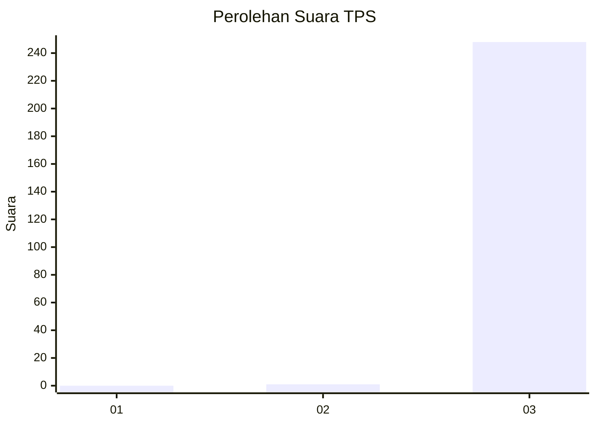
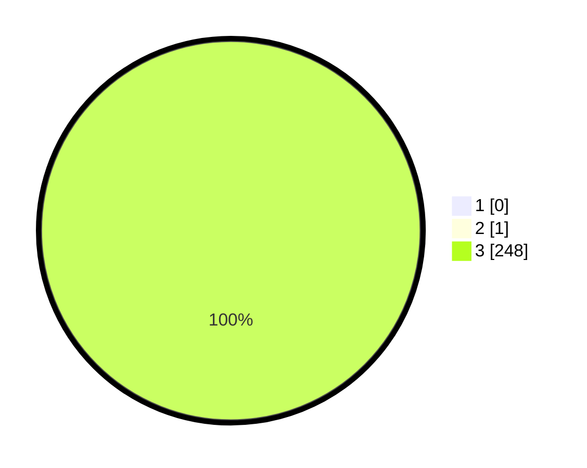

# Hasil

## Grafik

## Tabel

| No. | Nama Paslon    | Suara | Suara (raw) | Persentase |
|:--- |:-------------- | -----:| -----------:| ----------:|
| 1   | ANIES MUHAIMIN | 0     | [0][p-1]    | 0,00       |
| 2   | PRABOWO GIBRAN | 1     | [1][p-2]    | 0,40       |
| 3   | GANJAR MAHFUD  | 248   | [248][p-3]  | 99,60      |

[p-1]: https://github.com/gigit-pemilu/pemilu-2024-51-bali/blob/main/pilpres/hitung-suara/sub/51-bali/sub/02-tabanan/sub/04-kerambitan/sub/2003-penarukan/sub/004-tps/sub/paslon-1.txt
[p-2]: https://github.com/gigit-pemilu/pemilu-2024-51-bali/blob/main/pilpres/hitung-suara/sub/51-bali/sub/02-tabanan/sub/04-kerambitan/sub/2003-penarukan/sub/004-tps/sub/paslon-2.txt
[p-3]: https://github.com/gigit-pemilu/pemilu-2024-51-bali/blob/main/pilpres/hitung-suara/sub/51-bali/sub/02-tabanan/sub/04-kerambitan/sub/2003-penarukan/sub/004-tps/sub/paslon-3.txt

## Foto C Plano

https://sirekap-obj-formc.kpu.go.id/5553/pemilu/ppwp/51/02/04/20/03/5102042003004-20240214-131506--2b880c6c-caa4-48a8-87e6-6c4fa4214e14.jpg

https://sirekap-obj-formc.kpu.go.id/5553/pemilu/ppwp/51/02/04/20/03/5102042003004-20240214-131813--433a3630-bc5d-4eec-a715-2f6813a20fdb.jpg

https://sirekap-obj-formc.kpu.go.id/5553/pemilu/ppwp/51/02/04/20/03/5102042003004-20240214-131941--69b95df6-5157-4b7f-a1c2-1de1dd909c49.jpg

## Metadata

| Key        | Value               |
| ---------- | ------------------- |
| Time Stamp | 2024-02-14 21:46:01 |

## DATA PEMILIH TETAP

Jumlah pemilih dalam DPT: **252**.
 * L: **116**.
 * P: **136**.

## DATA PENGGUNA HAK PILIH

Jumlah pengguna hak pilih dalam DPT: **249**.
 * L: **116**.
 * P: **133**.

Jumlah pengguna hak pilih dalam DPTb: **0**.
 * L: **0**.
 * P: **0**.

Jumlah pengguna hak pilih dalam DPK: **0**.
 * L: **0**.
 * P: **0**.

Jumlah pengguna hak pilih: **249**.
 * L: **116**.
 * P: **133**.

## JUMLAH SUARA SAH DAN TIDAK SAH

JUMLAH SELURUH SUARA SAH: **249**.

JUMLAH SUARA TIDAK SAH: **0**.

JUMLAH SELURUH SUARA SAH DAN SUARA TIDAK SAH: **249**.

