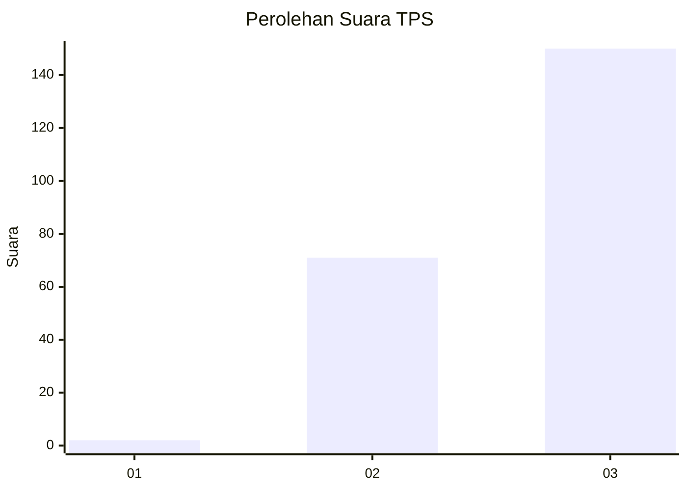
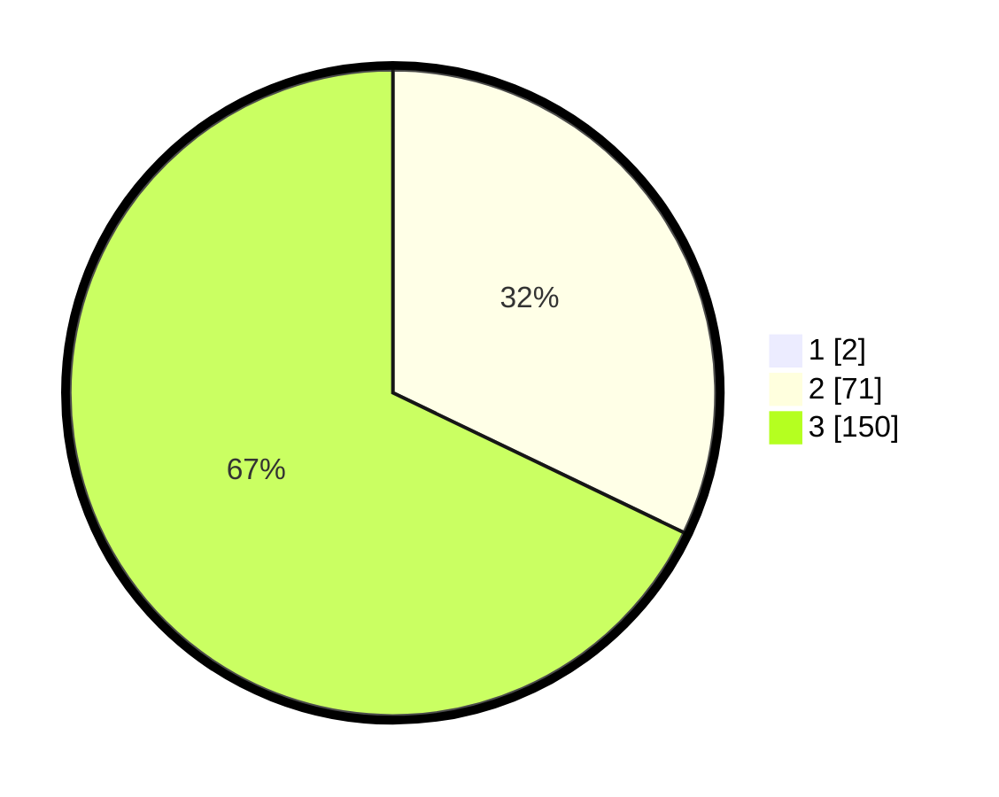

# Hasil

## Grafik

## Tabel

| No. | Nama Paslon    | Suara | Suara (raw) | Persentase |
|:--- |:-------------- | -----:| -----------:| ----------:|
| 1   | ANIES MUHAIMIN | 2     | [2][p-1]    | 0,90       |
| 2   | PRABOWO GIBRAN | 71    | [71][p-2]   | 31,84      |
| 3   | GANJAR MAHFUD  | 150   | [150][p-3]  | 67,26      |

[p-1]: https://github.com/gigit-pemilu/pemilu-2024-51-bali/blob/main/pilpres/hitung-suara/sub/51-bali/sub/02-tabanan/sub/04-kerambitan/sub/2003-penarukan/sub/007-tps/sub/paslon-1.txt
[p-2]: https://github.com/gigit-pemilu/pemilu-2024-51-bali/blob/main/pilpres/hitung-suara/sub/51-bali/sub/02-tabanan/sub/04-kerambitan/sub/2003-penarukan/sub/007-tps/sub/paslon-2.txt
[p-3]: https://github.com/gigit-pemilu/pemilu-2024-51-bali/blob/main/pilpres/hitung-suara/sub/51-bali/sub/02-tabanan/sub/04-kerambitan/sub/2003-penarukan/sub/007-tps/sub/paslon-3.txt

## Foto C Plano

https://sirekap-obj-formc.kpu.go.id/7455/pemilu/ppwp/51/02/04/20/03/5102042003007-20240214-131446--ec691a76-49cf-4ab4-9f9d-c031a5ea096a.jpg

https://sirekap-obj-formc.kpu.go.id/7455/pemilu/ppwp/51/02/04/20/03/5102042003007-20240214-132218--b14114ee-e6e6-4615-af1e-5b825e456e6c.jpg

https://sirekap-obj-formc.kpu.go.id/7455/pemilu/ppwp/51/02/04/20/03/5102042003007-20240214-132714--8c187b6d-dcaf-42a5-909a-9df7c7d181e5.jpg

## Metadata

| Key        | Value               |
| ---------- | ------------------- |
| Time Stamp | 2024-02-15 21:30:27 |

