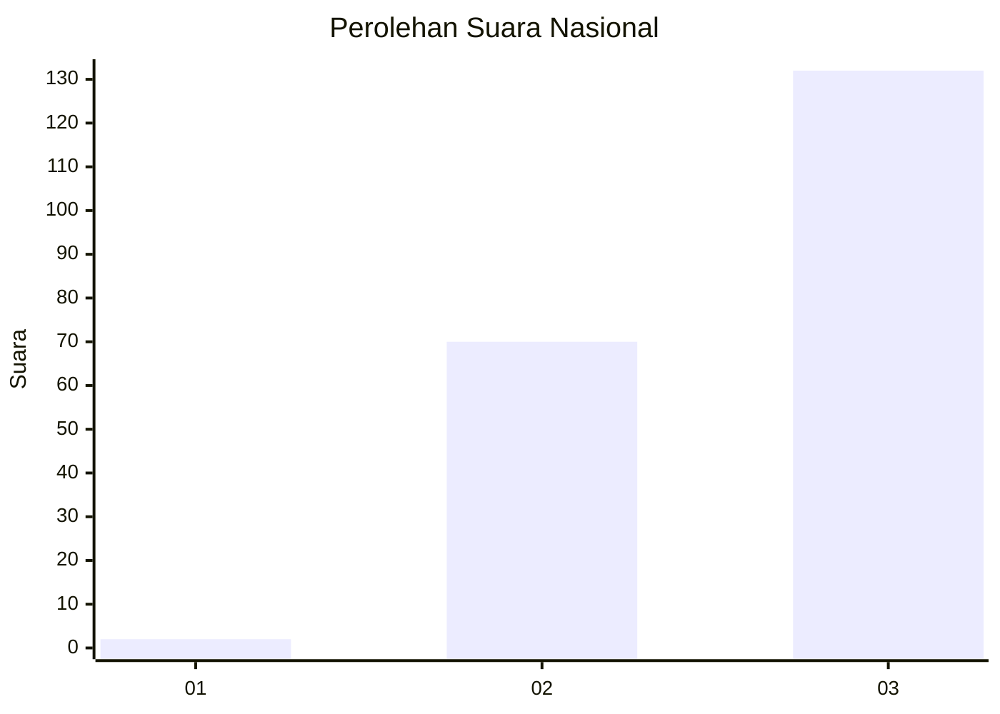
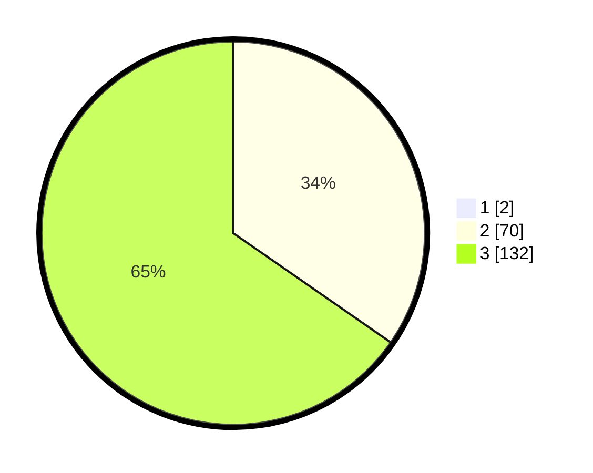

# Hasil

## Grafik

## Tabel

| No. | Nama Paslon    | Suara | Suara (raw) | Persentase |
|:--- |:-------------- | -----:| -----------:| ----------:|
| 1   | ANIES MUHAIMIN | 2     | [2][p-1]    | 0,98       |
| 2   | PRABOWO GIBRAN | 70    | [70][p-2]   | 34,31      |
| 3   | GANJAR MAHFUD  | 132   | [132][p-3]  | 64,71      |

[p-1]: https://github.com/gigit-pemilu/pemilu-2024/blob/main/pilpres/hitung-suara/sub/51-bali/sub/02-tabanan/sub/04-kerambitan/sub/2003-penarukan/sub/009-tps/sub/paslon-1.txt
[p-2]: https://github.com/gigit-pemilu/pemilu-2024/blob/main/pilpres/hitung-suara/sub/51-bali/sub/02-tabanan/sub/04-kerambitan/sub/2003-penarukan/sub/009-tps/sub/paslon-2.txt
[p-3]: https://github.com/gigit-pemilu/pemilu-2024/blob/main/pilpres/hitung-suara/sub/51-bali/sub/02-tabanan/sub/04-kerambitan/sub/2003-penarukan/sub/009-tps/sub/paslon-3.txt

## Foto C Plano

https://sirekap-obj-formc.kpu.go.id/288f/pemilu/ppwp/51/02/04/20/03/5102042003009-20240214-162210--7b2f048a-d3f5-466b-a82a-01cd6a5fe80f.jpg

https://sirekap-obj-formc.kpu.go.id/288f/pemilu/ppwp/51/02/04/20/03/5102042003009-20240216-002307--15e4e6a0-b8ef-408c-81fe-b72ca214d0dd.jpg

https://sirekap-obj-formc.kpu.go.id/288f/pemilu/ppwp/51/02/04/20/03/5102042003009-20240216-002306--7751f495-b0eb-4948-8f19-0da5e37b727d.jpg

## Metadata

| Key        | Value               |
| ---------- | ------------------- |
| Time Stamp | 2024-02-16 10:30:29 |

## DATA PEMILIH TETAP

Jumlah pemilih dalam DPT: **215**.
 * L: **113**.
 * P: **102**.

## DATA PENGGUNA HAK PILIH

Jumlah pengguna hak pilih dalam DPT: **209**.
 * L: **110**.
 * P: **99**.

Jumlah pengguna hak pilih dalam DPTb: **0**.
 * L: **0**.
 * P: **0**.

Jumlah pengguna hak pilih dalam DPK: **0**.
 * L: **0**.
 * P: **0**.

Jumlah pengguna hak pilih: **209**.
 * L: **110**.
 * P: **99**.

## JUMLAH SUARA SAH DAN TIDAK SAH

JUMLAH SELURUH SUARA SAH: **204**.

JUMLAH SUARA TIDAK SAH: **5**.

JUMLAH SELURUH SUARA SAH DAN SUARA TIDAK SAH: **209**.

