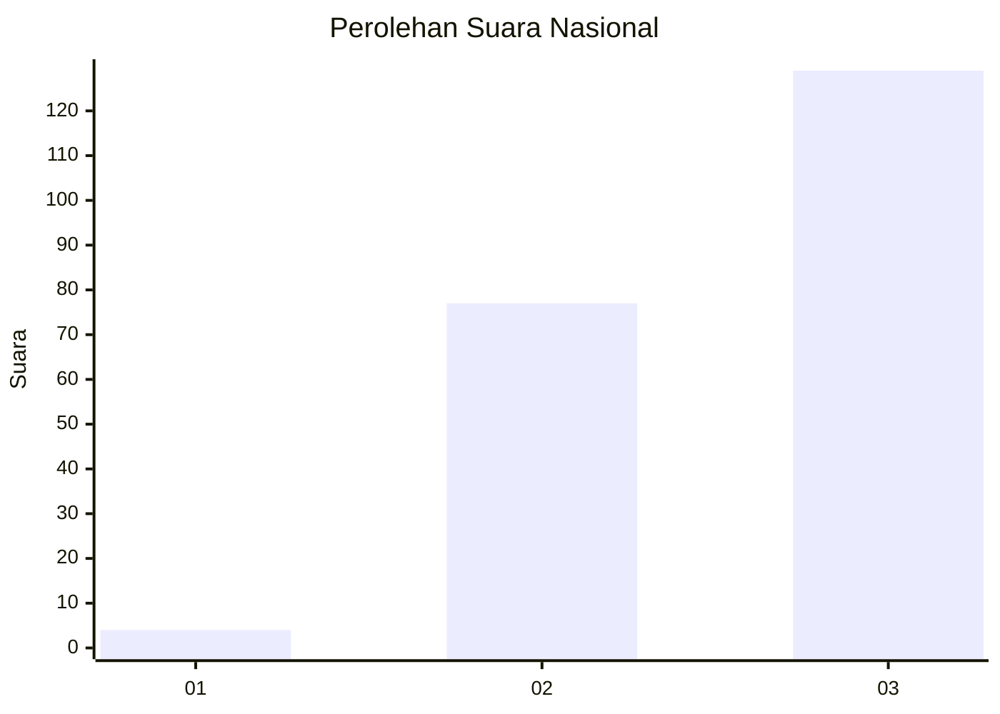
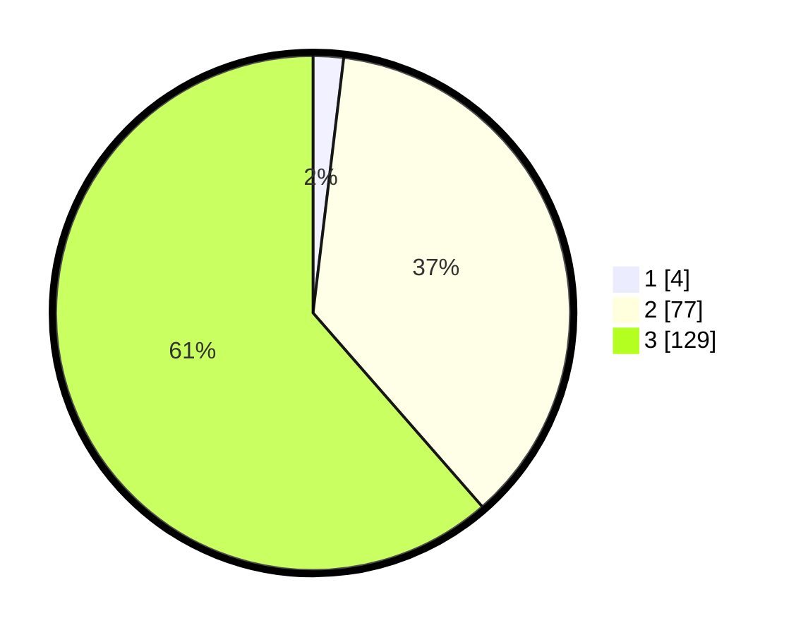

# Hasil

## Grafik

## Tabel

| No. | Nama Paslon    | Suara | Suara (raw) | Persentase |
|:--- |:-------------- | -----:| -----------:| ----------:|
| 1   | ANIES MUHAIMIN | 4     | [4][p-1]    | 1,90       |
| 2   | PRABOWO GIBRAN | 77    | [77][p-2]   | 36,67      |
| 3   | GANJAR MAHFUD  | 129   | [129][p-3]  | 61,43      |

[p-1]: https://github.com/gigit-pemilu/pemilu-2024/blob/main/pilpres/hitung-suara/sub/51-bali/sub/02-tabanan/sub/04-kerambitan/sub/2003-penarukan/sub/010-tps/sub/paslon-1.txt
[p-2]: https://github.com/gigit-pemilu/pemilu-2024/blob/main/pilpres/hitung-suara/sub/51-bali/sub/02-tabanan/sub/04-kerambitan/sub/2003-penarukan/sub/010-tps/sub/paslon-2.txt
[p-3]: https://github.com/gigit-pemilu/pemilu-2024/blob/main/pilpres/hitung-suara/sub/51-bali/sub/02-tabanan/sub/04-kerambitan/sub/2003-penarukan/sub/010-tps/sub/paslon-3.txt

## Foto C Plano

https://sirekap-obj-formc.kpu.go.id/775b/pemilu/ppwp/51/02/04/20/03/5102042003010-20240214-131929--6b0a49c4-bf83-4e58-8b64-23e5ef8c3bc8.jpg

https://sirekap-obj-formc.kpu.go.id/775b/pemilu/ppwp/51/02/04/20/03/5102042003010-20240214-131944--6e797c7d-bf2c-46a1-8b69-37e0ac764d7f.jpg

https://sirekap-obj-formc.kpu.go.id/775b/pemilu/ppwp/51/02/04/20/03/5102042003010-20240214-132005--e4a96cd7-7671-4cbd-98e7-6d932afe9e66.jpg

## Metadata

| Key        | Value               |
| ---------- | ------------------- |
| Time Stamp | 2024-02-14 21:46:01 |

## DATA PEMILIH TETAP

Jumlah pemilih dalam DPT: **224**.
 * L: **105**.
 * P: **119**.

## DATA PENGGUNA HAK PILIH

Jumlah pengguna hak pilih dalam DPT: **216**.
 * L: **100**.
 * P: **116**.

Jumlah pengguna hak pilih dalam DPTb: **0**.
 * L: **0**.
 * P: **0**.

Jumlah pengguna hak pilih dalam DPK: **1**.
 * L: **0**.
 * P: **1**.

Jumlah pengguna hak pilih: **217**.
 * L: **100**.
 * P: **117**.

## JUMLAH SUARA SAH DAN TIDAK SAH

JUMLAH SELURUH SUARA SAH: **210**.

JUMLAH SUARA TIDAK SAH: **7**.

JUMLAH SELURUH SUARA SAH DAN SUARA TIDAK SAH: **217**.

