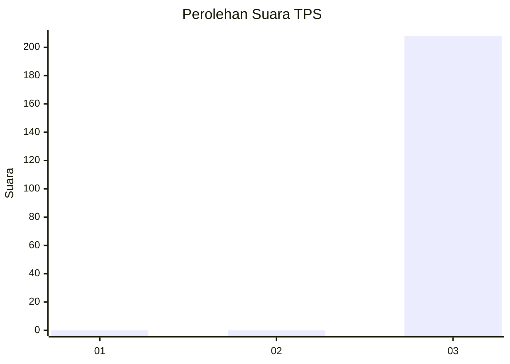
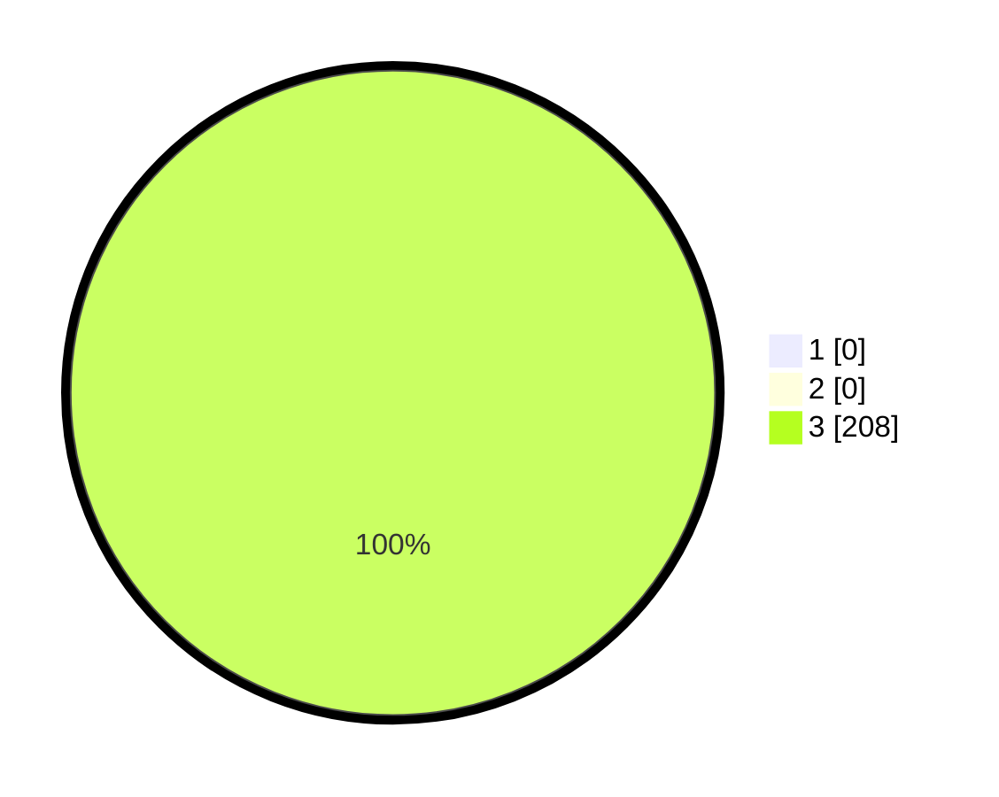

# Hasil

## Grafik

## Tabel

| No. | Nama Paslon    | Suara | Suara (raw) | Persentase |
|:--- |:-------------- | -----:| -----------:| ----------:|
| 1   | ANIES MUHAIMIN | 0     | [0][p-1]    | 0,00       |
| 2   | PRABOWO GIBRAN | 0     | [0][p-2]    | 0,00       |
| 3   | GANJAR MAHFUD  | 208   | [208][p-3]  | 100,00     |

[p-1]: https://github.com/gigit-pemilu/pemilu-2024-51-bali/blob/main/pilpres/hitung-suara/sub/51-bali/sub/02-tabanan/sub/04-kerambitan/sub/2003-penarukan/sub/011-tps/sub/paslon-1.txt
[p-2]: https://github.com/gigit-pemilu/pemilu-2024-51-bali/blob/main/pilpres/hitung-suara/sub/51-bali/sub/02-tabanan/sub/04-kerambitan/sub/2003-penarukan/sub/011-tps/sub/paslon-2.txt
[p-3]: https://github.com/gigit-pemilu/pemilu-2024-51-bali/blob/main/pilpres/hitung-suara/sub/51-bali/sub/02-tabanan/sub/04-kerambitan/sub/2003-penarukan/sub/011-tps/sub/paslon-3.txt

## Foto C Plano

https://sirekap-obj-formc.kpu.go.id/cafd/pemilu/ppwp/51/02/04/20/03/5102042003011-20240216-093232--e4c69c53-4106-4718-8a51-4d77402e3812.jpg

https://sirekap-obj-formc.kpu.go.id/cafd/pemilu/ppwp/51/02/04/20/03/5102042003011-20240216-094358--f185c2e3-7008-4522-8d6b-a709738eb6b4.jpg

https://sirekap-obj-formc.kpu.go.id/cafd/pemilu/ppwp/51/02/04/20/03/5102042003011-20240216-094743--cc310266-3d83-419b-af3d-92270af492c9.jpg

## Metadata

| Key        | Value               |
| ---------- | ------------------- |
| Time Stamp | 2024-02-16 10:30:29 |

## DATA PEMILIH TETAP

Jumlah pemilih dalam DPT: **214**.
 * L: **108**.
 * P: **106**.

## DATA PENGGUNA HAK PILIH

Jumlah pengguna hak pilih dalam DPT: **208**.
 * L: **105**.
 * P: **103**.

Jumlah pengguna hak pilih dalam DPTb: **0**.
 * L: **0**.
 * P: **0**.

Jumlah pengguna hak pilih dalam DPK: **0**.
 * L: **0**.
 * P: **0**.

Jumlah pengguna hak pilih: **208**.
 * L: **105**.
 * P: **103**.

## JUMLAH SUARA SAH DAN TIDAK SAH

JUMLAH SELURUH SUARA SAH: **208**.

JUMLAH SUARA TIDAK SAH: **0**.

JUMLAH SELURUH SUARA SAH DAN SUARA TIDAK SAH: **208**.

