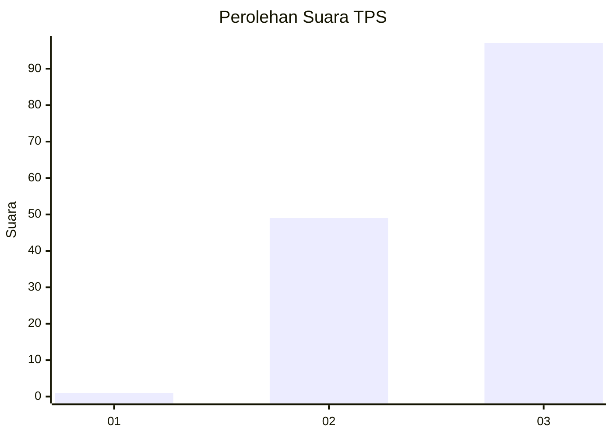
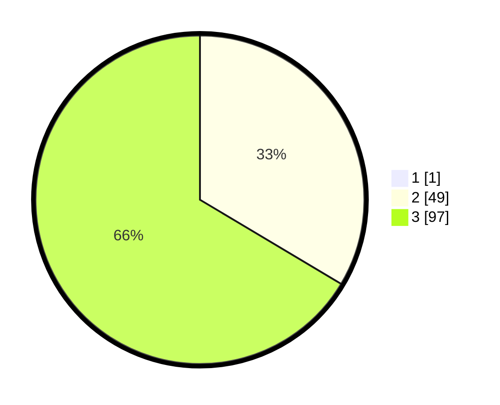

# Hasil

## Grafik

## Tabel

| No. | Nama Paslon    | Suara | Suara (raw) | Persentase |
|:--- |:-------------- | -----:| -----------:| ----------:|
| 1   | ANIES MUHAIMIN | 1     | [1][p-1]    | 0,68       |
| 2   | PRABOWO GIBRAN | 49    | [49][p-2]   | 33,33      |
| 3   | GANJAR MAHFUD  | 97    | [97][p-3]   | 65,99      |

[p-1]: https://github.com/gigit-pemilu/pemilu-2024-51-bali/blob/main/pilpres/hitung-suara/sub/51-bali/sub/02-tabanan/sub/04-kerambitan/sub/2004-belumbang/sub/001-tps/sub/paslon-1.txt
[p-2]: https://github.com/gigit-pemilu/pemilu-2024-51-bali/blob/main/pilpres/hitung-suara/sub/51-bali/sub/02-tabanan/sub/04-kerambitan/sub/2004-belumbang/sub/001-tps/sub/paslon-2.txt
[p-3]: https://github.com/gigit-pemilu/pemilu-2024-51-bali/blob/main/pilpres/hitung-suara/sub/51-bali/sub/02-tabanan/sub/04-kerambitan/sub/2004-belumbang/sub/001-tps/sub/paslon-3.txt

## Foto C Plano

https://sirekap-obj-formc.kpu.go.id/a092/pemilu/ppwp/51/02/04/20/04/5102042004001-20240214-125421--698c96ef-8107-42c3-89bf-9d8a24bd9386.jpg

https://sirekap-obj-formc.kpu.go.id/a092/pemilu/ppwp/51/02/04/20/04/5102042004001-20240214-125543--eb4ae260-2826-40bb-831c-25185fdfc534.jpg

## Metadata

| Key        | Value               |
| ---------- | ------------------- |
| Time Stamp | 2024-02-15 07:00:44 |

