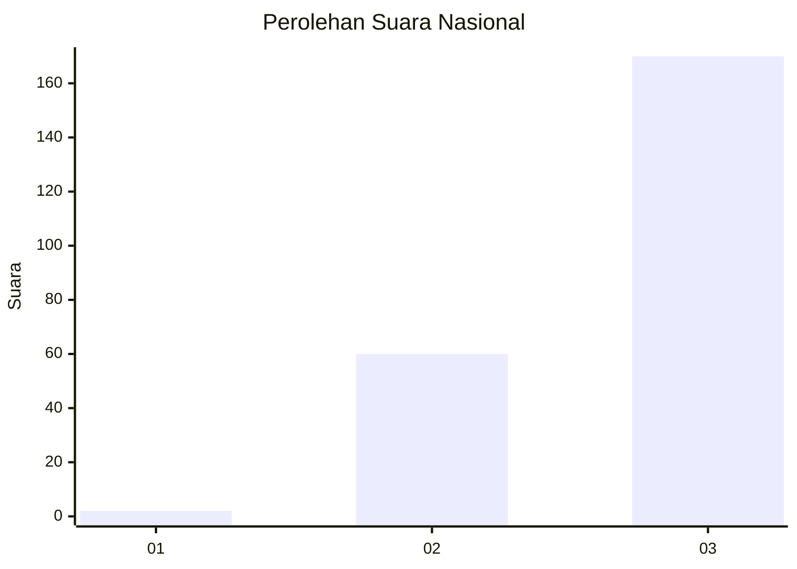
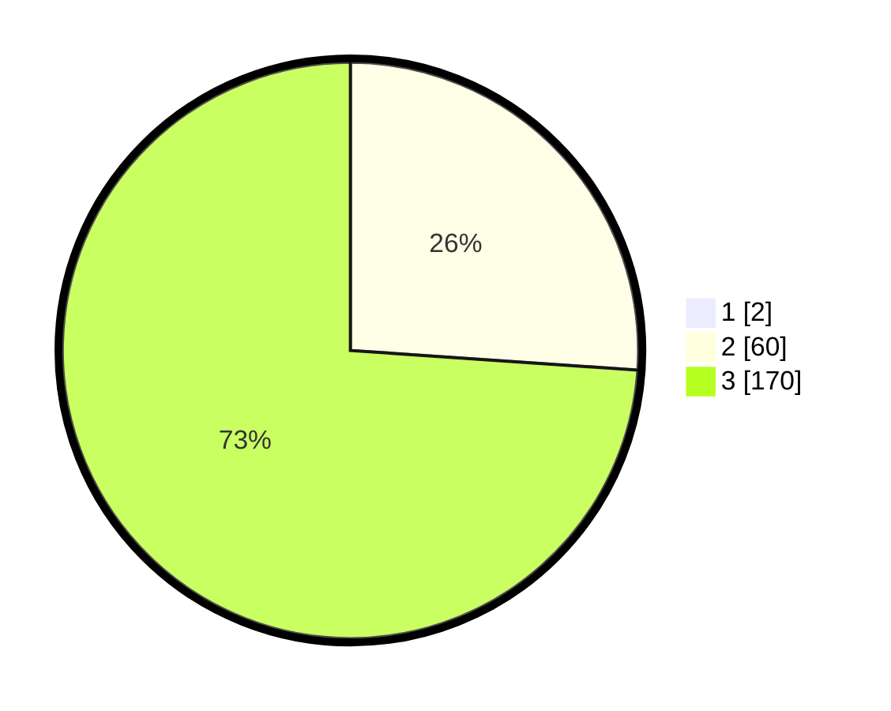

# Hasil

## Grafik

## Tabel

| No. | Nama Paslon    | Suara | Suara (raw) | Persentase |
|:--- |:-------------- | -----:| -----------:| ----------:|
| 1   | ANIES MUHAIMIN | 2     | [2][p-1]    | 0,86       |
| 2   | PRABOWO GIBRAN | 60    | [60][p-2]   | 25,86      |
| 3   | GANJAR MAHFUD  | 170   | [170][p-3]  | 73,28      |

[p-1]: https://github.com/gigit-pemilu/pemilu-2024/blob/main/pilpres/hitung-suara/sub/51-bali/sub/02-tabanan/sub/04-kerambitan/sub/2004-belumbang/sub/003-tps/sub/paslon-1.txt
[p-2]: https://github.com/gigit-pemilu/pemilu-2024/blob/main/pilpres/hitung-suara/sub/51-bali/sub/02-tabanan/sub/04-kerambitan/sub/2004-belumbang/sub/003-tps/sub/paslon-2.txt
[p-3]: https://github.com/gigit-pemilu/pemilu-2024/blob/main/pilpres/hitung-suara/sub/51-bali/sub/02-tabanan/sub/04-kerambitan/sub/2004-belumbang/sub/003-tps/sub/paslon-3.txt

## Foto C Plano

https://sirekap-obj-formc.kpu.go.id/9441/pemilu/ppwp/51/02/04/20/04/5102042004003-20240214-131701--88605972-34b0-4fbd-8036-7bf8d2d18a7c.jpg

https://sirekap-obj-formc.kpu.go.id/9441/pemilu/ppwp/51/02/04/20/04/5102042004003-20240214-132119--ab97f92c-44d6-43c9-89b6-9c1bf1518c74.jpg

https://sirekap-obj-formc.kpu.go.id/9441/pemilu/ppwp/51/02/04/20/04/5102042004003-20240214-132308--33822074-60cd-4365-a8a4-f9bfa8f871d9.jpg

## Metadata

| Key        | Value               |
| ---------- | ------------------- |
| Time Stamp | 2024-02-14 21:46:01 |

## DATA PEMILIH TETAP

Jumlah pemilih dalam DPT: **250**.
 * L: **115**.
 * P: **135**.

## DATA PENGGUNA HAK PILIH

Jumlah pengguna hak pilih dalam DPT: **234**.
 * L: **107**.
 * P: **127**.

Jumlah pengguna hak pilih dalam DPTb: **0**.
 * L: **0**.
 * P: **0**.

Jumlah pengguna hak pilih dalam DPK: **0**.
 * L: **0**.
 * P: **0**.

Jumlah pengguna hak pilih: **234**.
 * L: **107**.
 * P: **127**.

## JUMLAH SUARA SAH DAN TIDAK SAH

JUMLAH SELURUH SUARA SAH: **232**.

JUMLAH SUARA TIDAK SAH: **2**.

JUMLAH SELURUH SUARA SAH DAN SUARA TIDAK SAH: **234**.

