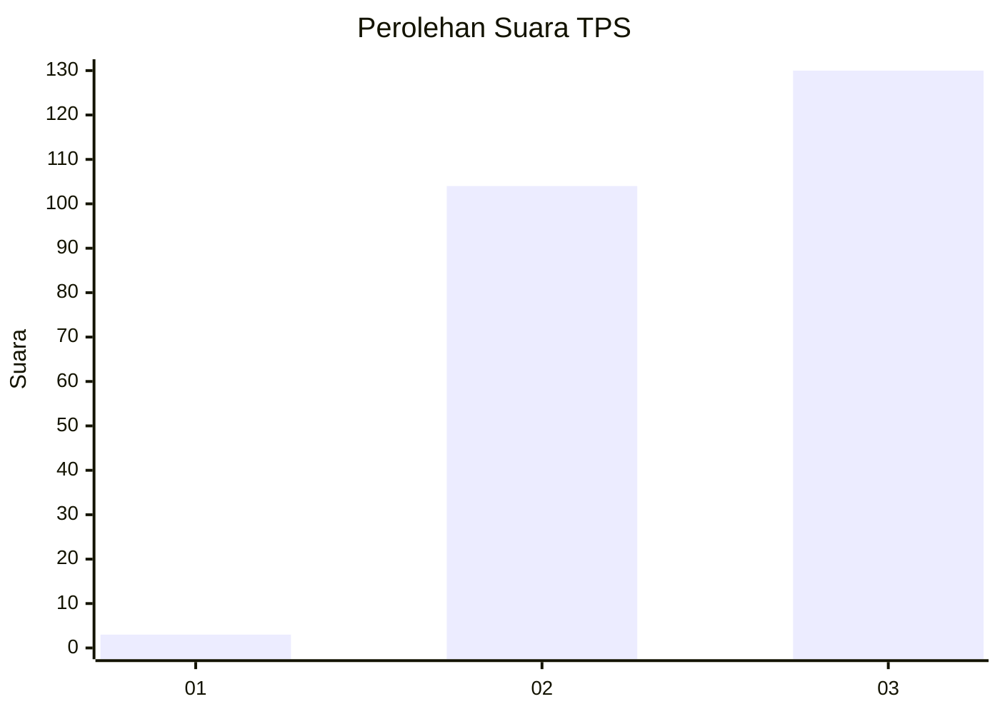
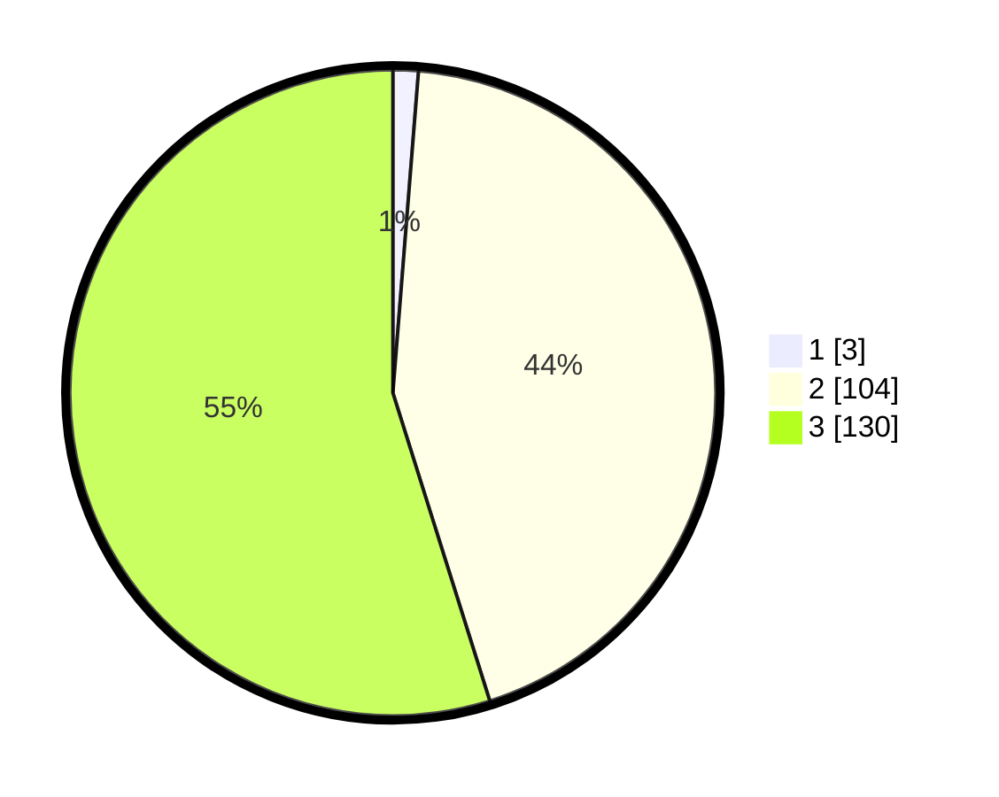

# Hasil

## Grafik

## Tabel

| No. | Nama Paslon    | Suara | Suara (raw) | Persentase |
|:--- |:-------------- | -----:| -----------:| ----------:|
| 1   | ANIES MUHAIMIN | 3     | [3][p-1]    | 1,27       |
| 2   | PRABOWO GIBRAN | 104   | [104][p-2]  | 43,88      |
| 3   | GANJAR MAHFUD  | 130   | [130][p-3]  | 54,85      |

[p-1]: https://github.com/gigit-pemilu/pemilu-2024-51-bali/blob/main/pilpres/hitung-suara/sub/51-bali/sub/02-tabanan/sub/04-kerambitan/sub/2004-belumbang/sub/005-tps/sub/paslon-1.txt
[p-2]: https://github.com/gigit-pemilu/pemilu-2024-51-bali/blob/main/pilpres/hitung-suara/sub/51-bali/sub/02-tabanan/sub/04-kerambitan/sub/2004-belumbang/sub/005-tps/sub/paslon-2.txt
[p-3]: https://github.com/gigit-pemilu/pemilu-2024-51-bali/blob/main/pilpres/hitung-suara/sub/51-bali/sub/02-tabanan/sub/04-kerambitan/sub/2004-belumbang/sub/005-tps/sub/paslon-3.txt

## Foto C Plano

https://sirekap-obj-formc.kpu.go.id/98b7/pemilu/ppwp/51/02/04/20/04/5102042004005-20240215-001033--452c6965-3121-4c79-98d8-73cf7b1a4ac4.jpg

https://sirekap-obj-formc.kpu.go.id/98b7/pemilu/ppwp/51/02/04/20/04/5102042004005-20240215-001032--a0beacf1-6c9e-4270-a517-ba83d340e18a.jpg

https://sirekap-obj-formc.kpu.go.id/98b7/pemilu/ppwp/51/02/04/20/04/5102042004005-20240215-001127--302f4d7a-6f45-433f-b2e8-d4b24853606b.jpg

## Metadata

| Key        | Value               |
| ---------- | ------------------- |
| Time Stamp | 2024-02-15 22:00:27 |

