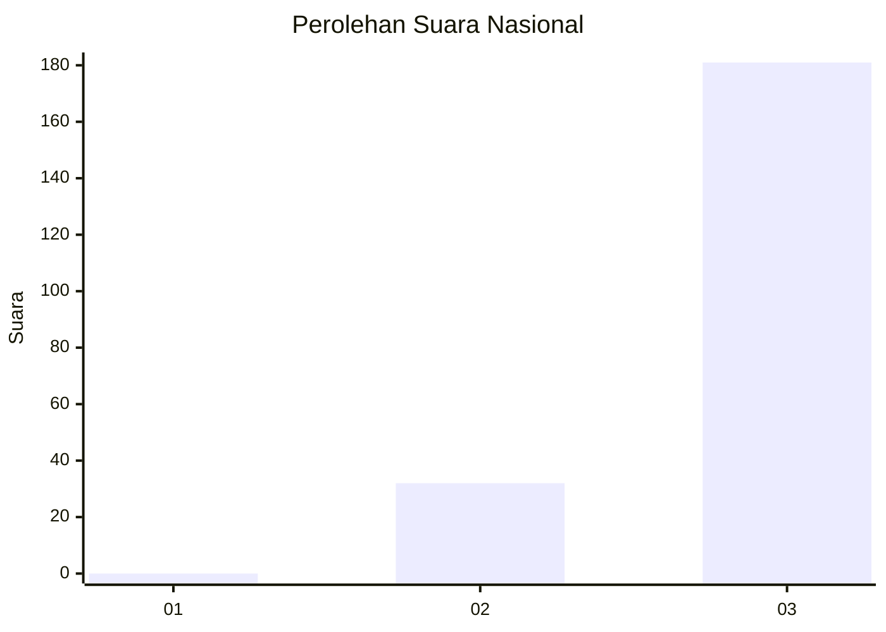
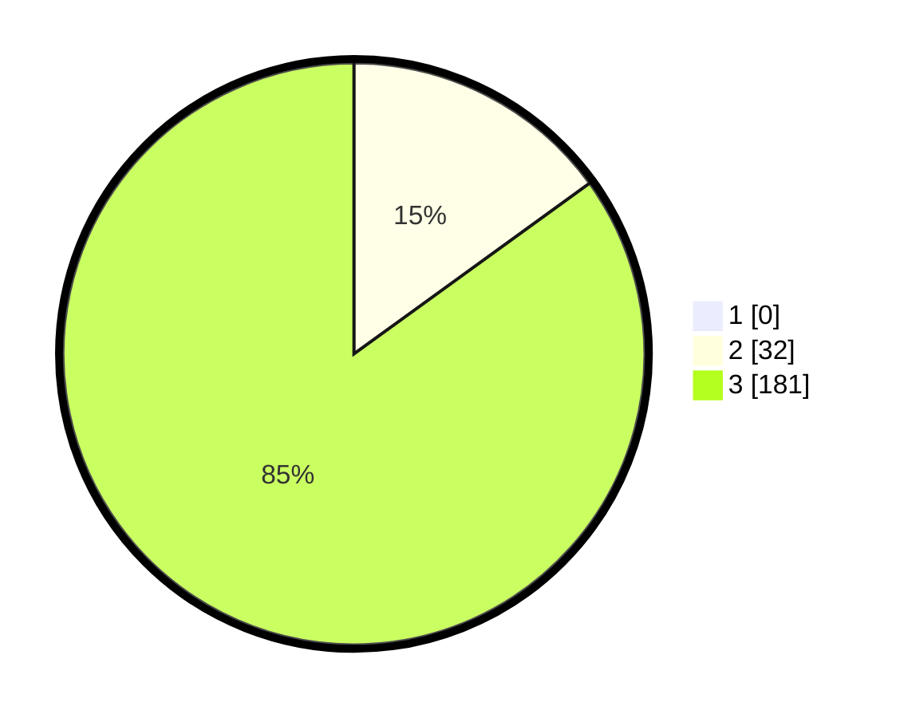

# Hasil

## Grafik

## Tabel

| No. | Nama Paslon    | Suara | Suara (raw) | Persentase |
|:--- |:-------------- | -----:| -----------:| ----------:|
| 1   | ANIES MUHAIMIN | 0     | [0][p-1]    | 0,00       |
| 2   | PRABOWO GIBRAN | 32    | [32][p-2]   | 15,02      |
| 3   | GANJAR MAHFUD  | 181   | [181][p-3]  | 84,98      |

[p-1]: https://github.com/gigit-pemilu/pemilu-2024/blob/main/pilpres/hitung-suara/sub/51-bali/sub/02-tabanan/sub/04-kerambitan/sub/2004-belumbang/sub/006-tps/sub/paslon-1.txt
[p-2]: https://github.com/gigit-pemilu/pemilu-2024/blob/main/pilpres/hitung-suara/sub/51-bali/sub/02-tabanan/sub/04-kerambitan/sub/2004-belumbang/sub/006-tps/sub/paslon-2.txt
[p-3]: https://github.com/gigit-pemilu/pemilu-2024/blob/main/pilpres/hitung-suara/sub/51-bali/sub/02-tabanan/sub/04-kerambitan/sub/2004-belumbang/sub/006-tps/sub/paslon-3.txt

## Foto C Plano

https://sirekap-obj-formc.kpu.go.id/8ad4/pemilu/ppwp/51/02/04/20/04/5102042004006-20240214-132330--64df0dfb-7668-419d-983a-9bd5a3975399.jpg

https://sirekap-obj-formc.kpu.go.id/8ad4/pemilu/ppwp/51/02/04/20/04/5102042004006-20240214-133036--59364099-67f2-4163-886f-45ecc201eb19.jpg

https://sirekap-obj-formc.kpu.go.id/8ad4/pemilu/ppwp/51/02/04/20/04/5102042004006-20240214-220520--bbda0b67-e644-4d1d-af7d-6c0a247ba252.jpg

## Metadata

| Key        | Value               |
| ---------- | ------------------- |
| Time Stamp | 2024-02-15 22:00:27 |

## DATA PEMILIH TETAP

Jumlah pemilih dalam DPT: **237**.
 * L: **111**.
 * P: **126**.

## DATA PENGGUNA HAK PILIH

Jumlah pengguna hak pilih dalam DPT: **213**.
 * L: **102**.
 * P: **111**.

Jumlah pengguna hak pilih dalam DPTb: **0**.
 * L: **0**.
 * P: **0**.

Jumlah pengguna hak pilih dalam DPK: **0**.
 * L: **0**.
 * P: **0**.

Jumlah pengguna hak pilih: **213**.
 * L: **102**.
 * P: **111**.

## JUMLAH SUARA SAH DAN TIDAK SAH

JUMLAH SELURUH SUARA SAH: **213**.

JUMLAH SUARA TIDAK SAH: **0**.

JUMLAH SELURUH SUARA SAH DAN SUARA TIDAK SAH: **213**.

