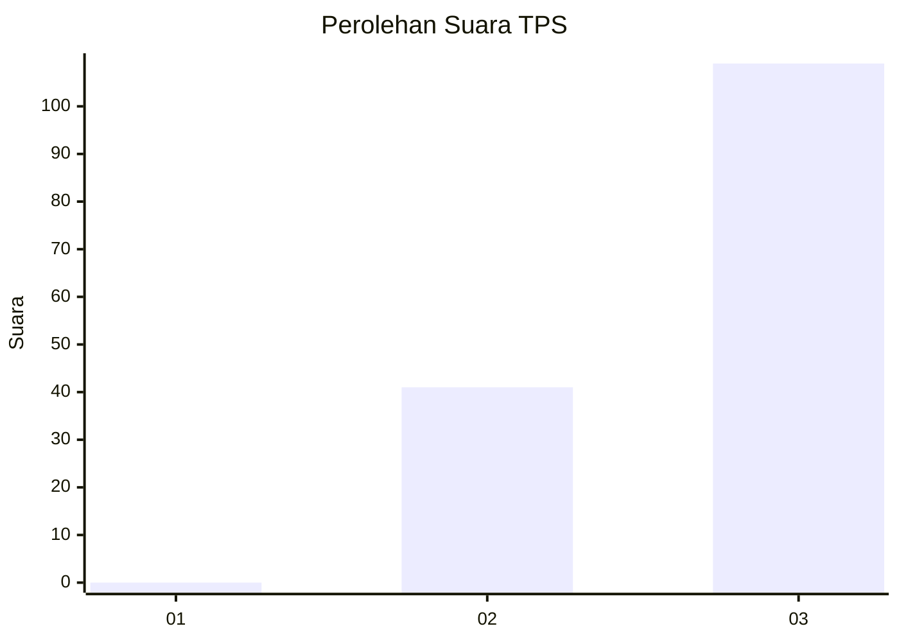
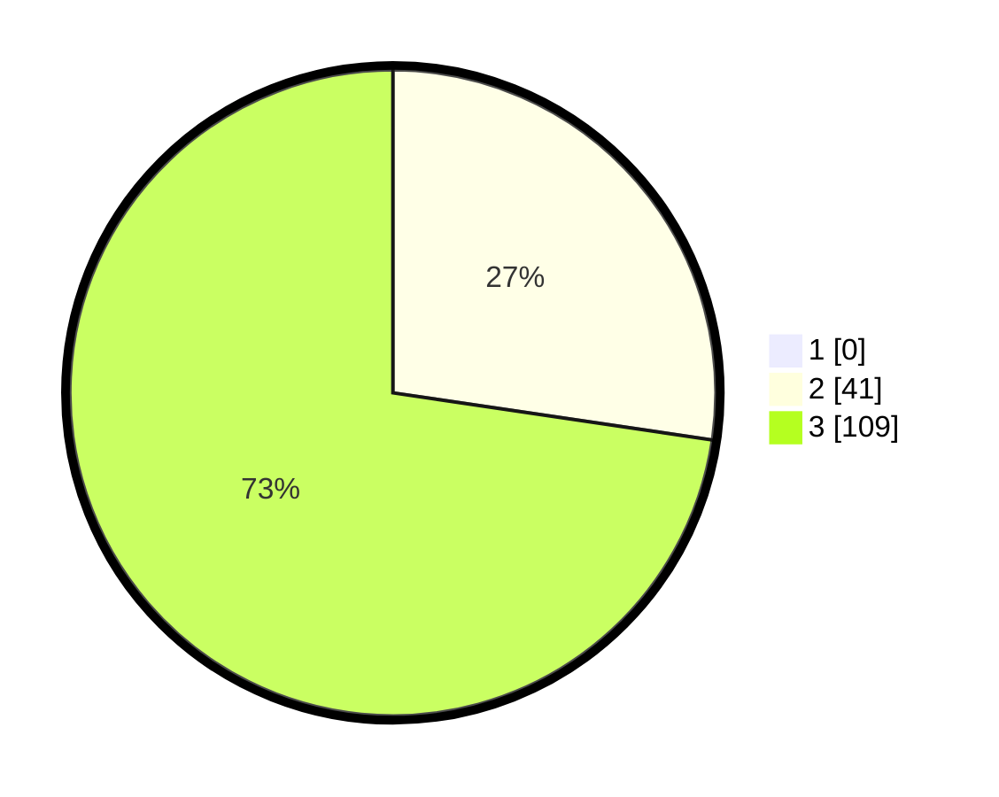

# Hasil

## Grafik

## Tabel

| No. | Nama Paslon    | Suara | Suara (raw) | Persentase |
|:--- |:-------------- | -----:| -----------:| ----------:|
| 1   | ANIES MUHAIMIN | 0     | [0][p-1]    | 0,00       |
| 2   | PRABOWO GIBRAN | 41    | [41][p-2]   | 27,33      |
| 3   | GANJAR MAHFUD  | 109   | [109][p-3]  | 72,67      |

[p-1]: https://github.com/gigit-pemilu/pemilu-2024-51-bali/blob/main/pilpres/hitung-suara/sub/51-bali/sub/02-tabanan/sub/04-kerambitan/sub/2004-belumbang/sub/008-tps/sub/paslon-1.txt
[p-2]: https://github.com/gigit-pemilu/pemilu-2024-51-bali/blob/main/pilpres/hitung-suara/sub/51-bali/sub/02-tabanan/sub/04-kerambitan/sub/2004-belumbang/sub/008-tps/sub/paslon-2.txt
[p-3]: https://github.com/gigit-pemilu/pemilu-2024-51-bali/blob/main/pilpres/hitung-suara/sub/51-bali/sub/02-tabanan/sub/04-kerambitan/sub/2004-belumbang/sub/008-tps/sub/paslon-3.txt

## Foto C Plano

https://sirekap-obj-formc.kpu.go.id/1813/pemilu/ppwp/51/02/04/20/04/5102042004008-20240214-141939--8be8f80c-1e30-4615-9286-9f7e295956de.jpg

https://sirekap-obj-formc.kpu.go.id/1813/pemilu/ppwp/51/02/04/20/04/5102042004008-20240214-193908--9b8024cf-42b6-4b56-9e5a-8951e988ba00.jpg

https://sirekap-obj-formc.kpu.go.id/1813/pemilu/ppwp/51/02/04/20/04/5102042004008-20240214-193913--a2290123-8bb0-4d23-b863-546372941c7c.jpg

## Metadata

| Key        | Value               |
| ---------- | ------------------- |
| Time Stamp | 2024-02-15 22:00:27 |

