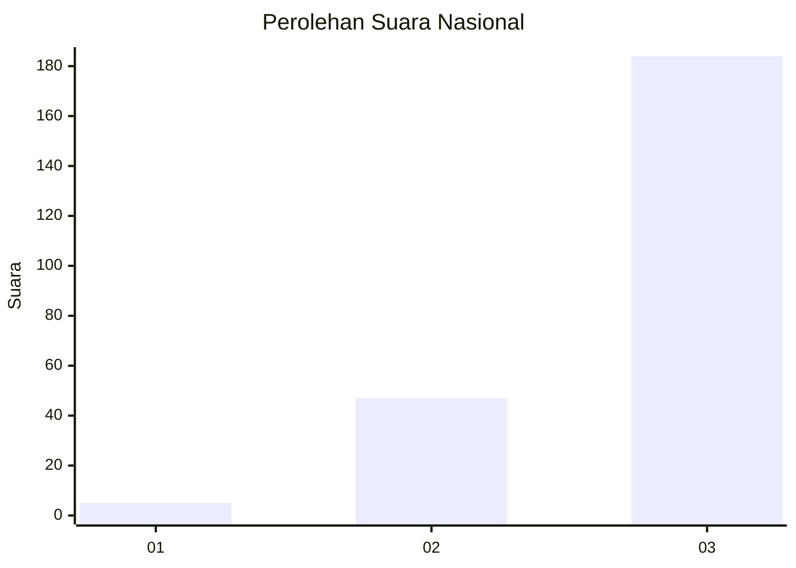
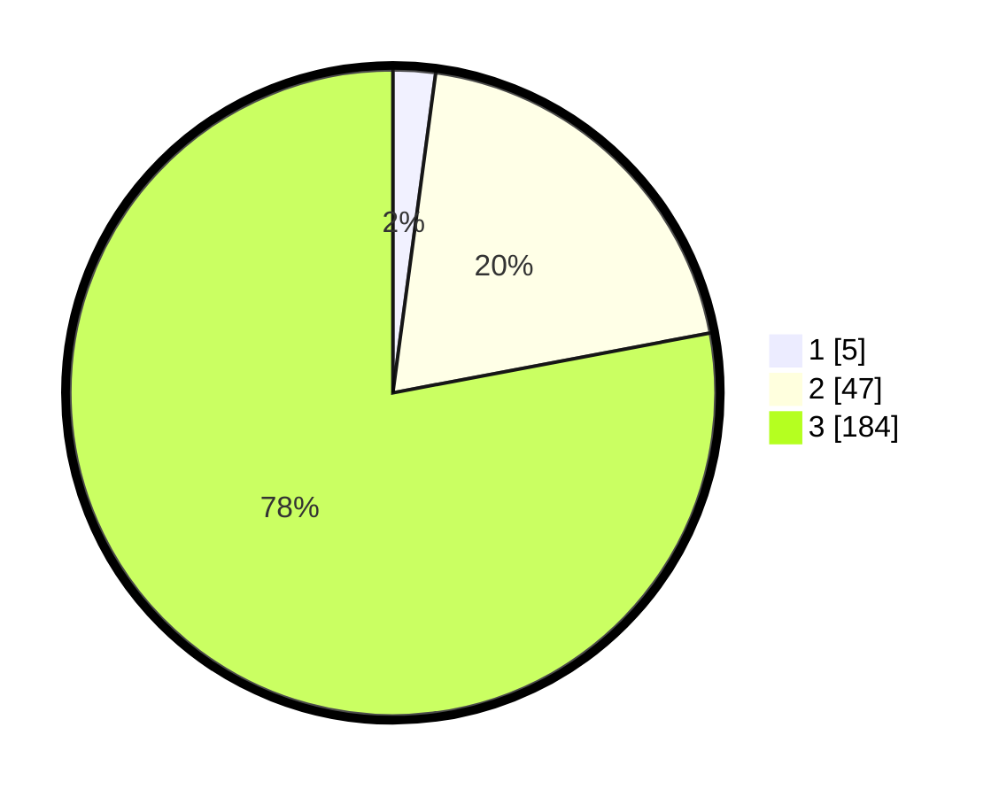

# Hasil

## Grafik

## Tabel

| No. | Nama Paslon    | Suara | Suara (raw) | Persentase |
|:--- |:-------------- | -----:| -----------:| ----------:|
| 1   | ANIES MUHAIMIN | 5     | [5][p-1]    | 2,12       |
| 2   | PRABOWO GIBRAN | 47    | [47][p-2]   | 19,92      |
| 3   | GANJAR MAHFUD  | 184   | [184][p-3]  | 77,97      |

[p-1]: https://github.com/gigit-pemilu/pemilu-2024/blob/main/pilpres/hitung-suara/sub/51-bali/sub/02-tabanan/sub/04-kerambitan/sub/2005-tista/sub/001-tps/sub/paslon-1.txt
[p-2]: https://github.com/gigit-pemilu/pemilu-2024/blob/main/pilpres/hitung-suara/sub/51-bali/sub/02-tabanan/sub/04-kerambitan/sub/2005-tista/sub/001-tps/sub/paslon-2.txt
[p-3]: https://github.com/gigit-pemilu/pemilu-2024/blob/main/pilpres/hitung-suara/sub/51-bali/sub/02-tabanan/sub/04-kerambitan/sub/2005-tista/sub/001-tps/sub/paslon-3.txt

## Foto C Plano

https://sirekap-obj-formc.kpu.go.id/2b30/pemilu/ppwp/51/02/04/20/05/5102042005001-20240216-160638--9bf537ec-57d8-4f5a-b386-b57d90b4b09e.jpg

https://sirekap-obj-formc.kpu.go.id/2b30/pemilu/ppwp/51/02/04/20/05/5102042005001-20240216-160639--4b400954-fc12-4749-adc3-f484d50d6b51.jpg

https://sirekap-obj-formc.kpu.go.id/2b30/pemilu/ppwp/51/02/04/20/05/5102042005001-20240216-160638--b1f60d17-ee38-4b4d-82b6-c2fa5654fd7c.jpg

## Metadata

| Key        | Value               |
| ---------- | ------------------- |
| Time Stamp | 2024-02-24 22:31:28 |

## DATA PEMILIH TETAP

Jumlah pemilih dalam DPT: **267**.
 * L: **131**.
 * P: **136**.

## DATA PENGGUNA HAK PILIH

Jumlah pengguna hak pilih dalam DPT: **236**.
 * L: **118**.
 * P: **118**.

Jumlah pengguna hak pilih dalam DPTb: **2**.
 * L: **1**.
 * P: **1**.

Jumlah pengguna hak pilih dalam DPK: **0**.
 * L: **0**.
 * P: **1**.

Jumlah pengguna hak pilih: **239**.
 * L: **119**.
 * P: **120**.

## JUMLAH SUARA SAH DAN TIDAK SAH

JUMLAH SELURUH SUARA SAH: **236**.

JUMLAH SUARA TIDAK SAH: **3**.

JUMLAH SELURUH SUARA SAH DAN SUARA TIDAK SAH: **239**.

