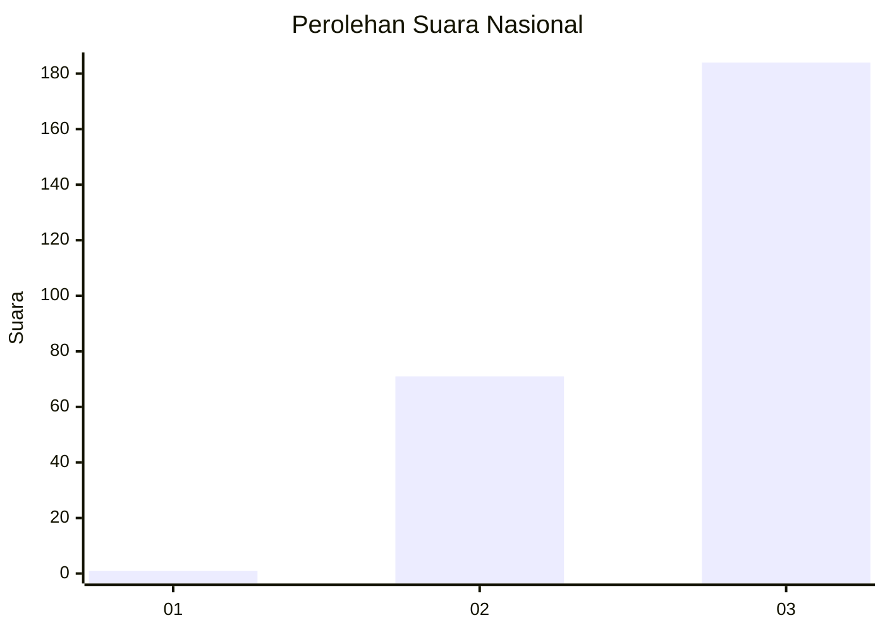
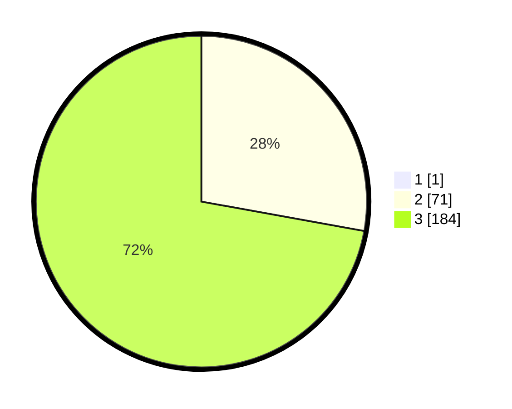

# Hasil

## Grafik

## Tabel

| No. | Nama Paslon    | Suara | Suara (raw) | Persentase |
|:--- |:-------------- | -----:| -----------:| ----------:|
| 1   | ANIES MUHAIMIN | 1     | [1][p-1]    | 0,39       |
| 2   | PRABOWO GIBRAN | 71    | [71][p-2]   | 27,73      |
| 3   | GANJAR MAHFUD  | 184   | [184][p-3]  | 71,88      |

[p-1]: https://github.com/gigit-pemilu/pemilu-2024/blob/main/pilpres/hitung-suara/sub/51-bali/sub/02-tabanan/sub/04-kerambitan/sub/2005-tista/sub/002-tps/sub/paslon-1.txt
[p-2]: https://github.com/gigit-pemilu/pemilu-2024/blob/main/pilpres/hitung-suara/sub/51-bali/sub/02-tabanan/sub/04-kerambitan/sub/2005-tista/sub/002-tps/sub/paslon-2.txt
[p-3]: https://github.com/gigit-pemilu/pemilu-2024/blob/main/pilpres/hitung-suara/sub/51-bali/sub/02-tabanan/sub/04-kerambitan/sub/2005-tista/sub/002-tps/sub/paslon-3.txt

## Foto C Plano

https://sirekap-obj-formc.kpu.go.id/7b80/pemilu/ppwp/51/02/04/20/05/5102042005002-20240216-151432--1be4611e-02a0-4b3d-b3e2-2c28a863a5cf.jpg

https://sirekap-obj-formc.kpu.go.id/7b80/pemilu/ppwp/51/02/04/20/05/5102042005002-20240216-151434--2d0872a7-7857-49d7-ae4b-283deb9473b1.jpg

https://sirekap-obj-formc.kpu.go.id/7b80/pemilu/ppwp/51/02/04/20/05/5102042005002-20240216-151433--83e2e2b2-39ac-47e8-8489-6c992379fae8.jpg

## Metadata

| Key        | Value               |
| ---------- | ------------------- |
| Time Stamp | 2024-02-21 16:00:00 |

## DATA PEMILIH TETAP

Jumlah pemilih dalam DPT: **280**.
 * L: **135**.
 * P: **145**.

## DATA PENGGUNA HAK PILIH

Jumlah pengguna hak pilih dalam DPT: **256**.
 * L: **125**.
 * P: **131**.

Jumlah pengguna hak pilih dalam DPTb: **0**.
 * L: **0**.
 * P: **0**.

Jumlah pengguna hak pilih dalam DPK: **1**.
 * L: **0**.
 * P: **1**.

Jumlah pengguna hak pilih: **257**.
 * L: **125**.
 * P: **132**.

## JUMLAH SUARA SAH DAN TIDAK SAH

JUMLAH SELURUH SUARA SAH: **256**.

JUMLAH SUARA TIDAK SAH: **1**.

JUMLAH SELURUH SUARA SAH DAN SUARA TIDAK SAH: **257**.

