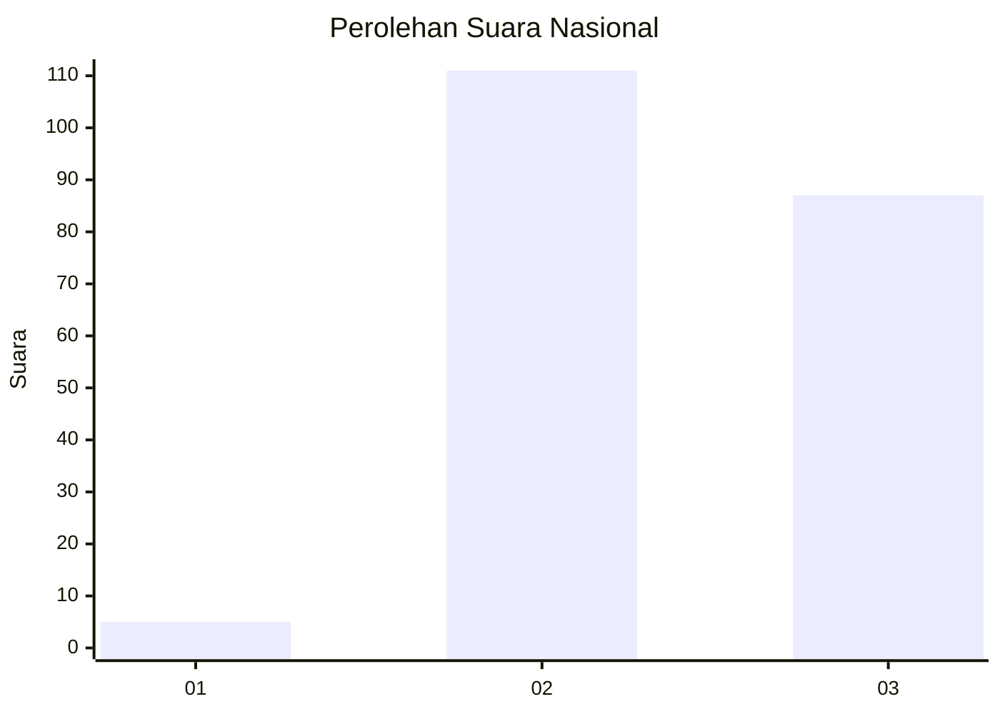
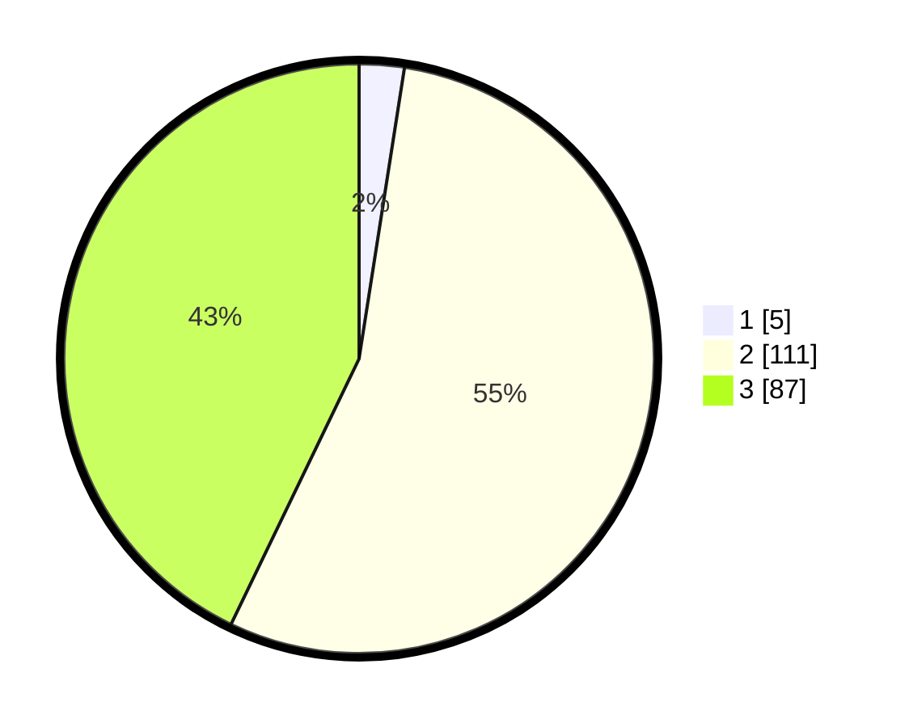

# Hasil

## Grafik

## Tabel

| No. | Nama Paslon    | Suara | Suara (raw) | Persentase |
|:--- |:-------------- | -----:| -----------:| ----------:|
| 1   | ANIES MUHAIMIN | 5     | [5][p-1]    | 2,46       |
| 2   | PRABOWO GIBRAN | 111   | [111][p-2]  | 54,68      |
| 3   | GANJAR MAHFUD  | 87    | [87][p-3]   | 42,86      |

[p-1]: https://github.com/gigit-pemilu/pemilu-2024/blob/main/pilpres/hitung-suara/sub/51-bali/sub/02-tabanan/sub/04-kerambitan/sub/2005-tista/sub/005-tps/sub/paslon-1.txt
[p-2]: https://github.com/gigit-pemilu/pemilu-2024/blob/main/pilpres/hitung-suara/sub/51-bali/sub/02-tabanan/sub/04-kerambitan/sub/2005-tista/sub/005-tps/sub/paslon-2.txt
[p-3]: https://github.com/gigit-pemilu/pemilu-2024/blob/main/pilpres/hitung-suara/sub/51-bali/sub/02-tabanan/sub/04-kerambitan/sub/2005-tista/sub/005-tps/sub/paslon-3.txt

## Foto C Plano

https://sirekap-obj-formc.kpu.go.id/6130/pemilu/ppwp/51/02/04/20/05/5102042005005-20240216-185411--815063e7-237e-4176-8409-3741e709b2f6.jpg

https://sirekap-obj-formc.kpu.go.id/6130/pemilu/ppwp/51/02/04/20/05/5102042005005-20240216-185412--6324d550-b8e0-4fcd-a995-185b7250cb60.jpg

https://sirekap-obj-formc.kpu.go.id/6130/pemilu/ppwp/51/02/04/20/05/5102042005005-20240216-185411--cbf4d00c-7585-492a-b8a6-f64e83824b98.jpg

## Metadata

| Key        | Value               |
| ---------- | ------------------- |
| Time Stamp | 2024-02-21 13:00:00 |

## DATA PEMILIH TETAP

Jumlah pemilih dalam DPT: **234**.
 * L: **110**.
 * P: **124**.

## DATA PENGGUNA HAK PILIH

Jumlah pengguna hak pilih dalam DPT: **204**.
 * L: **95**.
 * P: **109**.

Jumlah pengguna hak pilih dalam DPTb: **0**.
 * L: **0**.
 * P: **0**.

Jumlah pengguna hak pilih dalam DPK: **1**.
 * L: **0**.
 * P: **1**.

Jumlah pengguna hak pilih: **205**.
 * L: **95**.
 * P: **110**.

## JUMLAH SUARA SAH DAN TIDAK SAH

JUMLAH SELURUH SUARA SAH: **203**.

JUMLAH SUARA TIDAK SAH: **2**.

JUMLAH SELURUH SUARA SAH DAN SUARA TIDAK SAH: **205**.

