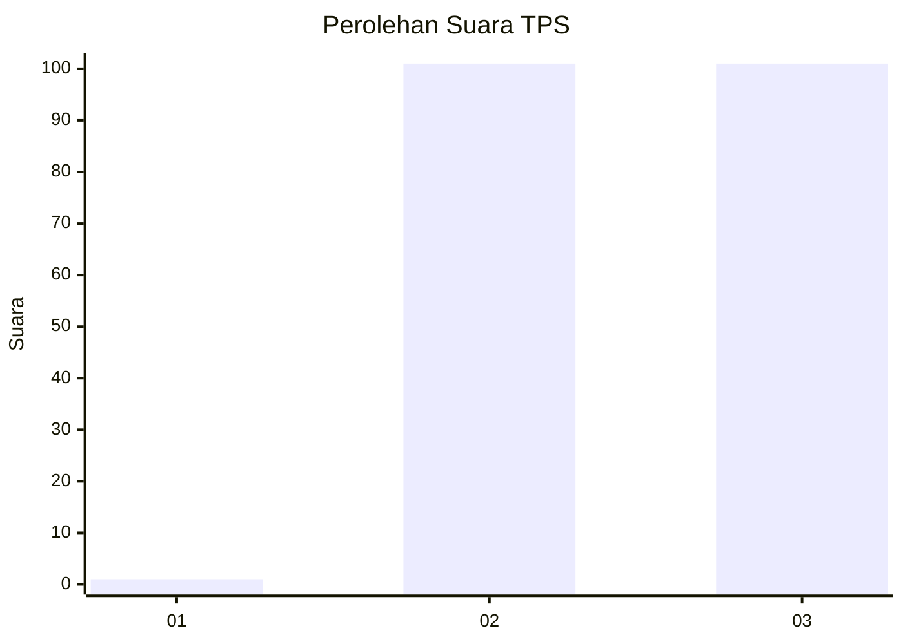
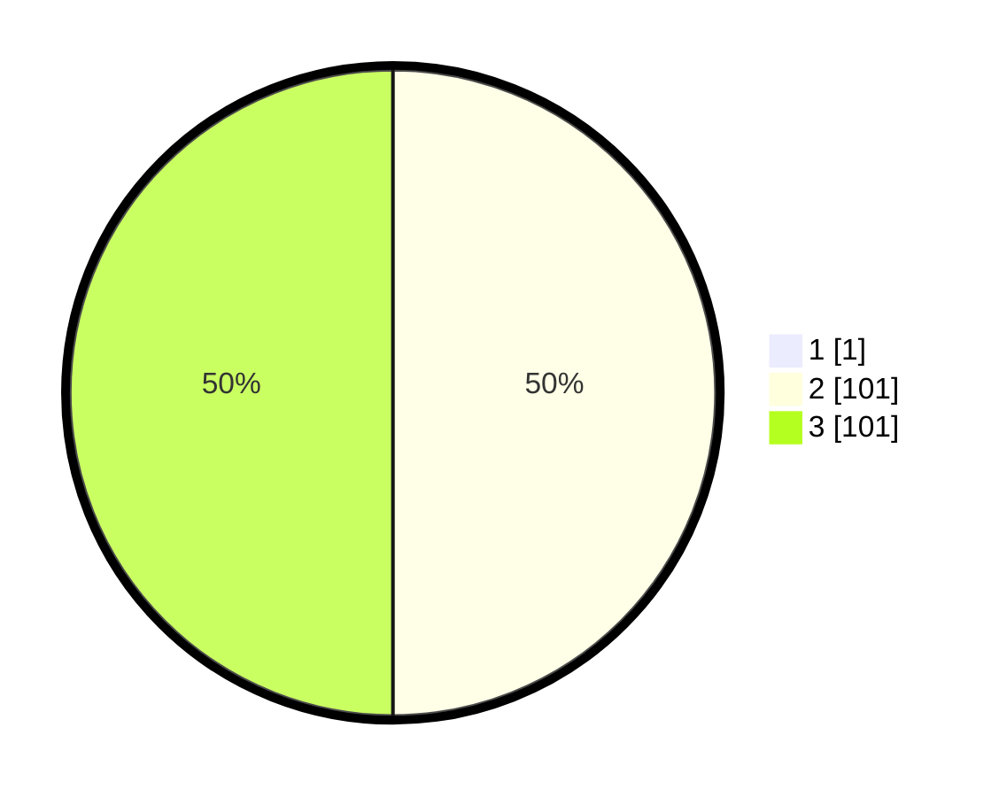

# Hasil

## Grafik

## Tabel

| No. | Nama Paslon    | Suara | Suara (raw) | Persentase |
|:--- |:-------------- | -----:| -----------:| ----------:|
| 1   | ANIES MUHAIMIN | 1     | [1][p-1]    | 0,49       |
| 2   | PRABOWO GIBRAN | 101   | [101][p-2]  | 49,75      |
| 3   | GANJAR MAHFUD  | 101   | [101][p-3]  | 49,75      |

[p-1]: https://github.com/gigit-pemilu/pemilu-2024-51-bali/blob/main/pilpres/hitung-suara/sub/51-bali/sub/02-tabanan/sub/04-kerambitan/sub/2006-kerambitan/sub/003-tps/sub/paslon-1.txt
[p-2]: https://github.com/gigit-pemilu/pemilu-2024-51-bali/blob/main/pilpres/hitung-suara/sub/51-bali/sub/02-tabanan/sub/04-kerambitan/sub/2006-kerambitan/sub/003-tps/sub/paslon-2.txt
[p-3]: https://github.com/gigit-pemilu/pemilu-2024-51-bali/blob/main/pilpres/hitung-suara/sub/51-bali/sub/02-tabanan/sub/04-kerambitan/sub/2006-kerambitan/sub/003-tps/sub/paslon-3.txt

## Foto C Plano

https://sirekap-obj-formc.kpu.go.id/9e84/pemilu/ppwp/51/02/04/20/06/5102042006003-20240216-142608--256e8fe2-3159-48e6-929f-2e180a344ee3.jpg

https://sirekap-obj-formc.kpu.go.id/9e84/pemilu/ppwp/51/02/04/20/06/5102042006003-20240216-142609--ddf3d55b-8a7b-4628-932e-f0bc3d16d4d4.jpg

https://sirekap-obj-formc.kpu.go.id/9e84/pemilu/ppwp/51/02/04/20/06/5102042006003-20240216-142608--0245f191-c85d-4c52-a106-03ebb36994f8.jpg

## Metadata

| Key        | Value               |
| ---------- | ------------------- |
| Time Stamp | 2024-02-21 12:00:00 |

## DATA PEMILIH TETAP

Jumlah pemilih dalam DPT: **227**.
 * L: **109**.
 * P: **118**.

## DATA PENGGUNA HAK PILIH

Jumlah pengguna hak pilih dalam DPT: **206**.
 * L: **99**.
 * P: **107**.

Jumlah pengguna hak pilih dalam DPTb: **0**.
 * L: **0**.
 * P: **0**.

Jumlah pengguna hak pilih dalam DPK: **0**.
 * L: **0**.
 * P: **0**.

Jumlah pengguna hak pilih: **206**.
 * L: **99**.
 * P: **107**.

## JUMLAH SUARA SAH DAN TIDAK SAH

JUMLAH SELURUH SUARA SAH: **203**.

JUMLAH SUARA TIDAK SAH: **3**.

JUMLAH SELURUH SUARA SAH DAN SUARA TIDAK SAH: **206**.

