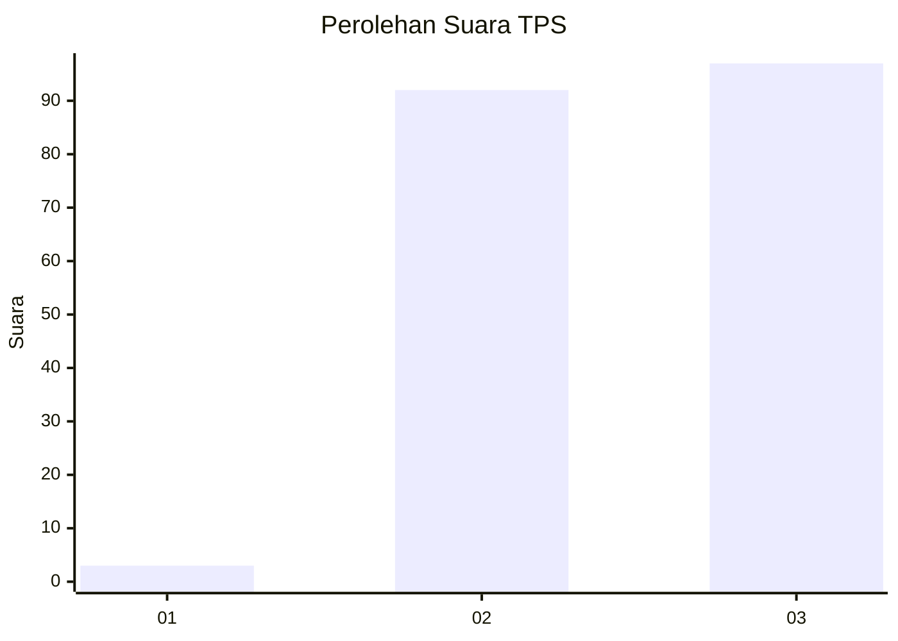
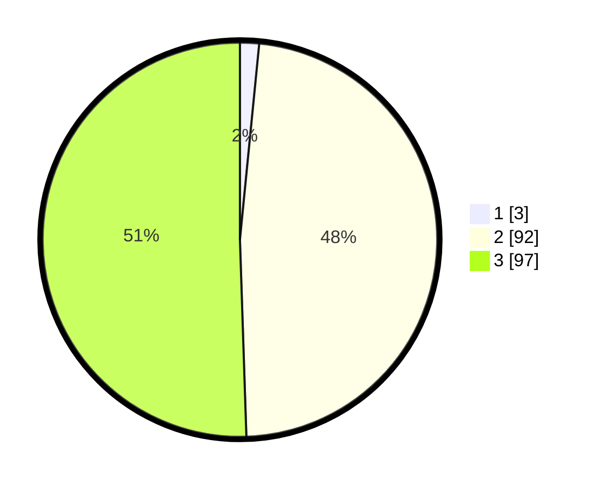

# Hasil

## Grafik

## Tabel

| No. | Nama Paslon    | Suara | Suara (raw) | Persentase |
|:--- |:-------------- | -----:| -----------:| ----------:|
| 1   | ANIES MUHAIMIN | 3     | [3][p-1]    | 1,56       |
| 2   | PRABOWO GIBRAN | 92    | [92][p-2]   | 47,92      |
| 3   | GANJAR MAHFUD  | 97    | [97][p-3]   | 50,52      |

[p-1]: https://github.com/gigit-pemilu/pemilu-2024-51-bali/blob/main/pilpres/hitung-suara/sub/51-bali/sub/02-tabanan/sub/04-kerambitan/sub/2006-kerambitan/sub/006-tps/sub/paslon-1.txt
[p-2]: https://github.com/gigit-pemilu/pemilu-2024-51-bali/blob/main/pilpres/hitung-suara/sub/51-bali/sub/02-tabanan/sub/04-kerambitan/sub/2006-kerambitan/sub/006-tps/sub/paslon-2.txt
[p-3]: https://github.com/gigit-pemilu/pemilu-2024-51-bali/blob/main/pilpres/hitung-suara/sub/51-bali/sub/02-tabanan/sub/04-kerambitan/sub/2006-kerambitan/sub/006-tps/sub/paslon-3.txt

## Foto C Plano

https://sirekap-obj-formc.kpu.go.id/49d8/pemilu/ppwp/51/02/04/20/06/5102042006006-20240216-142335--4c99d89d-5798-4378-b817-716d1d36fba8.jpg

https://sirekap-obj-formc.kpu.go.id/49d8/pemilu/ppwp/51/02/04/20/06/5102042006006-20240216-142336--0f970f5d-c48a-4093-8f6c-834b7c844fae.jpg

https://sirekap-obj-formc.kpu.go.id/49d8/pemilu/ppwp/51/02/04/20/06/5102042006006-20240216-142336--23ff7415-5dde-4b7e-837e-7be262e806fd.jpg

## Metadata

| Key        | Value               |
| ---------- | ------------------- |
| Time Stamp | 2024-02-21 14:00:00 |

## DATA PEMILIH TETAP

Jumlah pemilih dalam DPT: **231**.
 * L: **115**.
 * P: **116**.

## DATA PENGGUNA HAK PILIH

Jumlah pengguna hak pilih dalam DPT: **200**.
 * L: **100**.
 * P: **100**.

Jumlah pengguna hak pilih dalam DPTb: **1**.
 * L: **0**.
 * P: **1**.

Jumlah pengguna hak pilih dalam DPK: **1**.
 * L: **0**.
 * P: **1**.

Jumlah pengguna hak pilih: **202**.
 * L: **100**.
 * P: **102**.

## JUMLAH SUARA SAH DAN TIDAK SAH

JUMLAH SELURUH SUARA SAH: **192**.

JUMLAH SUARA TIDAK SAH: **10**.

JUMLAH SELURUH SUARA SAH DAN SUARA TIDAK SAH: **202**.

