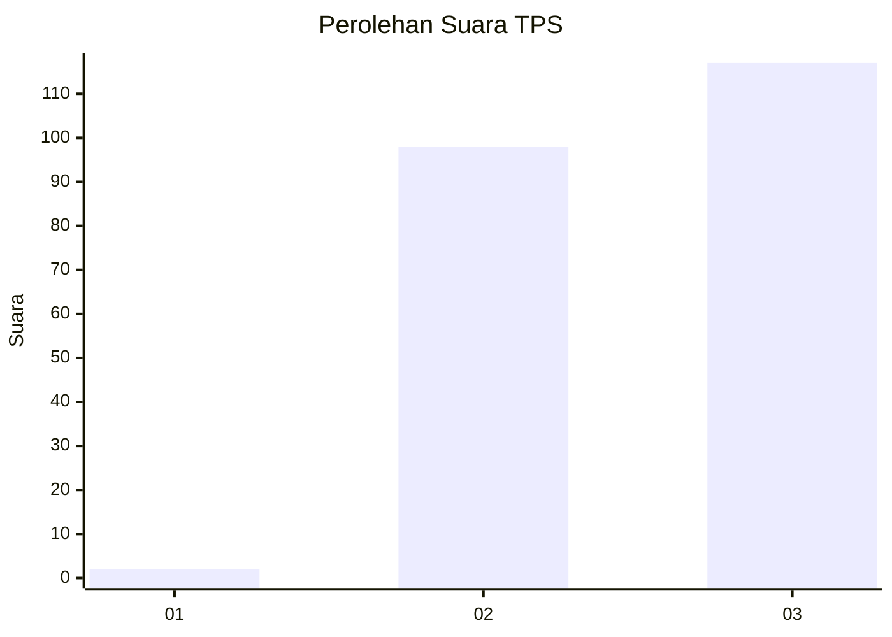
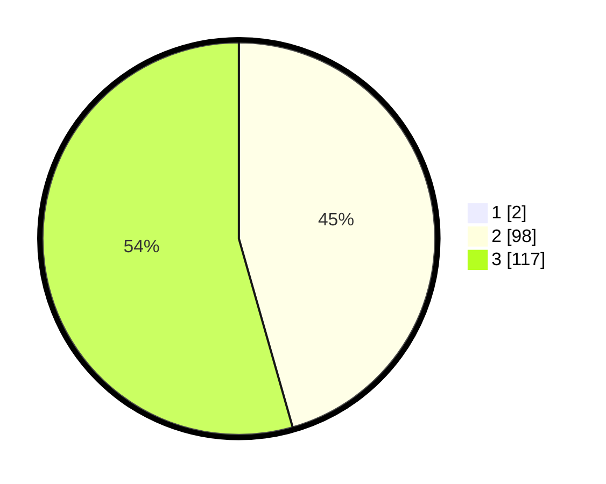

# Hasil

## Grafik

## Tabel

| No. | Nama Paslon    | Suara | Suara (raw) | Persentase |
|:--- |:-------------- | -----:| -----------:| ----------:|
| 1   | ANIES MUHAIMIN | 2     | [2][p-1]    | 0,92       |
| 2   | PRABOWO GIBRAN | 98    | [98][p-2]   | 45,16      |
| 3   | GANJAR MAHFUD  | 117   | [117][p-3]  | 53,92      |

[p-1]: https://github.com/gigit-pemilu/pemilu-2024-51-bali/blob/main/pilpres/hitung-suara/sub/51-bali/sub/02-tabanan/sub/04-kerambitan/sub/2006-kerambitan/sub/007-tps/sub/paslon-1.txt
[p-2]: https://github.com/gigit-pemilu/pemilu-2024-51-bali/blob/main/pilpres/hitung-suara/sub/51-bali/sub/02-tabanan/sub/04-kerambitan/sub/2006-kerambitan/sub/007-tps/sub/paslon-2.txt
[p-3]: https://github.com/gigit-pemilu/pemilu-2024-51-bali/blob/main/pilpres/hitung-suara/sub/51-bali/sub/02-tabanan/sub/04-kerambitan/sub/2006-kerambitan/sub/007-tps/sub/paslon-3.txt

## Foto C Plano

https://sirekap-obj-formc.kpu.go.id/ab65/pemilu/ppwp/51/02/04/20/06/5102042006007-20240214-131713--d74c4835-3733-458c-a7e0-218a7ad38333.jpg

https://sirekap-obj-formc.kpu.go.id/ab65/pemilu/ppwp/51/02/04/20/06/5102042006007-20240214-133407--9a6c54b5-cf7e-4a75-84ea-dc28777a50d0.jpg

https://sirekap-obj-formc.kpu.go.id/ab65/pemilu/ppwp/51/02/04/20/06/5102042006007-20240214-132010--a449609d-ac25-4db3-9cf5-0228c126e4d1.jpg

## Metadata

| Key        | Value               |
| ---------- | ------------------- |
| Time Stamp | 2024-02-15 22:00:27 |

## DATA PEMILIH TETAP

Jumlah pemilih dalam DPT: **232**.
 * L: **104**.
 * P: **128**.

## DATA PENGGUNA HAK PILIH

Jumlah pengguna hak pilih dalam DPT: **213**.
 * L: **96**.
 * P: **117**.

Jumlah pengguna hak pilih dalam DPTb: **2**.
 * L: **0**.
 * P: **2**.

Jumlah pengguna hak pilih dalam DPK: **5**.
 * L: **1**.
 * P: **4**.

Jumlah pengguna hak pilih: **220**.
 * L: **97**.
 * P: **123**.

## JUMLAH SUARA SAH DAN TIDAK SAH

JUMLAH SELURUH SUARA SAH: **217**.

JUMLAH SUARA TIDAK SAH: **3**.

JUMLAH SELURUH SUARA SAH DAN SUARA TIDAK SAH: **220**.

