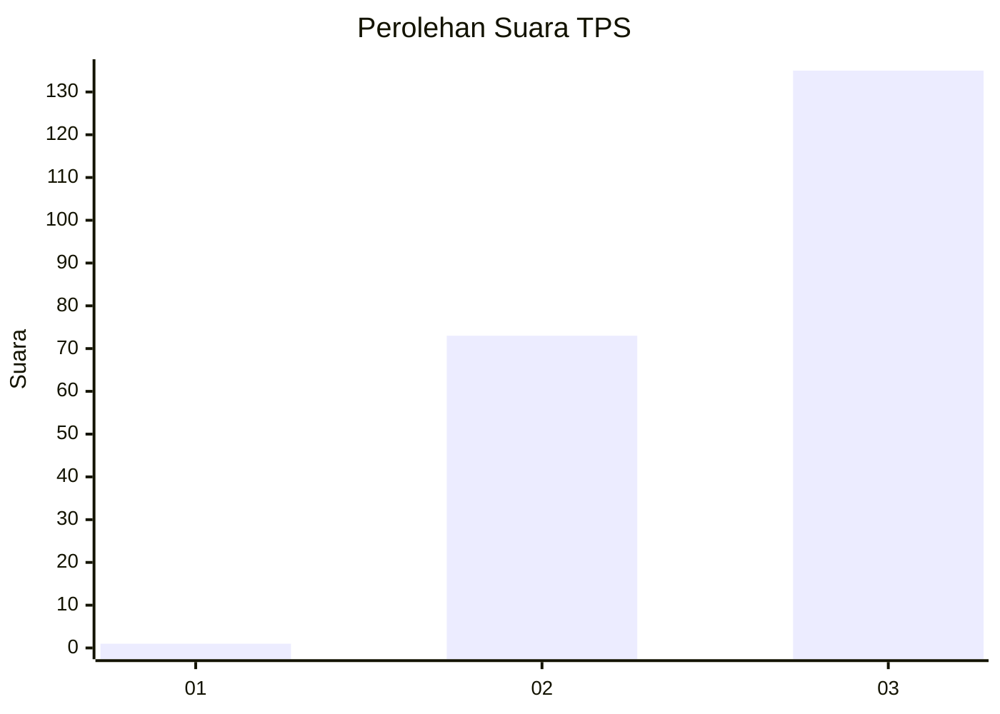
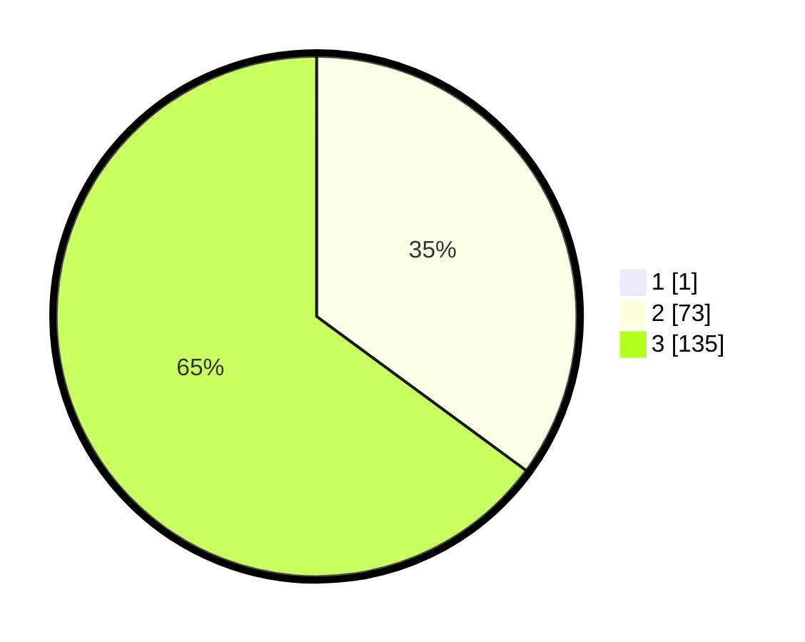

# Hasil

## Grafik

## Tabel

| No. | Nama Paslon    | Suara | Suara (raw) | Persentase |
|:--- |:-------------- | -----:| -----------:| ----------:|
| 1   | ANIES MUHAIMIN | 1     | [1][p-1]    | 0,48       |
| 2   | PRABOWO GIBRAN | 73    | [73][p-2]   | 34,93      |
| 3   | GANJAR MAHFUD  | 135   | [135][p-3]  | 64,59      |

[p-1]: https://github.com/gigit-pemilu/pemilu-2024-51-bali/blob/main/pilpres/hitung-suara/sub/51-bali/sub/02-tabanan/sub/04-kerambitan/sub/2006-kerambitan/sub/008-tps/sub/paslon-1.txt
[p-2]: https://github.com/gigit-pemilu/pemilu-2024-51-bali/blob/main/pilpres/hitung-suara/sub/51-bali/sub/02-tabanan/sub/04-kerambitan/sub/2006-kerambitan/sub/008-tps/sub/paslon-2.txt
[p-3]: https://github.com/gigit-pemilu/pemilu-2024-51-bali/blob/main/pilpres/hitung-suara/sub/51-bali/sub/02-tabanan/sub/04-kerambitan/sub/2006-kerambitan/sub/008-tps/sub/paslon-3.txt

## Foto C Plano

https://sirekap-obj-formc.kpu.go.id/b877/pemilu/ppwp/51/02/04/20/06/5102042006008-20240214-201613--4e7a60a7-b7d1-4da1-bdd3-a394441590c6.jpg

https://sirekap-obj-formc.kpu.go.id/b877/pemilu/ppwp/51/02/04/20/06/5102042006008-20240214-201726--e5008449-3ed5-4fb2-bbba-a791160e8a71.jpg

https://sirekap-obj-formc.kpu.go.id/b877/pemilu/ppwp/51/02/04/20/06/5102042006008-20240214-201846--df9d1a93-91a5-4fb2-bd2a-82e8e71120b1.jpg

## Metadata

| Key        | Value               |
| ---------- | ------------------- |
| Time Stamp | 2024-02-15 22:00:27 |

## DATA PEMILIH TETAP

Jumlah pemilih dalam DPT: **230**.
 * L: **105**.
 * P: **125**.

## DATA PENGGUNA HAK PILIH

Jumlah pengguna hak pilih dalam DPT: **210**.
 * L: **93**.
 * P: **117**.

Jumlah pengguna hak pilih dalam DPTb: **0**.
 * L: **0**.
 * P: **0**.

Jumlah pengguna hak pilih dalam DPK: **0**.
 * L: **0**.
 * P: **0**.

Jumlah pengguna hak pilih: **210**.
 * L: **93**.
 * P: **117**.

## JUMLAH SUARA SAH DAN TIDAK SAH

JUMLAH SELURUH SUARA SAH: **209**.

JUMLAH SUARA TIDAK SAH: **1**.

JUMLAH SELURUH SUARA SAH DAN SUARA TIDAK SAH: **210**.

