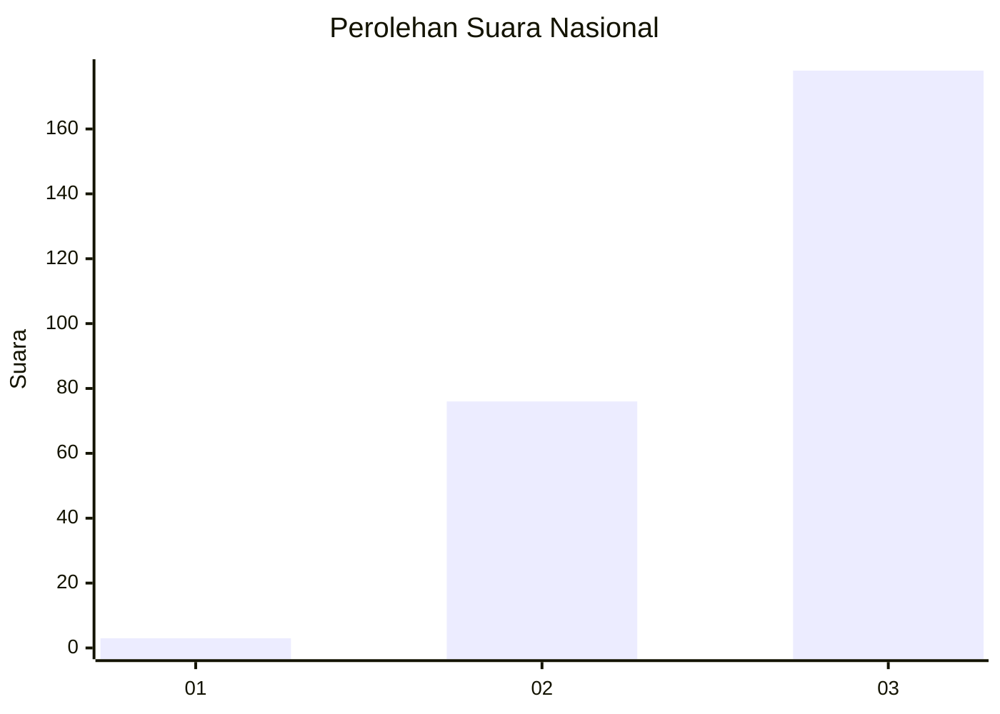
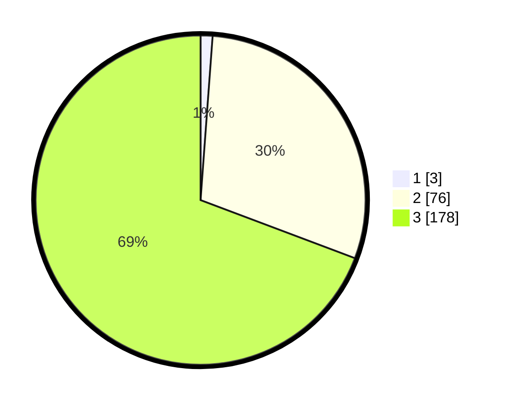

# Hasil

## Grafik

## Tabel

| No. | Nama Paslon    | Suara | Suara (raw) | Persentase |
|:--- |:-------------- | -----:| -----------:| ----------:|
| 1   | ANIES MUHAIMIN | 3     | [3][p-1]    | 1,17       |
| 2   | PRABOWO GIBRAN | 76    | [76][p-2]   | 29,57      |
| 3   | GANJAR MAHFUD  | 178   | [178][p-3]  | 69,26      |

[p-1]: https://github.com/gigit-pemilu/pemilu-2024/blob/main/pilpres/hitung-suara/sub/51-bali/sub/02-tabanan/sub/04-kerambitan/sub/2006-kerambitan/sub/010-tps/sub/paslon-1.txt
[p-2]: https://github.com/gigit-pemilu/pemilu-2024/blob/main/pilpres/hitung-suara/sub/51-bali/sub/02-tabanan/sub/04-kerambitan/sub/2006-kerambitan/sub/010-tps/sub/paslon-2.txt
[p-3]: https://github.com/gigit-pemilu/pemilu-2024/blob/main/pilpres/hitung-suara/sub/51-bali/sub/02-tabanan/sub/04-kerambitan/sub/2006-kerambitan/sub/010-tps/sub/paslon-3.txt

## Foto C Plano

https://sirekap-obj-formc.kpu.go.id/b1fb/pemilu/ppwp/51/02/04/20/06/5102042006010-20240214-203852--e2af34de-a10d-4945-8c4e-346c4d047571.jpg

https://sirekap-obj-formc.kpu.go.id/b1fb/pemilu/ppwp/51/02/04/20/06/5102042006010-20240214-204305--c8c7a9f6-802f-4b3b-af03-715de8c5c824.jpg

https://sirekap-obj-formc.kpu.go.id/b1fb/pemilu/ppwp/51/02/04/20/06/5102042006010-20240214-204444--551070fb-01f5-41b4-a962-c23f72013b17.jpg

## Metadata

| Key        | Value               |
| ---------- | ------------------- |
| Time Stamp | 2024-02-15 22:00:27 |

## DATA PEMILIH TETAP

Jumlah pemilih dalam DPT: **273**.
 * L: **126**.
 * P: **147**.

## DATA PENGGUNA HAK PILIH

Jumlah pengguna hak pilih dalam DPT: **255**.
 * L: **118**.
 * P: **137**.

Jumlah pengguna hak pilih dalam DPTb: **3**.
 * L: **1**.
 * P: **2**.

Jumlah pengguna hak pilih dalam DPK: **0**.
 * L: **0**.
 * P: **0**.

Jumlah pengguna hak pilih: **258**.
 * L: **119**.
 * P: **139**.

## JUMLAH SUARA SAH DAN TIDAK SAH

JUMLAH SELURUH SUARA SAH: **257**.

JUMLAH SUARA TIDAK SAH: **1**.

JUMLAH SELURUH SUARA SAH DAN SUARA TIDAK SAH: **258**.

