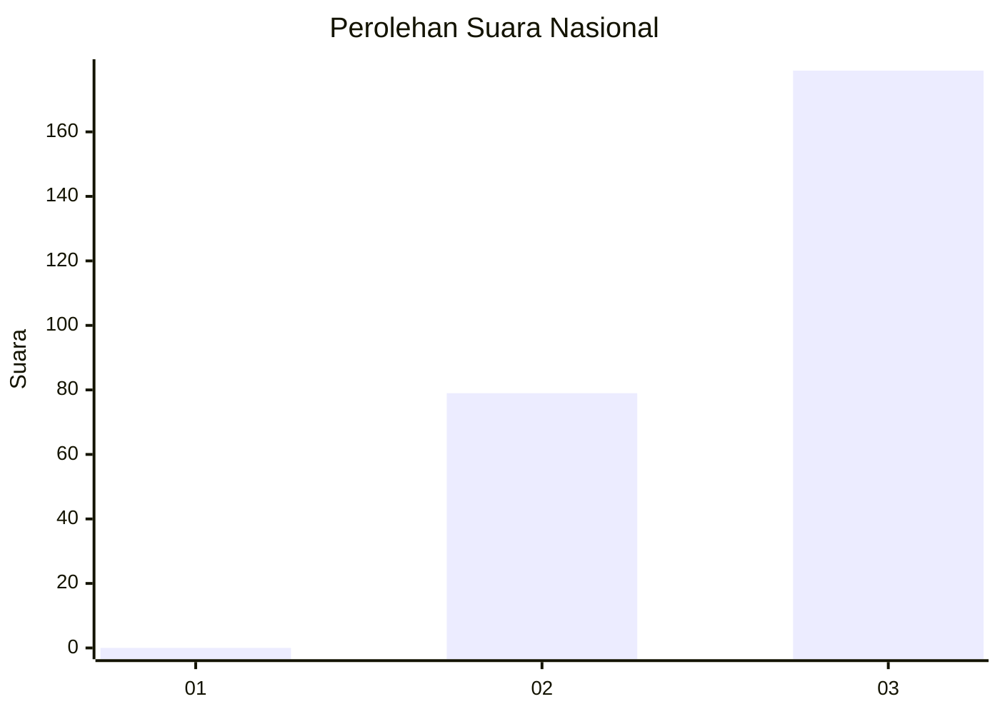
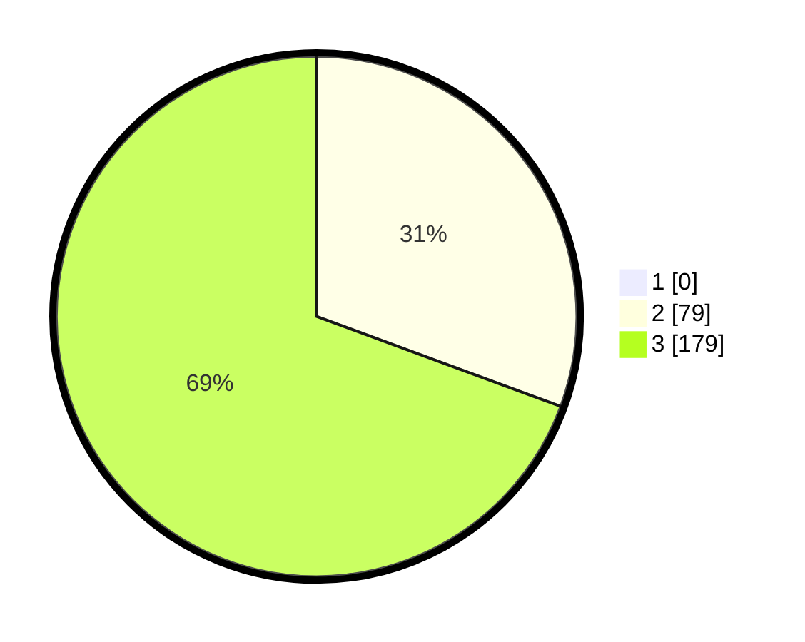

# Hasil

## Grafik

## Tabel

| No. | Nama Paslon    | Suara | Suara (raw) | Persentase |
|:--- |:-------------- | -----:| -----------:| ----------:|
| 1   | ANIES MUHAIMIN | 0     | [0][p-1]    | 0,00       |
| 2   | PRABOWO GIBRAN | 79    | [79][p-2]   | 30,62      |
| 3   | GANJAR MAHFUD  | 179   | [179][p-3]  | 69,38      |

[p-1]: https://github.com/gigit-pemilu/pemilu-2024/blob/main/pilpres/hitung-suara/sub/51-bali/sub/02-tabanan/sub/04-kerambitan/sub/2006-kerambitan/sub/011-tps/sub/paslon-1.txt
[p-2]: https://github.com/gigit-pemilu/pemilu-2024/blob/main/pilpres/hitung-suara/sub/51-bali/sub/02-tabanan/sub/04-kerambitan/sub/2006-kerambitan/sub/011-tps/sub/paslon-2.txt
[p-3]: https://github.com/gigit-pemilu/pemilu-2024/blob/main/pilpres/hitung-suara/sub/51-bali/sub/02-tabanan/sub/04-kerambitan/sub/2006-kerambitan/sub/011-tps/sub/paslon-3.txt

## Foto C Plano

https://sirekap-obj-formc.kpu.go.id/78f7/pemilu/ppwp/51/02/04/20/06/5102042006011-20240214-215810--d76363f1-a2ce-4f6a-88aa-0256a35abe47.jpg

https://sirekap-obj-formc.kpu.go.id/78f7/pemilu/ppwp/51/02/04/20/06/5102042006011-20240214-220335--8836c964-d18b-44ba-b4dc-98cd97fdeadf.jpg

https://sirekap-obj-formc.kpu.go.id/78f7/pemilu/ppwp/51/02/04/20/06/5102042006011-20240214-220551--06f334ac-5d34-446a-b90d-23fab06b12a1.jpg

## Metadata

| Key        | Value               |
| ---------- | ------------------- |
| Time Stamp | 2024-02-15 09:00:24 |

## DATA PEMILIH TETAP

Jumlah pemilih dalam DPT: **273**.
 * L: **131**.
 * P: **142**.

## DATA PENGGUNA HAK PILIH

Jumlah pengguna hak pilih dalam DPT: **256**.
 * L: **111**.
 * P: **145**.

Jumlah pengguna hak pilih dalam DPTb: **3**.
 * L: **0**.
 * P: **3**.

Jumlah pengguna hak pilih dalam DPK: **0**.
 * L: **0**.
 * P: **0**.

Jumlah pengguna hak pilih: **259**.
 * L: **111**.
 * P: **148**.

## JUMLAH SUARA SAH DAN TIDAK SAH

JUMLAH SELURUH SUARA SAH: **258**.

JUMLAH SUARA TIDAK SAH: **1**.

JUMLAH SELURUH SUARA SAH DAN SUARA TIDAK SAH: **259**.

