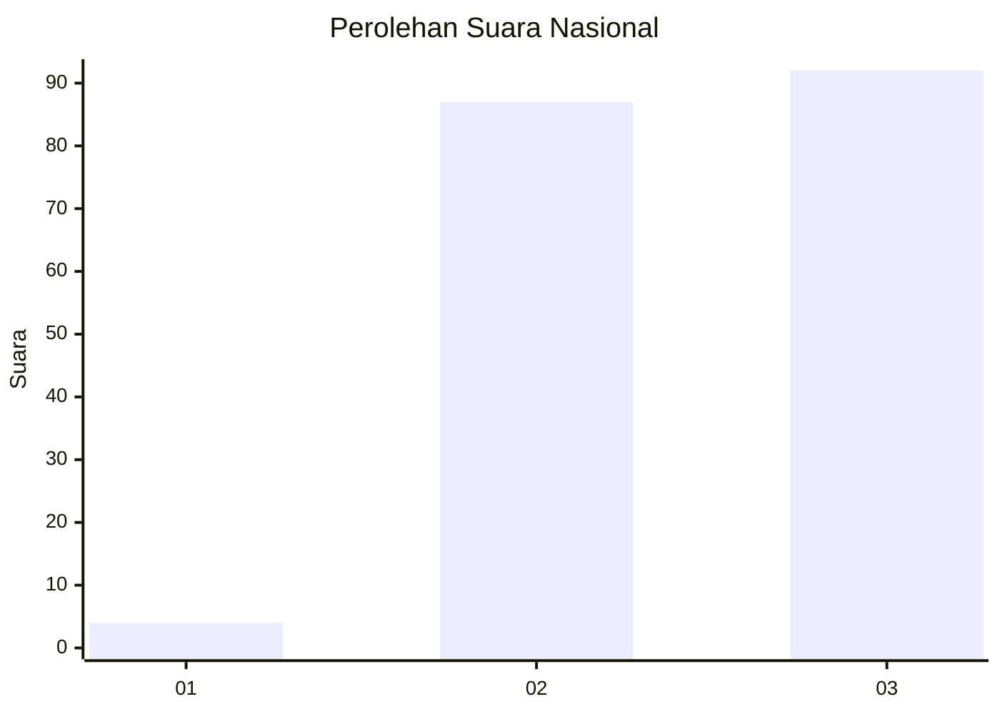
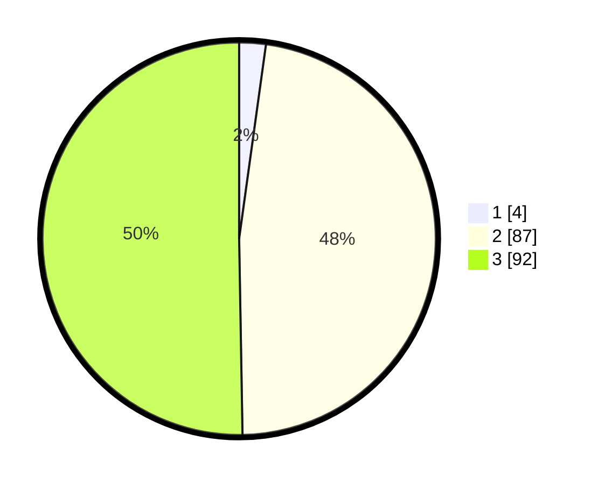

# Hasil

## Grafik

## Tabel

| No. | Nama Paslon    | Suara | Suara (raw) | Persentase |
|:--- |:-------------- | -----:| -----------:| ----------:|
| 1   | ANIES MUHAIMIN | 4     | [4][p-1]    | 2,19       |
| 2   | PRABOWO GIBRAN | 87    | [87][p-2]   | 47,54      |
| 3   | GANJAR MAHFUD  | 92    | [92][p-3]   | 50,27      |

[p-1]: https://github.com/gigit-pemilu/pemilu-2024/blob/main/pilpres/hitung-suara/sub/51-bali/sub/02-tabanan/sub/04-kerambitan/sub/2007-pangkung-karung/sub/001-tps/sub/paslon-1.txt
[p-2]: https://github.com/gigit-pemilu/pemilu-2024/blob/main/pilpres/hitung-suara/sub/51-bali/sub/02-tabanan/sub/04-kerambitan/sub/2007-pangkung-karung/sub/001-tps/sub/paslon-2.txt
[p-3]: https://github.com/gigit-pemilu/pemilu-2024/blob/main/pilpres/hitung-suara/sub/51-bali/sub/02-tabanan/sub/04-kerambitan/sub/2007-pangkung-karung/sub/001-tps/sub/paslon-3.txt

## Foto C Plano

https://sirekap-obj-formc.kpu.go.id/b3ae/pemilu/ppwp/51/02/04/20/07/5102042007001-20240216-042655--8d3bfcd0-d6e7-424b-8bf8-79337546d3af.jpg

https://sirekap-obj-formc.kpu.go.id/b3ae/pemilu/ppwp/51/02/04/20/07/5102042007001-20240216-053038--c46eefed-0c81-44cd-8e01-c812a2dcfb9c.jpg

https://sirekap-obj-formc.kpu.go.id/b3ae/pemilu/ppwp/51/02/04/20/07/5102042007001-20240216-042705--81845d54-432e-46ea-82bc-b2d163d38686.jpg

## Metadata

| Key        | Value               |
| ---------- | ------------------- |
| Time Stamp | 2024-02-16 10:30:29 |

## DATA PEMILIH TETAP

Jumlah pemilih dalam DPT: **0**.
 * L: **0**.
 * P: **0**.

## DATA PENGGUNA HAK PILIH

Jumlah pengguna hak pilih dalam DPT: **0**.
 * L: **0**.
 * P: **0**.

Jumlah pengguna hak pilih dalam DPTb: **0**.
 * L: **0**.
 * P: **0**.

Jumlah pengguna hak pilih dalam DPK: **0**.
 * L: **0**.
 * P: **0**.

Jumlah pengguna hak pilih: **0**.
 * L: **0**.
 * P: **0**.

## JUMLAH SUARA SAH DAN TIDAK SAH

JUMLAH SELURUH SUARA SAH: **183**.

JUMLAH SUARA TIDAK SAH: **1**.

JUMLAH SELURUH SUARA SAH DAN SUARA TIDAK SAH: **184**.

