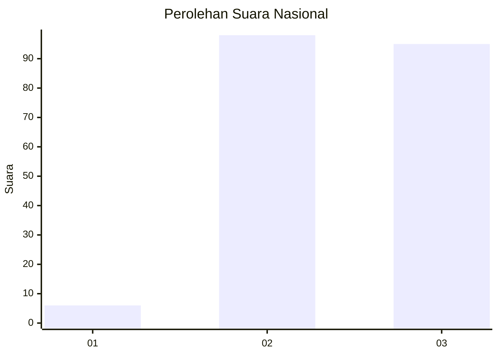
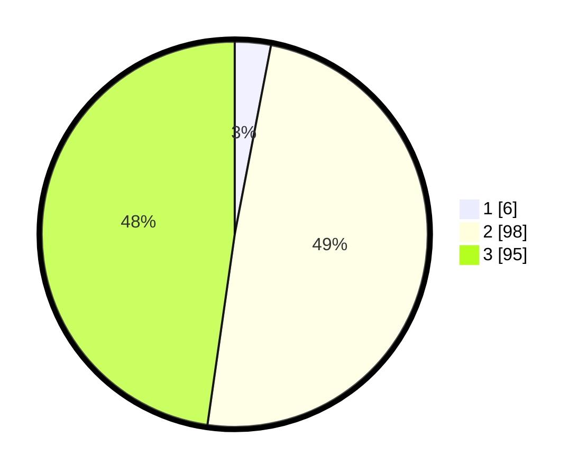

# Hasil

## Grafik

## Tabel

| No. | Nama Paslon    | Suara | Suara (raw) | Persentase |
|:--- |:-------------- | -----:| -----------:| ----------:|
| 1   | ANIES MUHAIMIN | 6     | [6][p-1]    | 3,02       |
| 2   | PRABOWO GIBRAN | 98    | [98][p-2]   | 49,25      |
| 3   | GANJAR MAHFUD  | 95    | [95][p-3]   | 47,74      |

[p-1]: https://github.com/gigit-pemilu/pemilu-2024/blob/main/pilpres/hitung-suara/sub/51-bali/sub/02-tabanan/sub/04-kerambitan/sub/2007-pangkung-karung/sub/002-tps/sub/paslon-1.txt
[p-2]: https://github.com/gigit-pemilu/pemilu-2024/blob/main/pilpres/hitung-suara/sub/51-bali/sub/02-tabanan/sub/04-kerambitan/sub/2007-pangkung-karung/sub/002-tps/sub/paslon-2.txt
[p-3]: https://github.com/gigit-pemilu/pemilu-2024/blob/main/pilpres/hitung-suara/sub/51-bali/sub/02-tabanan/sub/04-kerambitan/sub/2007-pangkung-karung/sub/002-tps/sub/paslon-3.txt

## Foto C Plano

https://sirekap-obj-formc.kpu.go.id/ba18/pemilu/ppwp/51/02/04/20/07/5102042007002-20240216-143720--e80d31b8-3e04-48d4-bf44-dfa69f5d886f.jpg

https://sirekap-obj-formc.kpu.go.id/ba18/pemilu/ppwp/51/02/04/20/07/5102042007002-20240216-143721--eee490b2-f9df-433a-9e76-0e0207bf3f5f.jpg

https://sirekap-obj-formc.kpu.go.id/ba18/pemilu/ppwp/51/02/04/20/07/5102042007002-20240216-143720--40ec018e-1175-4565-bdae-393645f4ee83.jpg

## Metadata

| Key        | Value               |
| ---------- | ------------------- |
| Time Stamp | 2024-02-21 18:00:00 |

## DATA PEMILIH TETAP

Jumlah pemilih dalam DPT: **205**.
 * L: **100**.
 * P: **105**.

## DATA PENGGUNA HAK PILIH

Jumlah pengguna hak pilih dalam DPT: **189**.
 * L: **93**.
 * P: **96**.

Jumlah pengguna hak pilih dalam DPTb: **3**.
 * L: **1**.
 * P: **2**.

Jumlah pengguna hak pilih dalam DPK: **12**.
 * L: **5**.
 * P: **7**.

Jumlah pengguna hak pilih: **204**.
 * L: **99**.
 * P: **105**.

## JUMLAH SUARA SAH DAN TIDAK SAH

JUMLAH SELURUH SUARA SAH: **199**.

JUMLAH SUARA TIDAK SAH: **5**.

JUMLAH SELURUH SUARA SAH DAN SUARA TIDAK SAH: **204**.

