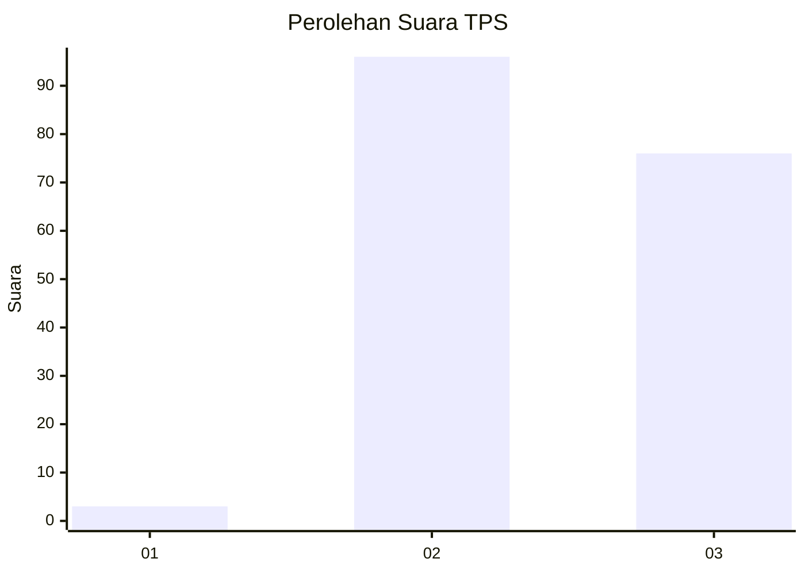
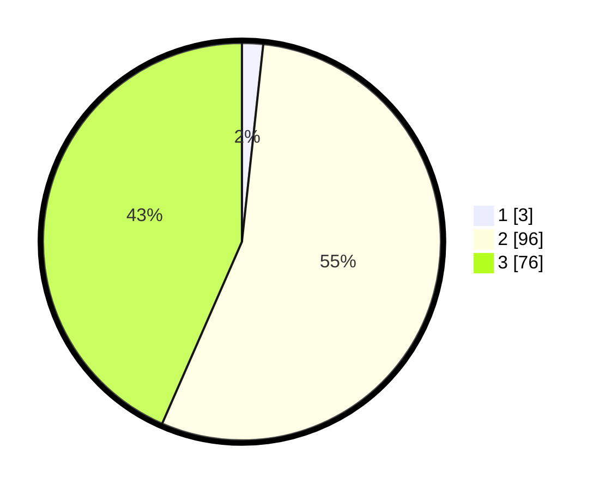

# Hasil

## Grafik

## Tabel

| No. | Nama Paslon    | Suara | Suara (raw) | Persentase |
|:--- |:-------------- | -----:| -----------:| ----------:|
| 1   | ANIES MUHAIMIN | 3     | [3][p-1]    | 1,71       |
| 2   | PRABOWO GIBRAN | 96    | [96][p-2]   | 54,86      |
| 3   | GANJAR MAHFUD  | 76    | [76][p-3]   | 43,43      |

[p-1]: https://github.com/gigit-pemilu/pemilu-2024-51-bali/blob/main/pilpres/hitung-suara/sub/51-bali/sub/02-tabanan/sub/04-kerambitan/sub/2007-pangkung-karung/sub/003-tps/sub/paslon-1.txt
[p-2]: https://github.com/gigit-pemilu/pemilu-2024-51-bali/blob/main/pilpres/hitung-suara/sub/51-bali/sub/02-tabanan/sub/04-kerambitan/sub/2007-pangkung-karung/sub/003-tps/sub/paslon-2.txt
[p-3]: https://github.com/gigit-pemilu/pemilu-2024-51-bali/blob/main/pilpres/hitung-suara/sub/51-bali/sub/02-tabanan/sub/04-kerambitan/sub/2007-pangkung-karung/sub/003-tps/sub/paslon-3.txt

## Foto C Plano

https://sirekap-obj-formc.kpu.go.id/847c/pemilu/ppwp/51/02/04/20/07/5102042007003-20240216-210303--64a7102c-ec68-4467-a136-f53d9ce7e11a.jpg

https://sirekap-obj-formc.kpu.go.id/847c/pemilu/ppwp/51/02/04/20/07/5102042007003-20240216-210305--031bfb00-edc5-403b-8af5-30cc22862d66.jpg

https://sirekap-obj-formc.kpu.go.id/847c/pemilu/ppwp/51/02/04/20/07/5102042007003-20240216-210304--c7128822-46d8-4e17-866c-8aab8dcdbcb1.jpg

## Metadata

| Key        | Value               |
| ---------- | ------------------- |
| Time Stamp | 2024-02-22 16:00:00 |

## DATA PEMILIH TETAP

Jumlah pemilih dalam DPT: **0**.
 * L: **0**.
 * P: **0**.

## DATA PENGGUNA HAK PILIH

Jumlah pengguna hak pilih dalam DPT: **0**.
 * L: **0**.
 * P: **0**.

Jumlah pengguna hak pilih dalam DPTb: **0**.
 * L: **0**.
 * P: **0**.

Jumlah pengguna hak pilih dalam DPK: **0**.
 * L: **0**.
 * P: **0**.

Jumlah pengguna hak pilih: **0**.
 * L: **0**.
 * P: **0**.

## JUMLAH SUARA SAH DAN TIDAK SAH

JUMLAH SELURUH SUARA SAH: **175**.

JUMLAH SUARA TIDAK SAH: **2**.

JUMLAH SELURUH SUARA SAH DAN SUARA TIDAK SAH: **177**.

