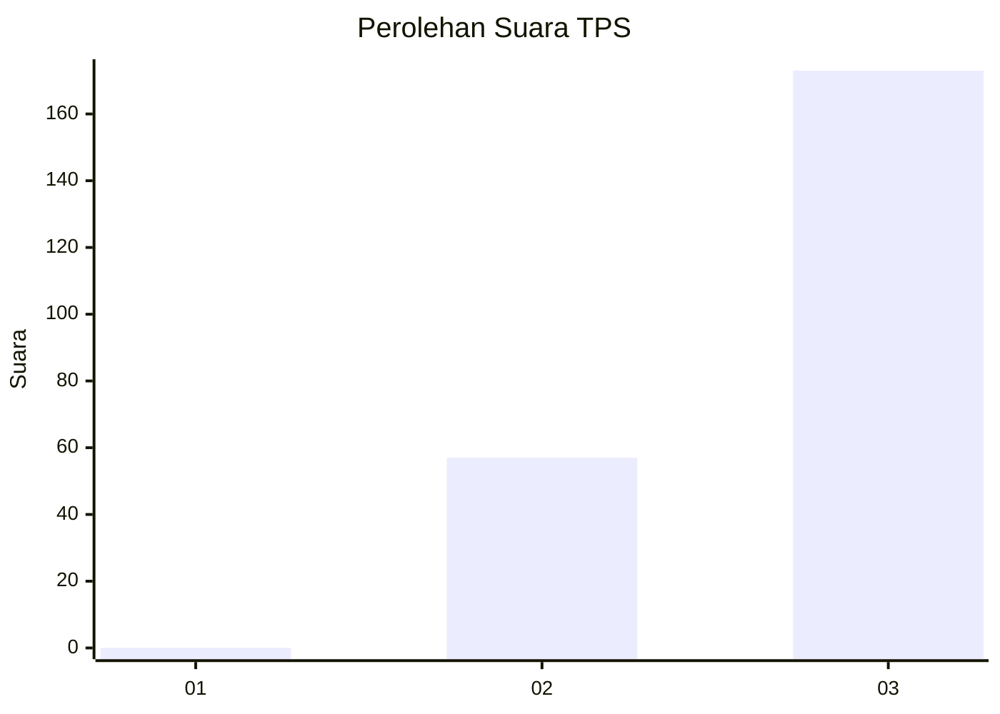
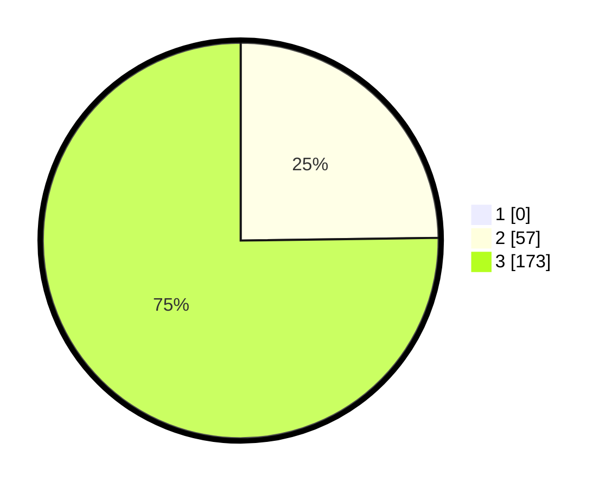

# Hasil

## Grafik

## Tabel

| No. | Nama Paslon    | Suara | Suara (raw) | Persentase |
|:--- |:-------------- | -----:| -----------:| ----------:|
| 1   | ANIES MUHAIMIN | 0     | [0][p-1]    | 0,00       |
| 2   | PRABOWO GIBRAN | 57    | [57][p-2]   | 24,78      |
| 3   | GANJAR MAHFUD  | 173   | [173][p-3]  | 75,22      |

[p-1]: https://github.com/gigit-pemilu/pemilu-2024-51-bali/blob/main/pilpres/hitung-suara/sub/51-bali/sub/02-tabanan/sub/04-kerambitan/sub/2007-pangkung-karung/sub/004-tps/sub/paslon-1.txt
[p-2]: https://github.com/gigit-pemilu/pemilu-2024-51-bali/blob/main/pilpres/hitung-suara/sub/51-bali/sub/02-tabanan/sub/04-kerambitan/sub/2007-pangkung-karung/sub/004-tps/sub/paslon-2.txt
[p-3]: https://github.com/gigit-pemilu/pemilu-2024-51-bali/blob/main/pilpres/hitung-suara/sub/51-bali/sub/02-tabanan/sub/04-kerambitan/sub/2007-pangkung-karung/sub/004-tps/sub/paslon-3.txt

## Foto C Plano

https://sirekap-obj-formc.kpu.go.id/7fbe/pemilu/ppwp/51/02/04/20/07/5102042007004-20240214-223516--7d07f08d-5de1-4a97-b6cf-7088e08aa0a9.jpg

https://sirekap-obj-formc.kpu.go.id/7fbe/pemilu/ppwp/51/02/04/20/07/5102042007004-20240216-145940--2506c08b-359a-43fd-8776-eb6a321abdd8.jpg

https://sirekap-obj-formc.kpu.go.id/7fbe/pemilu/ppwp/51/02/04/20/07/5102042007004-20240216-145940--90d4ab71-d69f-4e05-a64b-0364c3027f21.jpg

## Metadata

| Key        | Value               |
| ---------- | ------------------- |
| Time Stamp | 2024-02-24 22:31:28 |

## DATA PEMILIH TETAP

Jumlah pemilih dalam DPT: **266**.
 * L: **132**.
 * P: **134**.

## DATA PENGGUNA HAK PILIH

Jumlah pengguna hak pilih dalam DPT: **233**.
 * L: **113**.
 * P: **120**.

Jumlah pengguna hak pilih dalam DPTb: **0**.
 * L: **0**.
 * P: **0**.

Jumlah pengguna hak pilih dalam DPK: **0**.
 * L: **0**.
 * P: **0**.

Jumlah pengguna hak pilih: **233**.
 * L: **113**.
 * P: **120**.

## JUMLAH SUARA SAH DAN TIDAK SAH

JUMLAH SELURUH SUARA SAH: **230**.

JUMLAH SUARA TIDAK SAH: **3**.

JUMLAH SELURUH SUARA SAH DAN SUARA TIDAK SAH: **233**.

