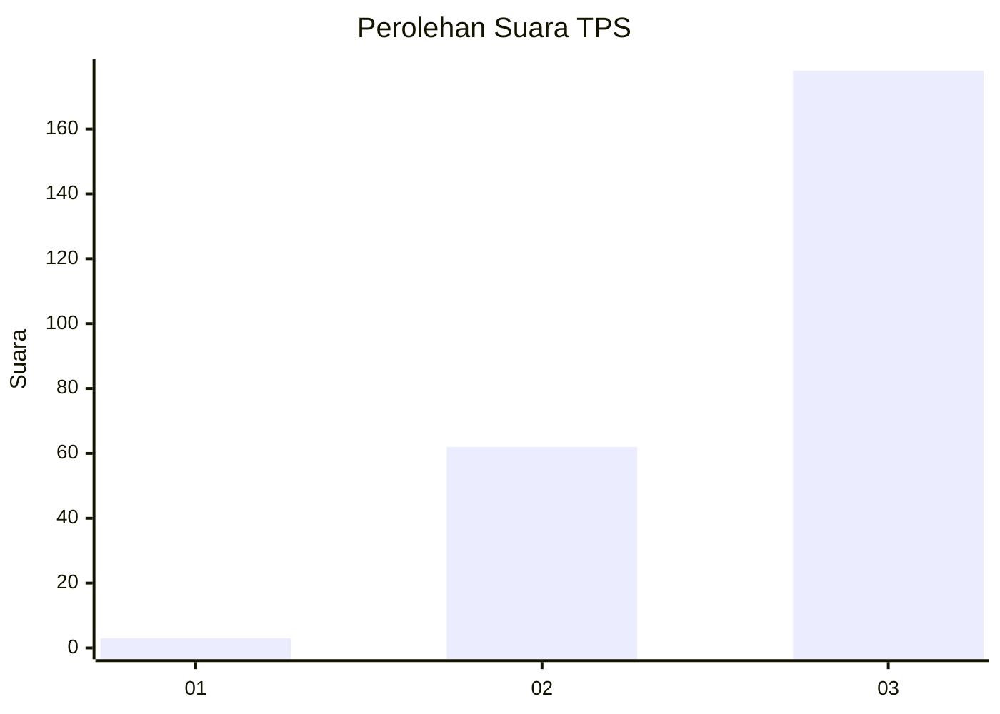
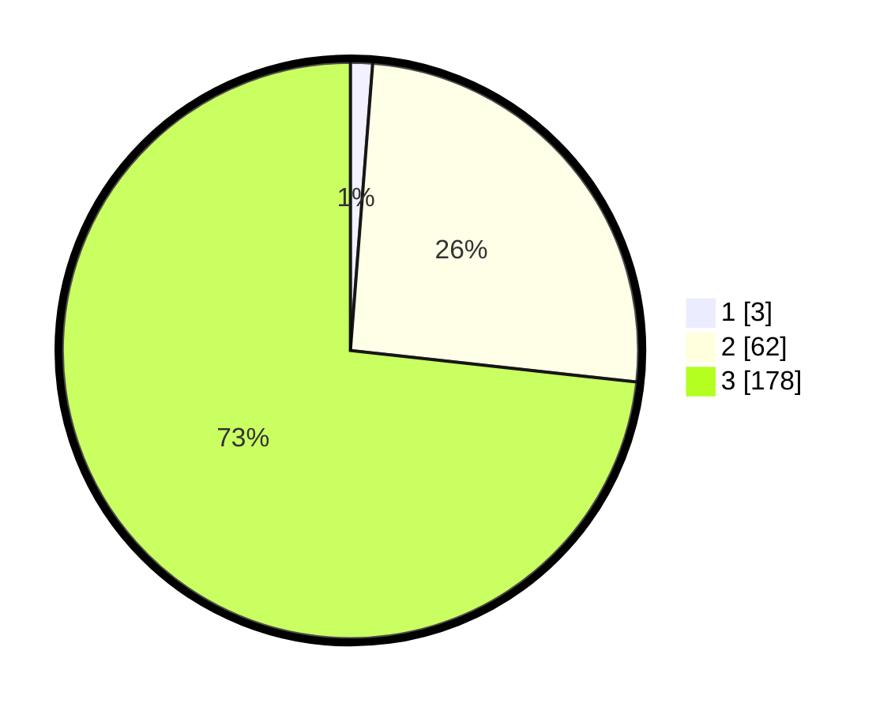

# Hasil

## Grafik

## Tabel

| No. | Nama Paslon    | Suara | Suara (raw) | Persentase |
|:--- |:-------------- | -----:| -----------:| ----------:|
| 1   | ANIES MUHAIMIN | 3     | [3][p-1]    | 1,23       |
| 2   | PRABOWO GIBRAN | 62    | [62][p-2]   | 25,51      |
| 3   | GANJAR MAHFUD  | 178   | [178][p-3]  | 73,25      |

[p-1]: https://github.com/gigit-pemilu/pemilu-2024-51-bali/blob/main/pilpres/hitung-suara/sub/51-bali/sub/02-tabanan/sub/04-kerambitan/sub/2007-pangkung-karung/sub/005-tps/sub/paslon-1.txt
[p-2]: https://github.com/gigit-pemilu/pemilu-2024-51-bali/blob/main/pilpres/hitung-suara/sub/51-bali/sub/02-tabanan/sub/04-kerambitan/sub/2007-pangkung-karung/sub/005-tps/sub/paslon-2.txt
[p-3]: https://github.com/gigit-pemilu/pemilu-2024-51-bali/blob/main/pilpres/hitung-suara/sub/51-bali/sub/02-tabanan/sub/04-kerambitan/sub/2007-pangkung-karung/sub/005-tps/sub/paslon-3.txt

## Foto C Plano

https://sirekap-obj-formc.kpu.go.id/c7e3/pemilu/ppwp/51/02/04/20/07/5102042007005-20240214-200541--4dc4cc1d-a772-4480-8344-8f7449cdfff2.jpg

https://sirekap-obj-formc.kpu.go.id/c7e3/pemilu/ppwp/51/02/04/20/07/5102042007005-20240214-202346--bf139b99-0eca-4afb-b779-84f0af6d6699.jpg

https://sirekap-obj-formc.kpu.go.id/c7e3/pemilu/ppwp/51/02/04/20/07/5102042007005-20240214-200704--1d269fd6-5799-4f71-8bb0-72e60730be99.jpg

## Metadata

| Key        | Value               |
| ---------- | ------------------- |
| Time Stamp | 2024-02-15 00:41:44 |

