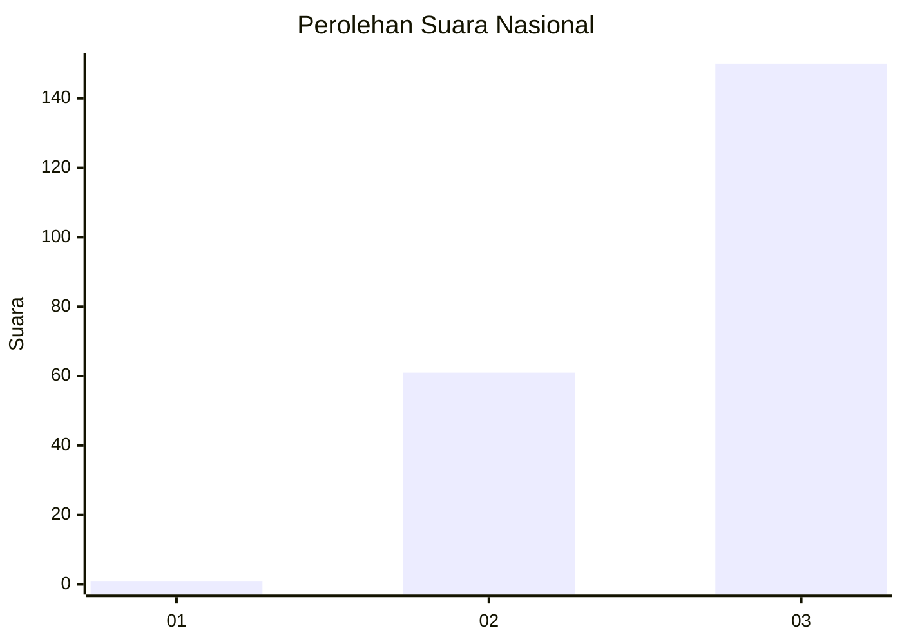
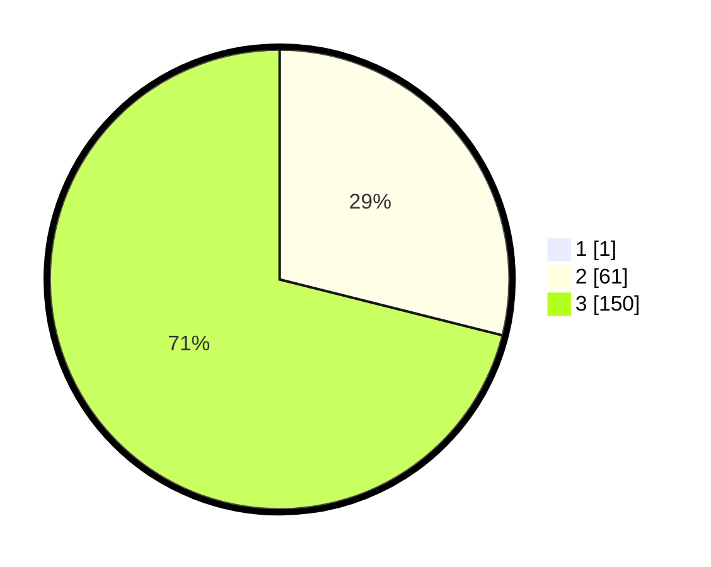

# Hasil

## Grafik

## Tabel

| No. | Nama Paslon    | Suara | Suara (raw) | Persentase |
|:--- |:-------------- | -----:| -----------:| ----------:|
| 1   | ANIES MUHAIMIN | 1     | [1][p-1]    | 0,47       |
| 2   | PRABOWO GIBRAN | 61    | [61][p-2]   | 28,77      |
| 3   | GANJAR MAHFUD  | 150   | [150][p-3]  | 70,75      |

[p-1]: https://github.com/gigit-pemilu/pemilu-2024/blob/main/pilpres/hitung-suara/sub/51-bali/sub/02-tabanan/sub/04-kerambitan/sub/2007-pangkung-karung/sub/008-tps/sub/paslon-1.txt
[p-2]: https://github.com/gigit-pemilu/pemilu-2024/blob/main/pilpres/hitung-suara/sub/51-bali/sub/02-tabanan/sub/04-kerambitan/sub/2007-pangkung-karung/sub/008-tps/sub/paslon-2.txt
[p-3]: https://github.com/gigit-pemilu/pemilu-2024/blob/main/pilpres/hitung-suara/sub/51-bali/sub/02-tabanan/sub/04-kerambitan/sub/2007-pangkung-karung/sub/008-tps/sub/paslon-3.txt

## Foto C Plano

https://sirekap-obj-formc.kpu.go.id/91a0/pemilu/ppwp/51/02/04/20/07/5102042007008-20240216-135042--516e85e7-a883-42b8-8063-e8519da952c8.jpg

https://sirekap-obj-formc.kpu.go.id/91a0/pemilu/ppwp/51/02/04/20/07/5102042007008-20240216-135043--7c018f70-d6c3-46d7-b44e-683ff8ba3a3b.jpg

https://sirekap-obj-formc.kpu.go.id/91a0/pemilu/ppwp/51/02/04/20/07/5102042007008-20240216-135042--41962f4c-a83d-4a4f-a510-ed6311bba6ef.jpg

## Metadata

| Key        | Value               |
| ---------- | ------------------- |
| Time Stamp | 2024-02-16 14:30:33 |

## DATA PEMILIH TETAP

Jumlah pemilih dalam DPT: **259**.
 * L: **164**.
 * P: **95**.

## DATA PENGGUNA HAK PILIH

Jumlah pengguna hak pilih dalam DPT: **210**.
 * L: **99**.
 * P: **111**.

Jumlah pengguna hak pilih dalam DPTb: **0**.
 * L: **0**.
 * P: **0**.

Jumlah pengguna hak pilih dalam DPK: **4**.
 * L: **3**.
 * P: **1**.

Jumlah pengguna hak pilih: **214**.
 * L: **102**.
 * P: **112**.

## JUMLAH SUARA SAH DAN TIDAK SAH

JUMLAH SELURUH SUARA SAH: **212**.

JUMLAH SUARA TIDAK SAH: **2**.

JUMLAH SELURUH SUARA SAH DAN SUARA TIDAK SAH: **214**.

