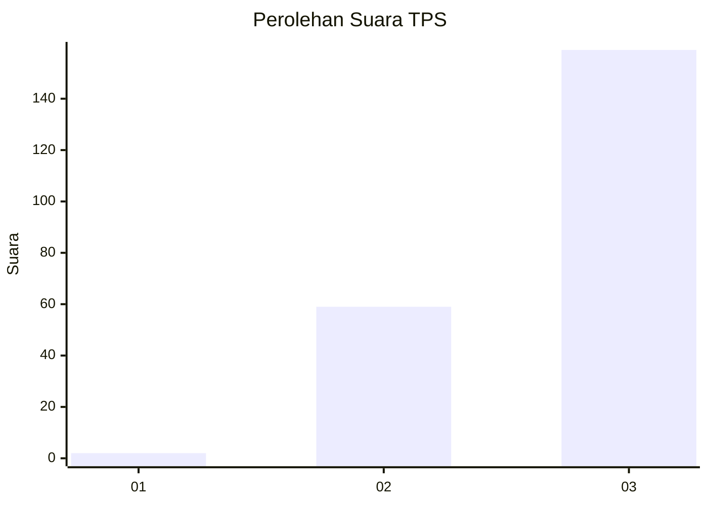
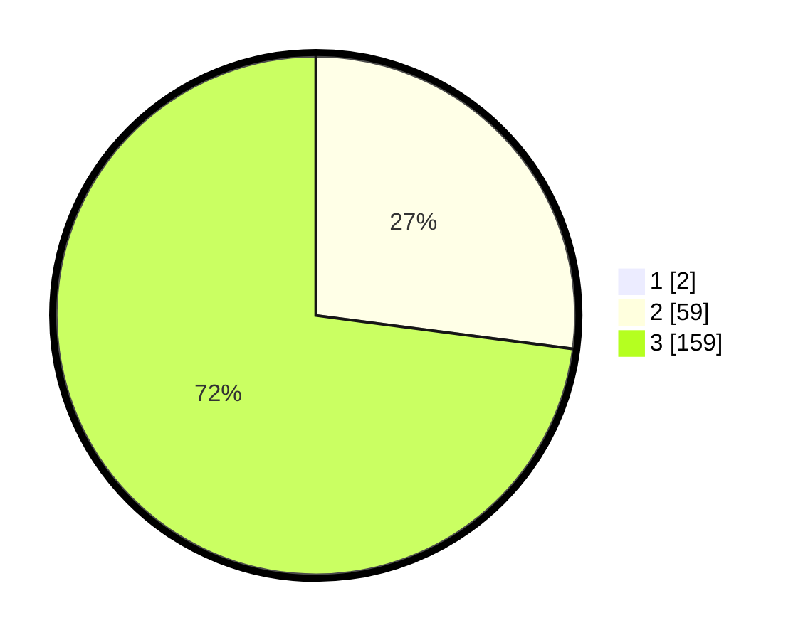

# Hasil

## Grafik

## Tabel

| No. | Nama Paslon    | Suara | Suara (raw) | Persentase |
|:--- |:-------------- | -----:| -----------:| ----------:|
| 1   | ANIES MUHAIMIN | 2     | [2][p-1]    | 0,91       |
| 2   | PRABOWO GIBRAN | 59    | [59][p-2]   | 26,82      |
| 3   | GANJAR MAHFUD  | 159   | [159][p-3]  | 72,27      |

[p-1]: https://github.com/gigit-pemilu/pemilu-2024-51-bali/blob/main/pilpres/hitung-suara/sub/51-bali/sub/02-tabanan/sub/04-kerambitan/sub/2007-pangkung-karung/sub/010-tps/sub/paslon-1.txt
[p-2]: https://github.com/gigit-pemilu/pemilu-2024-51-bali/blob/main/pilpres/hitung-suara/sub/51-bali/sub/02-tabanan/sub/04-kerambitan/sub/2007-pangkung-karung/sub/010-tps/sub/paslon-2.txt
[p-3]: https://github.com/gigit-pemilu/pemilu-2024-51-bali/blob/main/pilpres/hitung-suara/sub/51-bali/sub/02-tabanan/sub/04-kerambitan/sub/2007-pangkung-karung/sub/010-tps/sub/paslon-3.txt

## Foto C Plano

https://sirekap-obj-formc.kpu.go.id/841f/pemilu/ppwp/51/02/04/20/07/5102042007010-20240217-010355--51150bfb-2638-4c20-9055-361807534d4a.jpg

https://sirekap-obj-formc.kpu.go.id/841f/pemilu/ppwp/51/02/04/20/07/5102042007010-20240217-010356--239e4a94-94ed-4799-a180-8f4f0e2b86bc.jpg

https://sirekap-obj-formc.kpu.go.id/841f/pemilu/ppwp/51/02/04/20/07/5102042007010-20240217-010355--aa96f616-3461-4dda-b301-5928c2db29fc.jpg

## Metadata

| Key        | Value               |
| ---------- | ------------------- |
| Time Stamp | 2024-02-21 15:00:00 |

## DATA PEMILIH TETAP

Jumlah pemilih dalam DPT: **249**.
 * L: **125**.
 * P: **124**.

## DATA PENGGUNA HAK PILIH

Jumlah pengguna hak pilih dalam DPT: **215**.
 * L: **111**.
 * P: **104**.

Jumlah pengguna hak pilih dalam DPTb: **1**.
 * L: **0**.
 * P: **1**.

Jumlah pengguna hak pilih dalam DPK: **5**.
 * L: **2**.
 * P: **3**.

Jumlah pengguna hak pilih: **221**.
 * L: **113**.
 * P: **108**.

## JUMLAH SUARA SAH DAN TIDAK SAH

JUMLAH SELURUH SUARA SAH: **220**.

JUMLAH SUARA TIDAK SAH: **1**.

JUMLAH SELURUH SUARA SAH DAN SUARA TIDAK SAH: **221**.

